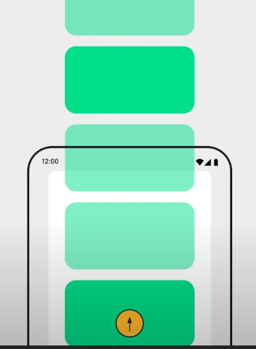
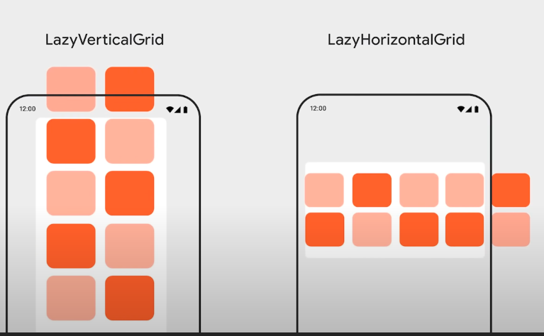
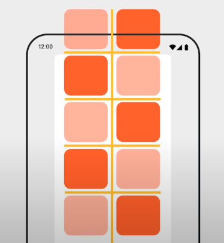

# Compose 延迟列表

> [视频地址](https://www.youtube.com/watch?v=1ANt65eoNhQ&ab_channel=AndroidDevelopers)  


## 视频内容总结
相较于传统的view方式，需要xml中定义recycerview、Adapter、viewholder等等，compose只需要非常简单的几行代码句可以实现滑动列表。
```kotlin
@Composable
fun FlowerList(flowers: List<Flower>) {
    LazyColumn {
        items(flowers) { flower ->
            FlowerItem(flower)
        }
    }
}
@Composable
fun FlowerItem(flower: Flower) {
    Column {
        Image(flower.image)
        Text(flower.name)
    }
}
```

### Lazy lists
```kotlin
@Composable
fun FlowerList(flowers: List<Flower>) {
    val state = rememberLazyListState()
    val showScrollTopButton by remember { // 判断 state.firstVisibleIItemIndex > 0 是否成立，不会随着 firstVisibleIItemIndex 的改变而改变
        derivedStateOf {
            state.firstVisibleIItemIndex > 0
        }
    }
    // state.layoutInfo.visibleItemsInfo 可以通过layoutinfo后去到一些当前滑动的信息
    // state.layoutInfo.totalItemCount
    LazyColumn(
        contentPadding = PaddingValues(10.dp), // 每个item周围包裹的padding
        modifier = Modifier.padding(10.dp)， // 整个lazycolumn的外围包裹padding
        state = state, // 当前list的状态
    ) { 
        item(HEADER) {
            Text("header") // 添加header
        }
        itemsIndexed(flowers) { index, flower ->
            FlowerItem(flower, index)
        }
    }
} 
```

### Lazy Grids

```kotlin
LazyVerticalGrid(
    columns = GridCell.Fixed(2), // 二等分
    // GridCell.Adaptive(199.dp) // 宽度
    verticalArrangement = Arrangement.spacedBy(10.dp), // 将会添加items之间的水平间距
    horizontalArrangement = Arrangement.spacedBy(10.dp),// 将会添加items之间的垂直间距
    contentPadding
) {
    items(data) { item ->
        Item(item)
    }
}
```


```kotlin

```

### Lazy Layout
### 有用的小提示
### 不要讲多种item 防止到一个 items中
### 自定义排列方式


## 补充