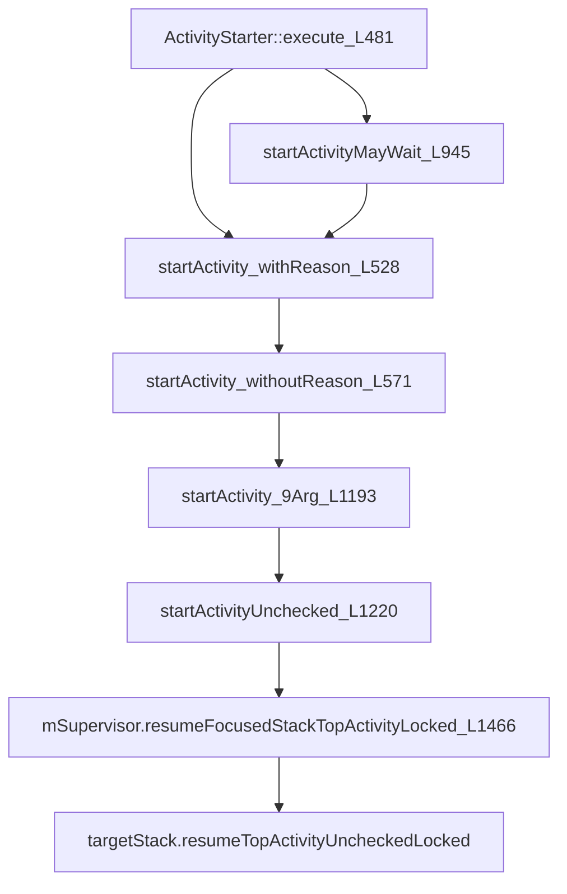

# Android Launcher 启动流程

> SystemServer::startBootstrapServices《创建AMS》  
  SystemServer::startOtherServices 《等系统完成之后，调用AWS的systemReady》  
  -> AMS::startHomeActivityLocked 《由ams 调用 启动launcher》  
  ---> ActivityStartController::startHomeActivity  《 ActivityStartController AMS 的属性 》  
  -----> ActivityStarter::execute  《 ActivityStarter ActivityStartController obtain 出来的一个实例 》  
  -----> ActivityStarter::startActivity  《经过一系列的调用启动activity》  
  -------> ActivityStackSupervisor::resumeFocusedStackTopActivityLocked  《ActivityStackSupervisor ActivityStack的管理者 》  
  -------> ActivityStackSupervisor::mFocusedStack::resumeTopActivityUncheckedLocked  《寻找到对应的task之后，使用ActivityStack启动activity》  
  -------> ActivityStackSupervisor::startSpecificActivityLocked  《寻找到对应的task之后，使用ActivityStack启动activity》  
  -> ActivityManagerService::startProcessLocked   
  -> ActivityManagerService::startProcess  
  ---> Process::start  
  -----> ZygoteProcess::start  
  -----> ZygoteProcess::zygoteSendArgsAndGetResult  
  -------> ZygoteServer::runSelectLoop  
  -------> ZygoteConnection::processOneCommand  
  -------> ZygoteConnection::handleChildProc  
  -> AMS::mStackSupervisor.resumeFocusedStackTopActivityLocked  


## AMS 的创建

```java
// frameworks/base/services/java/com/android/server/SystemServer.java
private void startBootstrapServices() { 
    final Watchdog watchdog = Watchdog.getInstance();
    watchdog.start();
    ...

    ActivityTaskManagerService atm = mSystemServiceManager.startService(
            ActivityTaskManagerService.Lifecycle.class).getService();
    // 使用lifecycle 可以将 ams添加到systemservice
    mActivityManagerService = ActivityManagerService.Lifecycle.startService(
            mSystemServiceManager, atm);
    mActivityManagerService.setSystemServiceManager(mSystemServiceManager);
    mActivityManagerService.setInstaller(installer);
    mWindowManagerGlobalLock = atm.getGlobalLock();
    ...
    // 添加到servicemanager，
    mActivityManagerService.setSystemProcess();
    ...

}
private void startOtherServices() { 
    ...
    mActivityManagerService.setWindowManager(wm);
    ...
    mActivityManagerService.systemReady(() -> {
        ...
    })
}
```

`mSystemServiceManager.startService` 通过反射去创建传入的class的实例，并且调用`onStart`方法

```java 
// frameworks/base/services/core/java/com/android/server/am/ActivityManagerService.java
public static final class Lifecycle extends SystemService {
    private final ActivityManagerService mService;
    private static ActivityTaskManagerService sAtm;
    public Lifecycle(Context context) {
        super(context);
        mService = new ActivityManagerService(context, sAtm);
    }
    public static ActivityManagerService startService(
            SystemServiceManager ssm, ActivityTaskManagerService atm) {
        sAtm = atm;
        return ssm.startService(ActivityManagerService.Lifecycle.class).getService();
    }

    @Override
    public void onStart() {
        mService.start();
    }
    ...
    public ActivityManagerService getService() {
        return mService;
    }
}
```
这也就意味着调用 `ActivityManagerService` 的构造函数，然后调用 `start` 方法。
先看构造函数。
```java
// frameworks/base/services/core/java/com/android/server/am/ActivityManagerService.java
public ActivityManagerService(Context systemContext) { 
    ...
    // 电量Service
    mBatteryStatsService = new BatteryStatsService(systemContext, systemDir, mHandler); 
    
    ...
    // 创建 Stack Supervisor
    mStackSupervisor = createStackSupervisor();
    
    // 用于控制activity 启动
    mActivityStartController = new ActivityStartController(this);
    // 最近的任务，home中可以看到
    mRecentTasks = createRecentTasks();
    mStackSupervisor.setRecentTasks(mRecentTasks);
    // 保持的任务task
    mLockTaskController = new LockTaskController(mContext, mStackSupervisor, mHandler);
    // 能将几个客户端作为一个事物一起管理的 类
    mLifecycleManager = new ClientLifecycleManager();
   
    // 监控  This class calls its monitor every minute. Killing this process if they don't return
    Watchdog.getInstance().addMonitor(this);
    Watchdog.getInstance().addThread(mHandler);

    // bind background thread to little cores
    // this is expected to fail inside of framework tests because apps can't touch cpusets directly
    // make sure we've already adjusted system_server's internal view of itself first
    updateOomAdjLocked();
    ...

}
protected ActivityStackSupervisor createStackSupervisor() {
    final ActivityStackSupervisor supervisor = new ActivityStackSupervisor(this, mHandler.getLooper());
    supervisor.initialize();
    return supervisor;
}
protected RecentTasks createRecentTasks() {
    return new RecentTasks(this, mStackSupervisor);
}
private void start() { 
    mProcessCpuThread.start();
    // 添加到 LocalServices 以及 ServiceManager
    mBatteryStatsService.publish();
    mAppOpsService.publish(mContext);
    // 用于systemserver内部管理各个service
    LocalServices.addService(ActivityManagerInternal.class, new LocalService());
    ...
}
```
创建AMS完成，接下来就是等待service都创建完成，开始systemReady程序。

## systemReady
```java
// http://androidxref.com/9.0.0_r3/xref/frameworks/base/services/core/java/com/android/server/am/ActivityManagerService.java
public void systemReady(final Runnable goingCallback, TimingsTraceLog traceLog) {
    // 各种内部service system ready
    ... 
    synchronized (this) { 
        ...
        // 启动Laucnher
        startHomeActivityLocked(currentUserId, "systemReady");
  
        mStackSupervisor.resumeFocusedStackTopActivityLocked(); 
        ...
    }
}

boolean startHomeActivityLocked(int userId, String reason) {
   
    Intent intent = getHomeIntent();
    ActivityInfo aInfo = resolveActivityInfo(intent, STOCK_PM_FLAGS, userId);
    if (aInfo != null) {
        intent.setComponent(new ComponentName(aInfo.applicationInfo.packageName, aInfo.name));
        
        aInfo = new ActivityInfo(aInfo);
        aInfo.applicationInfo = getAppInfoForUser(aInfo.applicationInfo, userId);
        ProcessRecord app = getProcessRecordLocked(aInfo.processName,
                aInfo.applicationInfo.uid, true);
        if (app == null || app.instr == null) {
            intent.setFlags(intent.getFlags() | FLAG_ACTIVITY_NEW_TASK);
            final int resolvedUserId = UserHandle.getUserId(aInfo.applicationInfo.uid); 
            final String myReason = reason + ":" + userId + ":" + resolvedUserId;
            // 启动launcher
            mActivityStartController.startHomeActivity(intent, aInfo, myReason);
        }
    } else {
        Slog.wtf(TAG, "No home screen found for " + intent, new Throwable());
    }

    return true;
}
```

## ActivityStartController::startHomeActivity
```java
// http://androidxref.com/9.0.0_r3/xref/frameworks/base/services/core/java/com/android/server/am/ActivityStartController.java
void startHomeActivity(Intent intent, ActivityInfo aInfo, String reason) {
    mSupervisor.moveHomeStackTaskToTop(reason);

    mLastHomeActivityStartResult = obtainStarter(intent, "startHomeActivity: " + reason)
            .setOutActivity(tmpOutRecord)
            .setCallingUid(0)
            .setActivityInfo(aInfo)
            // 开机首次启动，所以从这里开始start activity的真正流程
            .execute();

    mLastHomeActivityStartRecord = tmpOutRecord[0];
    // 此时是首次启动 所以这里是false
    if (mSupervisor.inResumeTopActivity) { 
        mSupervisor.scheduleResumeTopActivities();
    }
} 
```
## ActivityStarter::execute
```java
// http://androidxref.com/9.0.0_r3/xref/frameworks/base/services/core/java/com/android/server/am/ActivityStarter.java
int execute() {
    try {
        // TODO(b/64750076): Look into passing request directly to these methods to allow for transactional diffs and preprocessing.
        if (mRequest.mayWait) { // 需要等待activity的回调时 才进入这里。
            return startActivityMayWait(mRequest.caller, mRequest.callingUid,
                    mRequest.callingPackage, mRequest.intent, mRequest.resolvedType,
                    mRequest.voiceSession, mRequest.voiceInteractor, mRequest.resultTo,
                    mRequest.resultWho, mRequest.requestCode, mRequest.startFlags,
                    mRequest.profilerInfo, mRequest.waitResult, mRequest.globalConfig,
                    mRequest.activityOptions, mRequest.ignoreTargetSecurity, mRequest.userId,
                    mRequest.inTask, mRequest.reason,
                    mRequest.allowPendingRemoteAnimationRegistryLookup);
        } else {
            return startActivity(mRequest.caller, mRequest.intent, mRequest.ephemeralIntent,
                    mRequest.resolvedType, mRequest.activityInfo, mRequest.resolveInfo,
                    mRequest.voiceSession, mRequest.voiceInteractor, mRequest.resultTo,
                    mRequest.resultWho, mRequest.requestCode, mRequest.callingPid,
                    mRequest.callingUid, mRequest.callingPackage, mRequest.realCallingPid,
                    mRequest.realCallingUid, mRequest.startFlags, mRequest.activityOptions,
                    mRequest.ignoreTargetSecurity, mRequest.componentSpecified,
                    mRequest.outActivity, mRequest.inTask, mRequest.reason,
                    mRequest.allowPendingRemoteAnimationRegistryLookup);
        }
    } finally {
        onExecutionComplete();
    }
}
```


## ActivityStarter::startActivity


## ActivityStackSupervisor::resumeFocusedStackTopActivityLocked
```java 
// http://androidxref.com/9.0.0_r3/xref/frameworks/base/services/core/java/com/android/server/am/ActivityStackSupervisor.java

boolean resumeFocusedStackTopActivityLocked(ActivityStack targetStack, ActivityRecord target, ActivityOptions targetOptions) {
    // 如果要启动的activity 已经启动 则不要重复执行
    if (!readyToResume()) {
        return false;
    }
    // 如果要启动的 activity 就在当前的task中，直接启动 当前的task
    if (targetStack != null && isFocusedStack(targetStack)) {
        return targetStack.resumeTopActivityUncheckedLocked(target, targetOptions);
    }
    // 如果要启动的activity不在目前的task中，需要先处理当前的task
    final ActivityRecord r = mFocusedStack.topRunningActivityLocked();
    if (r == null || !r.isState(RESUMED)) {
        mFocusedStack.resumeTopActivityUncheckedLocked(null, null);
    } else if (r.isState(RESUMED)) { 
        mFocusedStack.executeAppTransition(targetOptions);
    }

    return false;
}
```

## ActivityStack::resumeTopActivityUncheckedLocked
```java
// http://androidxref.com/9.0.0_r3/xref/frameworks/base/services/core/java/com/android/server/am/ActivityStack.java
boolean resumeTopActivityUncheckedLocked(ActivityRecord prev, ActivityOptions options) {
    ...
    boolean result = false;
    try { 
        result = resumeTopActivityInnerLocked(prev, options);
    ...
    }
    ...
    return result;
}

private boolean resumeTopActivityInnerLocked(ActivityRecord prev, ActivityOptions options) {
    ...
     
     

    ActivityStack lastStack = mStackSupervisor.getLastStack();
    // 想要启动的activity 以及存在进程，所以直接启动activity即可
    if (next.app != null && next.app.thread != null) {
       
        
    } else {
        ...
        // 想要启动的activity不存在，需要特殊处理
        mStackSupervisor.startSpecificActivityLocked(next, true, true);
    }

    if (DEBUG_STACK) mStackSupervisor.validateTopActivitiesLocked();
    return true;
}
```

## ActivityStackSupervisor::startSpecificActivityLocked
```java
// http://androidxref.com/9.0.0_r3/xref/frameworks/base/services/core/java/com/android/server/am/ActivityStackSupervisor.java
void startSpecificActivityLocked(ActivityRecord r, boolean andResume, boolean checkConfig) {
    // 处理 目标app 是多进程的逻辑
    ...

    // 启动进程
    mService.startProcessLocked(r.processName, r.info.applicationInfo, true, 0,
            "activity", r.intent.getComponent(), false, false, true);
}
```

## ActivityManagerService::startProcessLocked
```java
// http://androidxref.com/9.0.0_r3/xref/frameworks/base/services/core/java/com/android/server/am/ActivityManagerService.java#4400
@GuardedBy("this")
final ProcessRecord startProcessLocked(String processName, ApplicationInfo info, ...) { 
    final String entryPoint = "android.app.ActivityThread";
    ...
    final boolean success = startProcessLocked(app, hostingType, hostingNameStr, abiOverride); 
    ...
    return success ? app : null;
}
```

## ActivityManagerService::startProcess
```java
// http://androidxref.com/9.0.0_r3/xref/frameworks/base/services/core/java/com/android/server/am/ActivityManagerService.java#4463
private ProcessStartResult startProcess(String hostingType, String entryPoint, ...) {
    try {
        if (hostingType.equals("webview_service")) {
            ...
        } else {
            startResult = Process.start(entryPoint,
                    app.processName, uid, uid, gids, runtimeFlags, mountExternal,
                    app.info.targetSdkVersion, seInfo, requiredAbi, instructionSet,
                    app.info.dataDir, invokeWith,
                    new String[] {PROC_START_SEQ_IDENT + app.startSeq});
        }  
        ...
    }
}
```

## Process::start
```java
// http://androidxref.com/9.0.0_r3/xref/frameworks/base/core/java/android/os/Process.java#479
public static final ProcessStartResult start(final String processClass, ...) {
    return zygoteProcess.start(processClass, niceName, uid, gid, gids,
                runtimeFlags, mountExternal, targetSdkVersion, seInfo,
                abi, instructionSet, appDataDir, invokeWith, zygoteArgs);
}
```

## ZygoteProcess::start
```java
// http://androidxref.com/9.0.0_r3/xref/frameworks/base/core/java/android/os/ZygoteProcess.java#220
public final Process.ProcessStartResult start(final String processClass, ...) {
    try {
        return startViaZygote(processClass, niceName, uid, gid, gids,
                runtimeFlags, mountExternal, targetSdkVersion, seInfo,
                abi, instructionSet, appDataDir, invokeWith, false /* startChildZygote */,
                zygoteArgs);
    } catch (ZygoteStartFailedEx ex) {
        ... 
    }
}
```
经过 startViaZygote 的调用来到了 zygoteSendArgsAndGetResult
## ZygoteProcess::zygoteSendArgsAndGetResult
使用socket 连接zygote 
```java
private static Process.ProcessStartResult zygoteSendArgsAndGetResult(ZygoteState zygoteState, ArrayList<String> args) throws ZygoteStartFailedEx {
    try {
        final DataInputStream inputStream = zygoteState.inputStream;
        ...
        Process.ProcessStartResult result = new Process.ProcessStartResult();
        ...
        result.pid = inputStream.readInt();
        result.usingWrapper = inputStream.readBoolean();
        ...
        return result;
    } catch (IOException ex) {
        zygoteState.close();
        throw new ZygoteStartFailedEx(ex);
    }
}
```
## ZygoteServer::runSelectLoop
zygote server收到 client发来的请求，调用`ZygoteConection::processOneCommand`
```java
// http://androidxref.com/9.0.0_r3/xref/frameworks/base/core/java/com/android/internal/os/ZygoteServer.java
Runnable runSelectLoop(String abiList) {
    ...
    while (true) {
         ...
        try {
            // 利用epoll 机制zygote server 在这里中断等待连接
            Os.poll(pollFds, -1);
        } catch (ErrnoException ex) {
            throw new RuntimeException("poll failed", ex);
        }
        for (int i = pollFds.length - 1; i >= 0; --i) {
             ...
             
            try {
                ZygoteConnection connection = peers.get(i);
                final Runnable command = connection.processOneCommand(this);
                if (mIsForkChild) { 
                    if (command == null) {
                        throw new IllegalStateException("command == null");
                    }
                    return command;
                }  
            }  
                ...
        }
    }
}

```

## ZygoteConnection::processOneCommand
```java
// http://androidxref.com/9.0.0_r3/xref/frameworks/base/core/java/com/android/internal/os/ZygoteConnection.java#processOneCommand
Runnable processOneCommand(ZygoteServer zygoteServer) {
    ...
    // 通过 native方法 fork 子进程
    pid = Zygote.forkAndSpecialize(parsedArgs.uid, parsedArgs.gid, parsedArgs.gids, ...);
    try {
        if (pid == 0) { 
            // pid==0 就是子进程
            ...
            // 关闭zygote的socketserver端口，app进程不需要socekt
            zygoteServer.closeServerSocket();
            // 处理子进程的参数
            return handleChildProc(parsedArgs, descriptors, childPipeFd,
                    parsedArgs.startChildZygote);
        } 
    }  
    ...
}
```

## ZygoteConnection::handleChildProc
```java
// http://androidxref.com/9.0.0_r3/xref/frameworks/base/core/java/com/android/internal/os/ZygoteConnection.java#handleChildProc
private Runnable handleChildProc(Arguments parsedArgs, FileDescriptor[] descriptors, FileDescriptor pipeFd, boolean isZygote) {
    ...
    // 关闭子进程的socket clent端口
    closeSocket();
    ...
    if (parsedArgs.niceName != null) {
        // 设置进程名称
        Process.setArgV0(parsedArgs.niceName);
    }
    ...
        if (!isZygote) {
            // ZygoteInit.zygoteInit 上面已经有提到过了，主要是一些runtimeinit，applitioninit等一些 进入app之前的基础设置，这里不再赘述
            // 返回ActivityThread::main 的caller
            return ZygoteInit.zygoteInit(parsedArgs.targetSdkVersion, parsedArgs.remainingArgs, null /* classLoader */);
        }
    ... 
}
```

## zygote 进程fork app 进程。
```java
// http://androidxref.com/9.0.0_r3/xref/frameworks/base/core/java/com/android/internal/os/ZygoteInit.java
public static void main(String argv[]) { 
    ...
    try {
        ...
        // 等待ams发起的fork子进程的动作
        caller = zygoteServer.runSelectLoop(abiList);
        // 当runSelectLoop 执行成功获取到caller之后，就是在子进程当中，也就是app进程
    } ... finally {
        // 关闭当前子进程也就是app进程的zygote socket
        zygoteServer.closeServerSocket();
    }
    // ZygoteInit.zygoteInit RuntimeInit, NativeInit 也会在
    //执行接下来的子进程的所需的内容 final String entryPoint = "android.app.ActivityThread";
    // 这里就是调用 ActivityThread::main
    if (caller != null) {
        caller.run();
    }
}
```

自此launcher启动完成。ams的流程就算完成了


# Android Activity 启动流程

## 常规 activity 启动
`startActivity` 都会指向下面这个方法
```java
// http://androidxref.com/9.0.0_r3/xref/frameworks/base/core/java/android/app/Activity.java
 public void startActivityForResult(@RequiresPermission Intent intent, int requestCode,
            @Nullable Bundle options) {
    ...
        Instrumentation.ActivityResult ar =
            mInstrumentation.execStartActivity(
                this/* 当前activity*/, mMainThread.getApplicationThread()/* 当前 */, mToken, this,
                intent, requestCode, options);
    ...
}
```
## Instrumentation 
```java
// http://androidxref.com/9.0.0_r3/xref/frameworks/base/core/java/android/app/Instrumentation.java
 public ActivityResult execStartActivity(
        Context who, IBinder contextThread, IBinder token, Activity target,
        Intent intent, int requestCode, Bundle options) {
    IApplicationThread whoThread = (IApplicationThread) contextThread;
     
    try { 
        int result = ActivityManager.getService()
            .startActivity(whoThread, who.getBasePackageName(), intent,
                    intent.resolveTypeIfNeeded(who.getContentResolver()),
                    token, target != null ? target.mEmbeddedID : null,
                    requestCode, 0, null, options);
        checkStartActivityResult(result, intent);
    } catch (RemoteException e) {
        throw new RuntimeException("Failure from system", e);
    }
    return null;
}

```
### ActivityManager.getService()
`ActivityManager.getService()` -> `IActivityManagerSingleton.get()` ->
```java
IBinder b = ServiceManager.getService(Context.ACTIVITY_SERVICE)
IActivityManager am = IActivityManager.Stub.asInterface(b)
```
返回的就是ams的binder用于app和ams通信

## IActivityManager::startActivity
这里就通过binder调用到了IActivityManager
```java
public class ActivityManagerService extends IActivityManager.Stub ... {
     public final int startActivity(IApplicationThread caller, String callingPackage,
            Intent intent, String resolvedType, IBinder resultTo, String resultWho, int requestCode,
            int startFlags, ProfilerInfo profilerInfo, Bundle bOptions) {
        return startActivityAsUser(caller, callingPackage, intent, resolvedType, resultTo,
                resultWho, requestCode, startFlags, profilerInfo, bOptions,
                UserHandle.getCallingUserId());
    }
    public final int startActivityAsUser(IApplicationThread caller, String callingPackage,
            Intent intent, String resolvedType, IBinder resultTo, String resultWho, int requestCode,
            int startFlags, ProfilerInfo profilerInfo, Bundle bOptions, int userId,
            boolean validateIncomingUser) {

        userId = mActivityStartController.checkTargetUser(userId, validateIncomingUser,
                Binder.getCallingPid(), Binder.getCallingUid(), "startActivityAsUser");

        return mActivityStartController.obtainStarter(intent, "startActivityAsUser")
                .setCaller(caller)
                .setCallingPackage(callingPackage)
                .setResolvedType(resolvedType)
                .setResultTo(resultTo)
                .setResultWho(resultWho)
                .setRequestCode(requestCode)
                .setStartFlags(startFlags)
                .setProfilerInfo(profilerInfo)
                .setActivityOptions(bOptions)
                .setMayWait(userId)
                .execute();

    }  
}
```
也是走到 ActivityStartController::execute

那么这个过程就不重复了。我们来看看普通activity是如何启动的

书接[上回](fwk/ams)
## zygote 进程fork app 进程。
```java
// http://androidxref.com/9.0.0_r3/xref/frameworks/base/core/java/com/android/internal/os/ZygoteInit.java
public static void main(String argv[]) { 
    ...
    try {
        ...
        // 等待ams发起的fork子进程的动作
        caller = zygoteServer.runSelectLoop(abiList);
        // 当runSelectLoop 执行成功获取到caller之后，就是在子进程当中，也就是app进程
    } ... finally {
        // 关闭当前子进程也就是app进程的zygote socket
        zygoteServer.closeServerSocket();
    }
    // ZygoteInit.zygoteInit RuntimeInit, NativeInit 也会在
    //执行接下来的子进程的所需的内容 final String entryPoint = "android.app.ActivityThread";
    // 这里就是调用 ActivityThread::main
    if (caller != null) {
        caller.run();
    }
}
```
## Activity:main
```java
// http://androidxref.com/9.0.0_r3/xref/frameworks/base/core/java/android/app/ActivityThread.java#handleBindApplication

public static void main(String[] args) { 

    // 准备文件环境
    Environment.initForCurrentUser(); 
    // 设置进程名称，后续会改成包名
    Process.setArgV0("<pre-initialized>");
    // 开始准备looper
    Looper.prepareMainLooper();
    // 当前进程在ams中 的序列号，startseq从ams传过来
    long startSeq = 0; 
    // `mResourcesManager = ResourcesManager.getInstance();`
    ActivityThread thread = new ActivityThread();
    // 
    thread.attach(false, startSeq);

    if (sMainThreadHandler == null) {
        sMainThreadHandler = thread.getHandler();
    }

    if (false) {
        Looper.myLooper().setMessageLogging(new
                LogPrinter(Log.DEBUG, "ActivityThread"));
    }

    // End of event ActivityThreadMain.
    Trace.traceEnd(Trace.TRACE_TAG_ACTIVITY_MANAGER);
    Looper.loop();

    throw new RuntimeException("Main thread loop unexpectedly exited");
}

```
## Activity:attach
```java
// 启用jit
ViewRootImpl.addFirstDrawHandler(new Runnable() {
    @Override
    public void run() {
        ensureJitEnabled();
    }
});
android.ddm.DdmHandleAppName.setAppName("<pre-initialized>", UserHandle.myUserId());
// 用于向ams汇报app Crash的错误
RuntimeInit.setApplicationObject(mAppThread.asBinder()); // 
final IActivityManager mgr = ActivityManager.getService();
try {
    // 通过binder调用ams的attachApplication
    mgr.attachApplication(mAppThread, startSeq);
} catch (RemoteException ex) {
    throw ex.rethrowFromSystemServer();
}
// 监听是否内存占用，自动如果超过一定的容量，自动送上门给ams咔嚓。是否咔嚓由ams决定
BinderInternal.addGcWatcher(new Runnable() {
    @Override public void run() {
        if (!mSomeActivitiesChanged) {
            return;
        }
        Runtime runtime = Runtime.getRuntime();
        long dalvikMax = runtime.maxMemory();
        long dalvikUsed = runtime.totalMemory() - runtime.freeMemory();
        if (dalvikUsed > ((3*dalvikMax)/4)) {
            mSomeActivitiesChanged = false;
            try {
                mgr.releaseSomeActivities(mAppThread);
            } catch (RemoteException e) {
                throw e.rethrowFromSystemServer();
            }
        }
    }
}); 
// 监听config 转化
ViewRootImpl.ConfigChangedCallback configChangedCallback = (Configuration globalConfig) -> {
    synchronized (mResourcesManager) { 
        if (mResourcesManager.applyConfigurationToResourcesLocked(globalConfig,null /* compat */)) {
            updateLocaleListFromAppContext(mInitialApplication.getApplicationContext(),
                    mResourcesManager.getConfiguration().getLocales());
            if (mPendingConfiguration == null
                    || mPendingConfiguration.isOtherSeqNewer(globalConfig)) {
                mPendingConfiguration = globalConfig;
                sendMessage(H.CONFIGURATION_CHANGED, globalConfig);
            }
        }
    }
};
ViewRootImpl.addConfigCallback(configChangedCallback);  
```

## AMS::attachApplication
```java
@GuardedBy("this")
private final boolean attachApplicationLocked(IApplicationThread thread,
        int pid, int callingUid, long startSeq) {
    ... 
    // 处理一系列的内容之后调用 IApplicationThread的 bindApplication
            thread.bindApplication(processName, appInfo, providers,
                    app.instr.mClass,
                    profilerInfo, app.instr.mArguments,
                    app.instr.mWatcher,
                    app.instr.mUiAutomationConnection, testMode,
                    mBinderTransactionTrackingEnabled, enableTrackAllocation,
                    isRestrictedBackupMode || !normalMode, app.persistent,
                    new Configuration(getGlobalConfiguration()), app.compat,
                    getCommonServicesLocked(app.isolated),
                    mCoreSettingsObserver.getCoreSettingsLocked(),
                    buildSerial, isAutofillCompatEnabled);
    ...
        try {
            if (mStackSupervisor.attachApplicationLocked(app)) {
                didSomething = true;
            }
        } catch (Exception e) {
            Slog.wtf(TAG, "Exception thrown launching activities in " + app, e);
            badApp = true;
        }
    ...
    return true;
}
```

## ActivityThread::bindApplication
```java

public final void bindApplication(String processName, ApplicationInfo appInfo, ...) {
    sendMessage(H.BIND_APPLICATION, data);
}

private void handleBindApplication(AppBindData data) {
        
    // 修改进程名称为包名
    Process.setArgV0(data.processName);
    android.ddm.DdmHandleAppName.setAppName(data.processName,
                                            UserHandle.myUserId());
    VMRuntime.setProcessPackageName(data.appInfo.packageName);
 
    // Instrumentation info affects the class loader, so load it before
    // setting up the app context.
    final InstrumentationInfo ii;
    if (data.instrumentationName != null) {
        try {
            ii = new ApplicationPackageManager(null, getPackageManager())
                    .getInstrumentationInfo(data.instrumentationName, 0);
        } catch (PackageManager.NameNotFoundException e) {
            throw new RuntimeException(
                    "Unable to find instrumentation info for: " + data.instrumentationName);
        }
        // 设置 instrument的各种参数 
        mInstrumentationPackageName = ii.packageName;
        mInstrumentationAppDir = ii.sourceDir;
        mInstrumentationSplitAppDirs = ii.splitSourceDirs;
        mInstrumentationLibDir = getInstrumentationLibrary(data.appInfo, ii);
        mInstrumentedAppDir = data.info.getAppDir();
        mInstrumentedSplitAppDirs = data.info.getSplitAppDirs();
        mInstrumentedLibDir = data.info.getLibDir();
    } else {
        ii = null;
    }
 

    // jit 即时编译的临时文件，将会保存到  profile中。等设备空闲之后 进行aot
    if (SystemProperties.getBoolean("dalvik.vm.usejitprofiles", false)) {
        BaseDexClassLoader.setReporter(DexLoadReporter.getInstance());
    }
 

    // 创建instrumention
    if (ii != null) {
        ApplicationInfo instrApp;
        try {
            instrApp = getPackageManager().getApplicationInfo(ii.packageName, 0,
                    UserHandle.myUserId());
        } catch (RemoteException e) {
            instrApp = null;
        }
        if (instrApp == null) {
            instrApp = new ApplicationInfo();
        }
        ii.copyTo(instrApp);
        instrApp.initForUser(UserHandle.myUserId());
        final LoadedApk pi = getPackageInfo(instrApp, data.compatInfo,
                appContext.getClassLoader(), false, true, false);
        final ContextImpl instrContext = ContextImpl.createAppContext(this, pi);

        try {
            final ClassLoader cl = instrContext.getClassLoader();
            mInstrumentation = (Instrumentation)
                cl.loadClass(data.instrumentationName.getClassName()).newInstance();
        } catch (Exception e) {
            throw new RuntimeException(
                "Unable to instantiate instrumentation "
                + data.instrumentationName + ": " + e.toString(), e);
        }

        final ComponentName component = new ComponentName(ii.packageName, ii.name);
        mInstrumentation.init(this, instrContext, appContext, component,
                data.instrumentationWatcher, data.instrumentationUiAutomationConnection);

        if (mProfiler.profileFile != null && !ii.handleProfiling
                && mProfiler.profileFd == null) {
            mProfiler.handlingProfiling = true;
            final File file = new File(mProfiler.profileFile);
            file.getParentFile().mkdirs();
            Debug.startMethodTracing(file.toString(), 8 * 1024 * 1024);
        }
    } else {
        mInstrumentation = new Instrumentation();
        mInstrumentation.basicInit(this);
    } 
 
    Application app; 
    try {
        //  创建application
        app = data.info.makeApplication(data.restrictedBackupMode, null);

        mInitialApplication = app;
 
        try {
            mInstrumentation.onCreate(data.instrumentationArgs); // 默认的empty，但是如果是在测试过程中，可能需要添加一些参数
        }
        catch (Exception e) {
            
        }
        try {
            mInstrumentation.callApplicationOnCreate(app); // applicaton.onCreate
        } catch (Exception e) {
            
        }
    }  
    ...
}
```

## 当进程启动完成，回调 `mStackSupervisor::attachApplicationLocked` -> `realStartActivityLocked`

```java
// http://androidxref.com/9.0.0_r3/xref/frameworks/base/services/core/java/com/android/server/am/ActivityStackSupervisor.java#1525
final boolean realStartActivityLocked(ActivityRecord r, ProcessRecord app,
        boolean andResume, boolean checkConfig) throws RemoteException {
        ...
        try { 
            // Create activity launch transaction.
            final ClientTransaction clientTransaction = ClientTransaction.obtain(app.thread,
                    r.appToken);
            clientTransaction.addCallback(LaunchActivityItem.obtain(new Intent(r.intent),
                    System.identityHashCode(r), r.info, 
                    mergedConfiguration.getGlobalConfiguration(),
                    mergedConfiguration.getOverrideConfiguration(), r.compat,
                    r.launchedFromPackage, task.voiceInteractor, app.repProcState, r.icicle,
                    r.persistentState, results, newIntents, mService.isNextTransitionForward(),
                    profilerInfo));

            // Set desired final state.
            final ActivityLifecycleItem lifecycleItem;
            if (andResume) {
                lifecycleItem = ResumeActivityItem.obtain(mService.isNextTransitionForward());
            } else {
                lifecycleItem = PauseActivityItem.obtain();
            }
            clientTransaction.setLifecycleStateRequest(lifecycleItem);

            // Schedule transaction.
            mService.getLifecycleManager().scheduleTransaction(clientTransaction);
        } catch (RemoteException e) {
          ...
        }
    
}
```
## LaunchActivityItem::execute

```java
// http://androidxref.com/9.0.0_r3/xref/frameworks/base/core/java/android/app/servertransaction/LaunchActivityItem.java
public void execute(ClientTransactionHandler client, IBinder token,
        PendingTransactionActions pendingActions) {
    Trace.traceBegin(TRACE_TAG_ACTIVITY_MANAGER, "activityStart");
    ActivityClientRecord r = new ActivityClientRecord(token, mIntent, mIdent, mInfo,
            mOverrideConfig, mCompatInfo, mReferrer, mVoiceInteractor, mState, mPersistentState,
            mPendingResults, mPendingNewIntents, mIsForward,
            mProfilerInfo, client);
    client.handleLaunchActivity(r, pendingActions, null /* customIntent */);
    Trace.traceEnd(TRACE_TAG_ACTIVITY_MANAGER);
}
```

## ActivityThread::handleLaunchActivity
使用instrumention 创建activity 然后 再后续一步步的调用生命周期

## ActivityThread::handleStartActivity
```java

public void handleStartActivity(ActivityClientRecord r,
        PendingTransactionActions pendingActions) {
    final Activity activity = r.activity;
    ...
    // Start
    activity.performStart("handleStartActivity");
    r.setState(ON_START);
    ...
    // Restore instance state
    if (pendingActions.shouldRestoreInstanceState()) {
        if (r.isPersistable()) {
            if (r.state != null || r.persistentState != null) {
                mInstrumentation.callActivityOnRestoreInstanceState(activity, r.state,
                        r.persistentState);
            }
        } else if (r.state != null) {
            mInstrumentation.callActivityOnRestoreInstanceState(activity, r.state);
        }
    }
    ...
    // Call postOnCreate()
    if (pendingActions.shouldCallOnPostCreate()) {
        activity.mCalled = false;
        if (r.isPersistable()) {
            mInstrumentation.callActivityOnPostCreate(activity, r.state,
                    r.persistentState);
        } else {
            mInstrumentation.callActivityOnPostCreate(activity, r.state);
        }
        if (!activity.mCalled) {
            throw new SuperNotCalledException(
                    "Activity " + r.intent.getComponent().toShortString()
                            + " did not call through to super.onPostCreate()");
        }
    }
}
```
从这里可以看到，先invoke onStart, 然后是有可能的onrestoreinstance，再是可能的postOnCreate