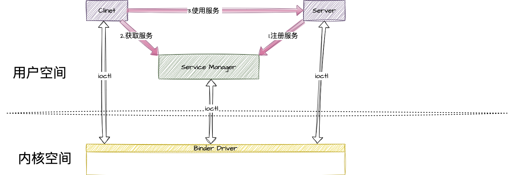
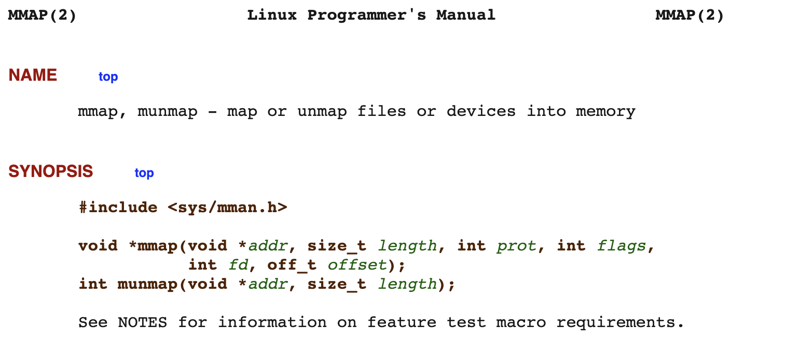

# binder
Binder 是什么？看了很多的文章，总是不出意外的陷入源码地狱，跳来跳去就迷失其中了。但是binder作为一种ipc机制应该是可以独立于这些源码之中的。那本菜鸟就将binder代码提纯，来领略清纯Binder的风采。

[可参考的binder代码，但是这里的代码是针对6.0 版本的](https://raw.githubusercontent.com/gburca/BinderDemo/master/binder.cpp)

## 从使用说明开始

这是张很经典的图，我们就从这张图开始说起。

### 第一步，注册服务
```c++
// 获取ServiceManager,然后添加服务，服务名称为demo
defaultServiceManager()->addService(String16("Demo"), new Demo(), false);
```
```c++
// 服务详情
class Demo : public BnDemo { 
    virtual int32_t add(int32_t v1, int32_t v2) {
        INFO("Demo::add(%i, %i)", v1, v2);
        return v1 + v2;
    }
};

```
### 第二步，获取服务
```c++
// 获取ServiceManager
sp<IServiceManager> sm = defaultServiceManager(); 
// 根据名称获取服务
sp<IBinder> binder = sm->getService(String16("Demo")); 
// 强制转化 为 IDemo 的 binder对象
sp<IDemo> demo = interface_cast<IDemo>(binder);  
```

### 第三步，使用服务
```c++
// 调用远程服务
int32_t sum = demo->add(3, 5);
```

是不是很简单，接下来我们就来一步一步的分享其中的奥秘。

## 如何获取到的ServiceManager？
[IServiceManager.cpp](http://aospxref.com/android-7.1.2_r39/xref/frameworks/native/libs/binder/IServiceManager.cpp?r=&mo=934&fi=33#33)
```c++
sp<IServiceManager> defaultServiceManager()
{
    if (gDefaultServiceManager != NULL) return gDefaultServiceManager;
    {
        // 加锁
        AutoMutex _l(gDefaultServiceManagerLock);
        while (gDefaultServiceManager == NULL) {
            // interface_cast 强制转化
            // ProcessState::self() 打开binder设备
            // getContextObject(NULL) 获取handle为0的binder对象 也就是ServiceManager
            gDefaultServiceManager = interface_cast<IServiceManager>(
                ProcessState::self()->getContextObject(NULL));
            if (gDefaultServiceManager == NULL)
                sleep(1);
        }
    }
    return gDefaultServiceManager;
}
```
这里留下两个疑问：
- `ProcessState::self()` 内部打开Binder设备的具体逻辑？  
- `getContextObject(NULL)` 如何就能获取到ServiceManager？

我们稍后分析。

不过，我们还是可以总结一下： 如何获取到的ServiceManager？
打开binder设备的0号服务，这个服务就是ServiceManager。

> 形象的比喻就是ip 为 `8.8.8.8`的服务器 他就是Google的dns服务器，写死了的！你可以在代码里hardcode的那种。  
在我们的binder机制里，binder驱动就是浏览器，`ip` 为0 他就是servicemanager，写死了的！google已经hardcode了的那种。  

## 如何注册服务？
```c++
// frameworks/native/libs/binder/IServiceManager.cpp#139 
virtual status_t addService(const String16& name, const sp<IBinder>& service, bool allowIsolated)
{
    Parcel data, reply;
    data.writeInterfaceToken(IServiceManager::getInterfaceDescriptor());
    // name 就是 demo，相当于我们的服务的域名
    data.writeString16(name);
    // 我们的服务 具体内容
    data.writeStrongBinder(service);
    // 暂时不知道是个啥，先跳过
    data.writeInt32(allowIsolated ? 1 : 0);
    // 向服务器发起请求
    status_t err = remote()->transact(ADD_SERVICE_TRANSACTION, data, &reply);
    // 得到结果
    return err == NO_ERROR ? reply.readExceptionCode() : err;
}
```

这里我们有留下了两个疑问：
- `IServiceManager::getInterfaceDescriptor()` 这是个啥？ 
- `remote()` 如何就是 service manager的binder对象了？

不过，我们还是可以总结一下： 如何添加服务？  
将我们的服务binder写入Parcel，然后传输给 ServiceManager进程。

> 再形象的比喻一下，ServiceManager这就是相当于阿里云，你在后台弄了一台云服务器，将这台服务器绑上域名，ip具体多少无所谓了，只有阿里云才会关心ip。  
`域名`就是我们的name`demo`。  
`服务器内容` 就是我们的`Demo()`。  
`ip` servicemanager内部的handle，who care。

## 如何获取服务?
```c++
// frameworks/native/libs/binder/IServiceManager.cpp#162
virtual sp<IBinder> getService(const String16& name) const
{
    // 循环五遍去检查服务？先跳过。
    unsigned n;
    for (n = 0; n < 5; n++){
        if (n > 0) {
            ALOGI("Waiting for service %s...", String8(name).string());
            sleep(1);
        }
        sp<IBinder> svc = checkService(name);
        if (svc != NULL) return svc;
    }
    return NULL;
}
virtual sp<IBinder> checkService( const String16& name) const
{
    Parcel data, reply;
    data.writeInterfaceToken(IServiceManager::getInterfaceDescriptor());
    data.writeString16(name);
    // CHECK_SERVICE_TRANSACTION 检查服务，然后大脑服务器
    remote()->transact(CHECK_SERVICE_TRANSACTION, data, &reply);
    return reply.readStrongBinder();
}
```
> 来吧！开始形象的比喻，这里就是用域名`demo`找serverManager 要我们的具体服务内容。然后SM给我们回了一个binder，就是我们的服务的远程代理。

## 如何使用服务？ 
> 如何使用服务？不用说，`mote()->transact` 对吧？不信你看！
```c++
virtual int32_t add(int32_t v1, int32_t v2) {
    Parcel data, reply;
    data.writeInterfaceToken(IDemo::getInterfaceDescriptor());
    data.writeInt32(v1);
    data.writeInt32(v2);
    aout << "BpDemo::add parcel to be sent:\n";
    data.print(PLOG); endl(PLOG);
    remote()->transact(ADD, data, &reply);
    ALOGD("BpDemo::add transact reply");
    reply.print(PLOG); endl(PLOG);

    int32_t res;
    status_t status = reply.readInt32(&res);
    ALOGD("BpDemo::add(%i, %i) = %i (status: %i)", v1, v2, res, status);
    return res;
}
```
`remote()`，`remote()`，又是 `remote()`！看来不看下`remote`里面是个啥是不行了！
## remote()->transact
```c++
// frameworks/native/include/binder/Binder.h#mRemote
class BpRefBase : public virtual RefBase
{
protected: 
    inline  IBinder*        remote()                { return mRemote; }
    inline  IBinder*        remote() const          { return mRemote; } 
private:  
    IBinder* const          mRemote; 
};
```
研究进入深水区，怎么就出现一个BpRefBase？
```c++
// frameworks/native/libs/binder/Binder.cpp#264
// 看构造函数，mRemote 就是传入的 sp<IBinder> 去get获取到的。
// 回到我们的demo。不卖关子关键就在这里 sp<IDemo> demo = interface_cast<IDemo>(binder); 
BpRefBase::BpRefBase(const sp<IBinder>& o)
    : mRemote(o.get()), mRefs(NULL), mState(0)
{
    if (mRemote) {
        mRemote->incStrong(this);           // Removed on first IncStrong().
        mRefs = mRemote->createWeak(this);  // Held for our entire lifetime.
    }
}
```
`sp<IDemo> demo = interface_cast<IDemo>(binder); `  
remote 就是这个binder，而这个binder就是 servicemanager的bidner对象。

那么大的来了，
```c++
remote()->transact(ADD, data, &reply);
```
这里面是怎么处理的？
从上面我们已知，`remote()` => `BnInterface<IDemo>` => `BBinder`
```c++
// frameworks/native/libs/binder/Binder.cpp#115
status_t BBinder::transact(
    uint32_t code, const Parcel& data, Parcel* reply, uint32_t flags)
{
    data.setDataPosition(0);

    status_t err = NO_ERROR;
    switch (code) {
        case PING_TRANSACTION:
            reply->writeInt32(pingBinder());
            break;
        default:
            err = onTransact(code, data, reply, flags);
            break;
    }

    if (reply != NULL) {
        reply->setDataPosition(0);
    }

    return err;
}
```
只是简单的将值传过来了，在我们的例子中 就是走到了这。
```c++

status_t BnDemo::onTransact(uint32_t code, const Parcel& data, Parcel* reply, uint32_t flags) {
    ALOGD("BnDemo::onTransact(%i) %i", code, flags);
    data.checkInterface(this);
    data.print(PLOG); endl(PLOG);

    switch(code) {
        case ADD: {
            int32_t inV1 = data.readInt32();
            int32_t inV2 = data.readInt32();
            int32_t sum = add(inV1, inV2);
            ALOGD("BnDemo::onTransact add(%i, %i) = %i", inV1, inV2, sum);
            ASSERT(reply != 0);
            reply->print(PLOG); endl(PLOG);
            reply->writeInt32(sum);
            return NO_ERROR;
        } break;
        default:
            return BBinder::onTransact(code, data, reply, flags);
    }
}
```

整体流程已经走完，那么就要追求一些细节。

接下来两步最关键：

## ProcessState::self()
[源码](http://aospxref.com/android-7.1.2_r39/xref/frameworks/native/libs/binder/ProcessState.cpp)
```c++
// frameworks/native/libs/binder/ProcessState.cpp
sp<ProcessState> ProcessState::self()
{
    Mutex::Autolock _l(gProcessMutex);
    if (gProcess != NULL) {
        return gProcess;
    }
    gProcess = new ProcessState;
    return gProcess;
}

ProcessState::ProcessState()
    : mDriverFD(open_driver())
    , mVMStart(MAP_FAILED)
    , mThreadCountLock(PTHREAD_MUTEX_INITIALIZER)
    , mThreadCountDecrement(PTHREAD_COND_INITIALIZER)
    , mExecutingThreadsCount(0)
    , mMaxThreads(DEFAULT_MAX_BINDER_THREADS)
    , mStarvationStartTimeMs(0)
    , mManagesContexts(false)
    , mBinderContextCheckFunc(NULL)
    , mBinderContextUserData(NULL)
    , mThreadPoolStarted(false)
    , mThreadPoolSeq(1)
{
    // 打开binder驱动，失败了 mDriverFD 设置为-1
    if (mDriverFD >= 0) {
        // mmap the binder, providing a chunk of virtual address space to receive transactions.
        // 映射一块地址，映射失败？gg
        // 但是这里我崩出了一个疑问，客户端不是将内容拷贝到内科空间嘛，为什么要mmap？留下这个疑惑！之后再讨论。
        mVMStart = mmap(0, BINDER_VM_SIZE, PROT_READ, MAP_PRIVATE | MAP_NORESERVE, mDriverFD, 0);
        if (mVMStart == MAP_FAILED) {
            // *sigh*
            ALOGE("Using /dev/binder failed: unable to mmap transaction memory.\n");
            close(mDriverFD);
            mDriverFD = -1;
        }
    }

    LOG_ALWAYS_FATAL_IF(mDriverFD < 0, "Binder driver could not be opened.  Terminating.");
}
```
### mDriverFD(open_driver())
```c++
static int open_driver()
{
    // 打开binder这个驱动，大于等于0 成功，小于0 gg。
    int fd = open("/dev/binder", O_RDWR | O_CLOEXEC);
    if (fd >= 0) {
        int vers = 0;
        // 获取binder版本号，如果获取不到说明binder不通，gg
        status_t result = ioctl(fd, BINDER_VERSION, &vers);
        if (result == -1) {
            ALOGE("Binder ioctl to obtain version failed: %s", strerror(errno));
            close(fd);
            fd = -1;
        }
        // 版本号不对，也gg
        if (result != 0 || vers != BINDER_CURRENT_PROTOCOL_VERSION) {
            ALOGE("Binder driver protocol does not match user space protocol!");
            close(fd);
            fd = -1;
        }
        // 设置服务端最大线程数 DEFAULT_MAX_BINDER_THREADS 为15
        size_t maxThreads = DEFAULT_MAX_BINDER_THREADS;
        result = ioctl(fd, BINDER_SET_MAX_THREADS, &maxThreads);
        if (result == -1) {
            ALOGE("Binder ioctl to set max threads failed: %s", strerror(errno));
        }
        // 如果设置失败 拉倒
    } else {
        ALOGW("Opening '/dev/binder' failed: %s\n", strerror(errno));
    }
    return fd;
}
```
### mmap(0, BINDER_VM_SIZE, PROT_READ, MAP_PRIVATE | MAP_NORESERVE, mDriverFD, 0);
[官方解释](https://man7.org/linux/man-pages/man2/mmap.2.html)  



## getContextObject(NULL)


## 客户端不是将内容拷贝到内科空间嘛，为什么要mmap？


## 参考资料
- []()
- []()

## [源代码](https://raw.githubusercontent.com/gburca/BinderDemo/master/binder.cpp)
```c++
// https://raw.githubusercontent.com/gburca/BinderDemo/master/binder.cpp
/*
 * Author: Gabriel Burca <gburca dash binder at ebixio dot com>
 *
 * Sample code for using binders in Android from C++
 *
 * The Demo service provides 3 operations: push(), alert(), add(). See
 * the IDemo class documentation to see what they do.
 *
 * Both the server and client code are included below.
 *
 * To view the log output:
 *      adb logcat -v time binder_demo:* *:S
 *
 * To run, create 2 adb shell sessions. In the first one run "binder" with no
 * arguments to start the service. In the second one run "binder N" where N is
 * an integer, to start a client that connects to the service and calls push(N),
 * alert(), and add(N, 5).
 */

#define LOG_TAG "binder_demo"

/* For relevant code see:
    frameworks/native/{include,libs}/binder/{IInterface,Parcel}.{h,cpp}
    system/core/include/utils/{Errors,RefBase}.h
 */

#include <stdlib.h>

#include <utils/RefBase.h>
#include <utils/Log.h>
#include <binder/TextOutput.h>

#include <binder/IInterface.h>
#include <binder/IBinder.h>
#include <binder/ProcessState.h>
#include <binder/IServiceManager.h>
#include <binder/IPCThreadState.h>

using namespace android;


#define INFO(...) \
    do { \
        printf(__VA_ARGS__); \
        printf("\n"); \
        ALOGD(__VA_ARGS__); \
    } while(0)

void assert_fail(const char *file, int line, const char *func, const char *expr) {
    INFO("assertion failed at file %s, line %d, function %s:",
            file, line, func);
    INFO("%s", expr);
    abort();
}

#define ASSERT(e) \
    do { \
        if (!(e)) \
            assert_fail(__FILE__, __LINE__, __func__, #e); \
    } while(0)


// Where to print the parcel contents: aout, alog, aerr. alog doesn't seem to work.
#define PLOG aout


// Interface (our AIDL) - Shared by server and client
class IDemo : public IInterface {
    public:
        enum {
            ALERT = IBinder::FIRST_CALL_TRANSACTION,
            PUSH,
            ADD
        };
        // Sends a user-provided value to the service
        virtual void        push(int32_t data)          = 0;
        // Sends a fixed alert string to the service
        virtual void        alert()                     = 0;
        // Requests the service to perform an addition and return the result
        virtual int32_t     add(int32_t v1, int32_t v2) = 0;

        DECLARE_META_INTERFACE(Demo);  // Expands to 5 lines below:
        //static const android::String16 descriptor;
        //static android::sp<IDemo> asInterface(const android::sp<android::IBinder>& obj);
        //virtual const android::String16& getInterfaceDescriptor() const;
        //IDemo();
        //virtual ~IDemo();
};

// Client
class BpDemo : public BpInterface<IDemo> {
    public:
        BpDemo(const sp<IBinder>& impl) : BpInterface<IDemo>(impl) {
            ALOGD("BpDemo::BpDemo()");
        }

        virtual void push(int32_t push_data) {
            Parcel data, reply;
            data.writeInterfaceToken(IDemo::getInterfaceDescriptor());
            data.writeInt32(push_data);

            aout << "BpDemo::push parcel to be sent:\n";
            data.print(PLOG); endl(PLOG);

            remote()->transact(PUSH, data, &reply);

            aout << "BpDemo::push parcel reply:\n";
            reply.print(PLOG); endl(PLOG);

            ALOGD("BpDemo::push(%i)", push_data);
        }

        virtual void alert() {
            Parcel data, reply;
            data.writeInterfaceToken(IDemo::getInterfaceDescriptor());
            data.writeString16(String16("The alert string"));
            remote()->transact(ALERT, data, &reply, IBinder::FLAG_ONEWAY);    // asynchronous call
            ALOGD("BpDemo::alert()");
        }

        virtual int32_t add(int32_t v1, int32_t v2) {
            Parcel data, reply;
            data.writeInterfaceToken(IDemo::getInterfaceDescriptor());
            data.writeInt32(v1);
            data.writeInt32(v2);
            aout << "BpDemo::add parcel to be sent:\n";
            data.print(PLOG); endl(PLOG);
            remote()->transact(ADD, data, &reply);
            ALOGD("BpDemo::add transact reply");
            reply.print(PLOG); endl(PLOG);

            int32_t res;
            status_t status = reply.readInt32(&res);
            ALOGD("BpDemo::add(%i, %i) = %i (status: %i)", v1, v2, res, status);
            return res;
        }
};

    //IMPLEMENT_META_INTERFACE(Demo, "Demo");
    // Macro above expands to code below. Doing it by hand so we can log ctor and destructor calls.
    const android::String16 IDemo::descriptor("Demo");
    const android::String16& IDemo::getInterfaceDescriptor() const {
        return IDemo::descriptor;
    }
    android::sp<IDemo> IDemo::asInterface(const android::sp<android::IBinder>& obj) {
        android::sp<IDemo> intr;
        if (obj != NULL) {
            intr = static_cast<IDemo*>(obj->queryLocalInterface(IDemo::descriptor).get());
            if (intr == NULL) {
                intr = new BpDemo(obj);
            }
        }
        return intr;
    }
    IDemo::IDemo() { ALOGD("IDemo::IDemo()"); }
    IDemo::~IDemo() { ALOGD("IDemo::~IDemo()"); }
    // End of macro expansion

// Server
class BnDemo : public BnInterface<IDemo> {
    virtual status_t onTransact(uint32_t code, const Parcel& data, Parcel* reply, uint32_t flags = 0);
};

status_t BnDemo::onTransact(uint32_t code, const Parcel& data, Parcel* reply, uint32_t flags) {
    ALOGD("BnDemo::onTransact(%i) %i", code, flags);
    data.checkInterface(this);
    data.print(PLOG); endl(PLOG);

    switch(code) {
        case ALERT: {
            alert();    // Ignoring the fixed alert string
            return NO_ERROR;
        } break;
        case PUSH: {
            int32_t inData = data.readInt32();
            ALOGD("BnDemo::onTransact got %i", inData);
            push(inData);
            ASSERT(reply != 0);
            reply->print(PLOG); endl(PLOG);
            return NO_ERROR;
        } break;
        case ADD: {
            int32_t inV1 = data.readInt32();
            int32_t inV2 = data.readInt32();
            int32_t sum = add(inV1, inV2);
            ALOGD("BnDemo::onTransact add(%i, %i) = %i", inV1, inV2, sum);
            ASSERT(reply != 0);
            reply->print(PLOG); endl(PLOG);
            reply->writeInt32(sum);
            return NO_ERROR;
        } break;
        default:
            return BBinder::onTransact(code, data, reply, flags);
    }
}

class Demo : public BnDemo {
    virtual void push(int32_t data) {
        INFO("Demo::push(%i)", data);
    }
    virtual void alert() {
        INFO("Demo::alert()");
    }
    virtual int32_t add(int32_t v1, int32_t v2) {
        INFO("Demo::add(%i, %i)", v1, v2);
        return v1 + v2;
    }
};


// Helper function to get a hold of the "Demo" service.
sp<IDemo> getDemoServ() {
    sp<IServiceManager> sm = defaultServiceManager();
    ASSERT(sm != 0);
    sp<IBinder> binder = sm->getService(String16("Demo"));
    // TODO: If the "Demo" service is not running, getService times out and binder == 0.
    ASSERT(binder != 0);
    sp<IDemo> demo = interface_cast<IDemo>(binder);
    ASSERT(demo != 0);
    return demo;
}


int main(int argc, char **argv) {

    if (argc == 1) {
        ALOGD("We're the service");

        defaultServiceManager()->addService(String16("Demo"), new Demo());
        android::ProcessState::self()->startThreadPool();
        ALOGD("Demo service is now ready");
        IPCThreadState::self()->joinThreadPool();
        ALOGD("Demo service thread joined");
    } else if (argc == 2) {
        INFO("We're the client: %s", argv[1]);

        int v = atoi(argv[1]);

        sp<IDemo> demo = getDemoServ();
        demo->alert();
        demo->push(v);
        const int32_t adder = 5;
        int32_t sum = demo->add(v, adder);
        ALOGD("Addition result: %i + %i = %i", v, adder, sum);
    }

    return 0;
}

/*
    Single-threaded service, single-threaded client.
 */
```