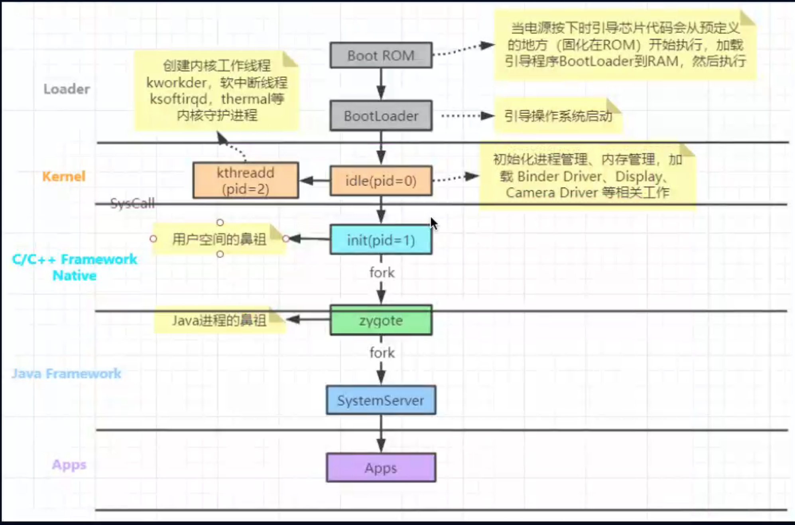
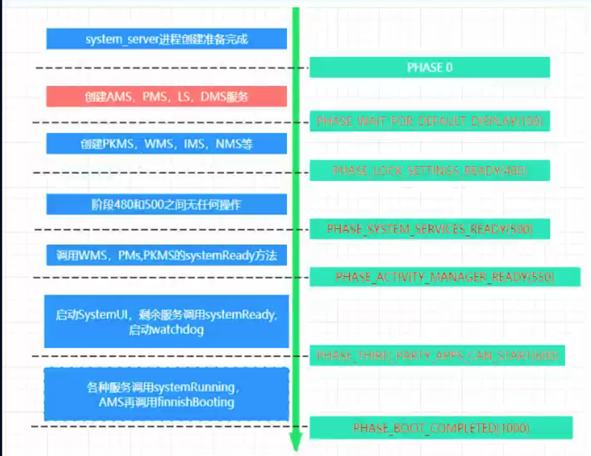

# 系统启动流程



## Boot Rom:  
    嵌入处理器芯片的一小段rom，是设备开机后执行的第一段代码。
## bootloader:  
    在内核kernel启动之前的一段加载程序，为启动操作系统内核做好准备。
## kernel：  
    内核启动的第一个进场为idle进程。是kthreadd进程和init进程的父进程。
    kthreadd进程是内核空间所有进程的鼻祖。
## init：  
    设置环境  
    解析init_xxx.rc 启动各种rc  
    启动zygote
```c++
// http://androidxref.com/9.0.0_r3/xref/system/core/init/init.cpp

int main(int argc, char** argv) {
   
    ...
    // 如果是初始化第一阶段，则需要执行下面的步骤1
    if (is_first_stage) {
        ...

        // 清理umask
        umask(0);

        ...

        // 1、创建和挂载启动所需的文件目录
        mount("tmpfs", "/dev", "tmpfs", MS_NOSUID, "mode=0755");
        mkdir("/dev/pts", 0755);
        mkdir("/dev/socket", 0755);
        mount("devpts", "/dev/pts", "devpts", 0, NULL);
        #define MAKE_STR(x) __STRING(x)
        mount("proc", "/proc", "proc", 0, "hidepid=2,gid=" MAKE_STR(AID_READPROC));
        ...

        // 初识化Kernel的Log，获取外界的Kernel日志
        InitKernelLogging(argv);

        ...
    }

    // 初识化Kernel的Log，获取外界的Kernel日志
    InitKernelLogging(argv);

    ...

    // 2、初始化属性相关资源
    property_init();

    ...

    // 创建epoll句柄
    epoll_fd = epoll_createl(EPOLL_CLOEXEC);
    ...

    // 3、设置子信号处理函数
    sigchld_handler_init();

    // 导入默认的环境变量
    property_load_boot_defaults();

    // 4、启动属性服务
    start_property_service();
    set_usb_controller();

    ...

    // 加载引导脚本
    LoadBootScripts(am, sm);

    ...   
    while (true) {

        ...

        if (!(waiting_for_prop || Service::is_exec_service_running())) {
            // 内部会偏离执行每个action中携带的command对应的执行函数
            am.ExecuteOneCommand();

        }
        if (!(waiting_for_prop || Service::is_exec_service_running())) {
            if (!shutting_down) {
                // 重启死去的子进程
                auto next_process_restart_time = RestartProcesses();

                ...
            }

            // If there's more work to do, wake up again immediately.
            if (am.HasMoreCommands()) epoll_timeout_ms = 0;
        }
        epoll_event ev;
        int nr = TEMP_FAILURE_RETRY(epoll_wait(epoll_fd, &ev, 1, epoll_timeout_ms));
        if (nr == -1) {
            PLOG(ERROR) << "epoll_wait failed";
        } else if (nr == 1) {
            ((void (*)()) ev.data.ptr)();
        }
    }

    return 0;
}
```
## zygote
```rc
// http://androidxref.com/9.0.0_r3/xref/system/core/rootdir/init.zygote64_32.rc
service zygote /system/bin/app_process64 -Xzygote /system/bin --zygote --start-system-server --socket-name=zygote
    class main
    priority -20
    user root
    group root readproc reserved_disk
    socket zygote stream 660 root system
    onrestart write /sys/android_power/request_state wake
    onrestart write /sys/power/state on
    onrestart restart audioserver
    onrestart restart cameraserver
    onrestart restart media
    onrestart restart netd
    onrestart restart wificond
    writepid /dev/cpuset/foreground/tasks

service zygote_secondary /system/bin/app_process32 -Xzygote /system/bin --zygote --socket-name=zygote_secondary --enable-lazy-preload
    class main
    priority -20
    user root
    group root readproc reserved_disk
    socket zygote_secondary stream 660 root system
    onrestart restart zygote
    writepid /dev/cpuset/foreground/tasks
```
启动app_process64, 传递的参数为 `-Xzygote /system/bin --zygote --start-system-server --socket-name=zygote`
```c++
// http://androidxref.com/9.0.0_r3/xref/frameworks/base/cmds/app_process/app_main.cpp
// -Xzygote /system/bin --zygote --start-system-server --socket-name=zygote
int main(int argc, char* const argv[])
{ 
    AppRuntime runtime(argv[0], computeArgBlockSize(argc, argv));

    ... 
 
    while (i < argc) {
        const char* arg = argv[i++];
        if (strcmp(arg, "--zygote") == 0) {
            zygote = true;
            niceName = ZYGOTE_NICE_NAME;
        } else if (strcmp(arg, "--start-system-server") == 0) {
            startSystemServer = true;
        } else if (strcmp(arg, "--application") == 0) {
            application = true;
        } else if (strncmp(arg, "--nice-name=", 12) == 0) {
            niceName.setTo(arg + 12);
        } else if (strncmp(arg, "--", 2) != 0) {
            className.setTo(arg);
            break;
        } else {
            --i;
            break;
        }
    }
 
    ...

    if (zygote) {
        runtime.start("com.android.internal.os.ZygoteInit", args, zygote);
    } else if (className) {
        runtime.start("com.android.internal.os.RuntimeInit", args, zygote);
    } else {
        fprintf(stderr, "Error: no class name or --zygote supplied.\n");
        app_usage();
        LOG_ALWAYS_FATAL("app_process: no class name or --zygote supplied.");
    }
}
```
调用AppRuntime的start方法，先看AppRuntime的start方法。（AndroidRuntime是appRuntime的父类）
```c++
// http://androidxref.com/9.0.0_r3/xref/frameworks/base/core/jni/AndroidRuntime.cpp
void AndroidRuntime::start(const char* className, const Vector<String8>& options, bool zygote)
{ 
    static const String8 startSystemServer("start-system-server");
    ...
    // 加载libart.so 
    JniInvocation jni_invocation;
    jni_invocation.Init(NULL);
    JNIEnv* env;
    // 创建Java VM
    if (startVm(&mJavaVM, &env, zygote) != 0) {
        return;
    }
    onVmCreated(env);
    /*
     * 注册Android的各种native方法
     */
    if (startReg(env) < 0) {
        ALOGE("Unable to register all android natives\n");
        return;
    }
    // 篇幅所限，省略准备参数的代码
    ...
    /* 
     * 启动ZygoteInit.java的main方法
     */
    char* slashClassName = toSlashClassName(className != NULL ? className : "");
    jclass startClass = env->FindClass(slashClassName);
    if (startClass == NULL) { 
        // 直接结束
    } else {
        jmethodID startMeth = env->GetStaticMethodID(startClass, "main",
            "([Ljava/lang/String;)V");
        if (startMeth == NULL) { 
        // 直接结束
        } else {
            // 调用ZygoteInit::main
            env->CallStaticVoidMethod(startClass, startMeth, strArray);
    // zygote 正常情况下不会允许到这，除非关机，或者crash 
    ...
}
```
最后启动`ZygoteInit.java`
```java
// http://androidxref.com/9.0.0_r3/xref/frameworks/base/core/java/com/android/internal/os/ZygoteInit.java
public static void main(String argv[]) {
    // 启动 localsocket
    ZygoteServer zygoteServer = new ZygoteServer();
    ...
    try {
        ...
        if (startSystemServer) {
            //  fork system server 的进程
            Runnable r = forkSystemServer(abiList, socketName, zygoteServer);
            if (r != null) {
                // 如果是父进程为空，如果是子进程systemserver进程这是 SystemServer::main
                r.run();
                return;
            }
        }
        // 等待ams发起的fork子进程的动作
        caller = zygoteServer.runSelectLoop(abiList);
        // 当runSelectLoop 执行成功获取到caller之后，就是在子进程当中，也就是app进程
    } catch (Throwable ex) {
        Log.e(TAG, "System zygote died with exception", ex);
        throw ex;
    } finally {
        // 关闭当前子进程也就是app进程的zygote socket
        zygoteServer.closeServerSocket();
    }
    //执行接下来的子进程的所需的内容
    if (caller != null) {
        caller.run();
    }
}

```
## forkSystemServer
```java
// http://androidxref.com/9.0.0_r3/xref/frameworks/base/core/java/com/android/internal/os/ZygoteInit.java#forkSystemServer
private static Runnable forkSystemServer(String abiList, String socketName, ZygoteServer zygoteServer) {
     ...
    String args[] = {
        "--setuid=1000",
        "--setgid=1000", 
        ...
        "com.android.server.SystemServer",
    }; 
   

    try { 
        /* 调用 native 代码去fork 进程 */
        pid = Zygote.forkSystemServer(
                parsedArgs.uid, parsedArgs.gid,
                parsedArgs.gids,
                parsedArgs.runtimeFlags,
                null,
                parsedArgs.permittedCapabilities,
                parsedArgs.effectiveCapabilities);
    } catch (IllegalArgumentException ex) {
        throw new RuntimeException(ex);
    }
    if (pid == 0) {
        // 子进程SystemServer 进程
        zygoteServer.closeServerSocket();
        return handleSystemServerProcess(parsedArgs);
    }
    return null;
}

``` 

fork的“写时拷贝” copy on write 技术：linux 中 每个进程都会有自己的虚拟地址，而父进程和子进程虽然虚拟地址不同，但是指向的却是同一个物理地址。只有当父或子进程对内存进行修改时，才会 拷贝一份对应的父进程的内容给子进程单独所有。


再来查看`handleSystemServerProcess`
```java
// http://androidxref.com/9.0.0_r3/xref/frameworks/base/core/java/com/android/internal/os/ZygoteInit.java#handleSystemServerProcess
private static Runnable handleSystemServerProcess(ZygoteConnection.Arguments parsedArgs) {

    if (parsedArgs.niceName != null) {
        // 设置 进程名称为 SystemServer
        Process.setArgV0(parsedArgs.niceName);
    }

    final String systemServerClasspath = Os.getenv("SYSTEMSERVERCLASSPATH");
    if (systemServerClasspath != null) {
        // 加载一些 SystemServer需要的jar并且使用dexopt 优化
        performSystemServerDexOpt(systemServerClasspath);
        ...
    }

    if (parsedArgs.invokeWith != null) {
        // systemserver启动不进入这里
        ...
    } else {
        // 创建classloader
        ClassLoader cl = null;
        if (systemServerClasspath != null) {
            cl = createPathClassLoader(systemServerClasspath, parsedArgs.targetSdkVersion);

            Thread.currentThread().setContextClassLoader(cl);
        }
 
        return ZygoteInit.zygoteInit(parsedArgs.targetSdkVersion, parsedArgs.remainingArgs, cl);
    }
    /* should never reach here */
}
```
进入`ZygoteInit::zygoteInit`方法
```java
// http://androidxref.com/9.0.0_r3/xref/frameworks/base/core/java/com/android/internal/os/ZygoteInit.java#zygoteInit
public static final Runnable zygoteInit(int targetSdkVersion, String[] argv, ClassLoader classLoader) {
    ... 
    RuntimeInit.commonInit();
    ZygoteInit.nativeZygoteInit();
    return RuntimeInit.applicationInit(targetSdkVersion, argv, classLoader);
}
```
此处调用了三个方法
- [`RuntimeInit::commonInit`](http://androidxref.com/9.0.0_r3/xref/frameworks/base/core/java/com/android/internal/os/RuntimeInit.java)  
设置线程的 `uncaughtExceptionPreHandler`和`defaultUncaughtExceptionHandler`，以及log重置，http-agent等
- [`ZygoteInit::nativeZygoteInit`](http://androidxref.com/9.0.0_r3/xref/frameworks/base/core/jni/AndroidRuntime.cpp#com_android_internal_os_ZygoteInit_nativeZygoteInit)   
调用了`gCurRuntime->onZygoteInit` 查看[AppRuntime](http://androidxref.com/9.0.0_r3/xref/frameworks/base/cmds/app_process/app_main.cpp) 的代码
```c++
virtual void onZygoteInit()
{
    // 打开binder驱动
    sp<ProcessState> proc = ProcessState::self();
    // 启动binder线程池
    proc->startThreadPool();
}
```
- [`RuntimeInit::applicationInit`](http://androidxref.com/9.0.0_r3/xref/frameworks/base/core/java/com/android/internal/os/RuntimeInit.java#345)   
进入这段代码，返回的就是 `SystemServer::main` 的一个caller
```java
protected static Runnable applicationInit(int targetSdkVersion, String[] argv,
        ClassLoader classLoader) { 
    // 返回一个invoke SystemServer::main方法的runnable
    return findStaticMain(args.startClass, args.startArgs, classLoader);
}
```
## SystemServer
进入`SystemServer::main`.   
> SystemServer的主要功能就是启动各种服务。启动的顺序如下图所示

```java
// http://androidxref.com/9.0.0_r3/xref/frameworks/base/services/java/com/android/server/SystemServer.java
public static void main(String[] args) {
    new SystemServer().run();
}
private void run() {
    try {
        ... 
        // 循环
        Looper.prepareMainLooper(); 
        ...
        // 启动native的库
        System.loadLibrary("android_servers");
        ...
        // 创建system context
        createSystemContext();
        // 创建servicemanager
        mSystemServiceManager = new SystemServiceManager(mSystemContext);
        mSystemServiceManager.setStartInfo(mRuntimeRestart,
                mRuntimeStartElapsedTime, mRuntimeStartUptime);
        LocalServices.addService(SystemServiceManager.class, mSystemServiceManager);
        // 创建线程池
        SystemServerInitThreadPool.get(); 
    } 
    ...
    try { 
        // 启动引导服务。
        // Installer->DeviceIdentifiersPolicyService->AMS->PMS->重启系统服务->LightsService->DisplayManagerService->等待DMS完成
        // PKMS->OtaDexOptService->UserManagerService->startSensorService
        startBootstrapServices(); 

        // 启动核心服务。包括电量服务, WebViewUpdateService, BinderCallsStatsService
        startCoreServices(); 

        // 启动其他服务。
        // 
        startOtherServices(); 
    }  
    ...
    Looper.loop();
    throw new RuntimeException("Main thread loop unexpectedly exited");
}

```
我们来查看几个主要的service的启动顺序和相互持有关系。
- AWS ActivityManagerService，四大组件管理
- WMS WindowManagerService，窗口管理
- DMS DisplayManagerService，显示设备管理
- IMS InputManagerService 输入管理
- PKMS PackageManagerService 包管理
- PMS PowerManagerService 电量管理

我们来看相关代码摘抄

```java
// http://androidxref.com/9.0.0_r3/xref/frameworks/base/services/java/com/android/server/SystemServer.java
private void startBootstrapServices() { 
    ...
    mActivityManagerService = mSystemServiceManager.startService(
            ActivityManagerService.Lifecycle.class).getService();
    mActivityManagerService.setSystemServiceManager(mSystemServiceManager);
    mActivityManagerService.setInstaller(installer);
    ...

    mPowerManagerService = mSystemServiceManager.startService(PowerManagerService.class);
    mActivityManagerService.initPowerManagement();

    mDisplayManagerService = mSystemServiceManager.startService(DisplayManagerService.class);

    mPackageManagerService = PackageManagerService.main(mSystemContext, installer, mFactoryTestMode != FactoryTest.FACTORY_TEST_OFF, mOnlyCore);

    mActivityManagerService.setSystemProcess();

    mDisplayManagerService.setupSchedulerPolicies();


    ...

}
private void startOtherServices() {
    ...
    final Watchdog watchdog = Watchdog.getInstance();
    watchdog.init(context, mActivityManagerService);
    ...
    inputManager = new InputManagerService(context);
    wm = WindowManagerService.main(context, inputManager, mFactoryTestMode != FactoryTest.FACTORY_TEST_LOW_LEVEL, !mFirstBoot, mOnlyCore, new PhoneWindowManager());
    ServiceManager.addService(Context.WINDOW_SERVICE, wm, /* allowIsolated= */ false, DUMP_FLAG_PRIORITY_CRITICAL | DUMP_FLAG_PROTO);
    ServiceManager.addService(Context.INPUT_SERVICE, inputManager, /* allowIsolated= */ false, DUMP_FLAG_PRIORITY_CRITICAL);

    mActivityManagerService.setWindowManager(wm);
    
    wm.onInitReady();
    ...
    inputManager.setWindowManagerCallbacks(wm.getInputMonitor());
    inputManager.start();

    mDisplayManagerService.windowManagerAndInputReady();
    
    wm.displayReady();

    ...

    wm.systemReady();

    mPowerManagerService.systemReady(mActivityManagerService.getAppOpsService());

    mPackageManagerService.systemReady();

    mDisplayManagerService.systemReady(safeMode, mOnlyCore);

    mActivityManagerService.systemReady(() -> {
        ...
    })


}
```
总结：

AMS->PMS->DMS->PKMS->IMS->WMS  
ims::start->wm::displayready->pms::systemready->pkms::systemready->dms::systemready->ams::systemReady
