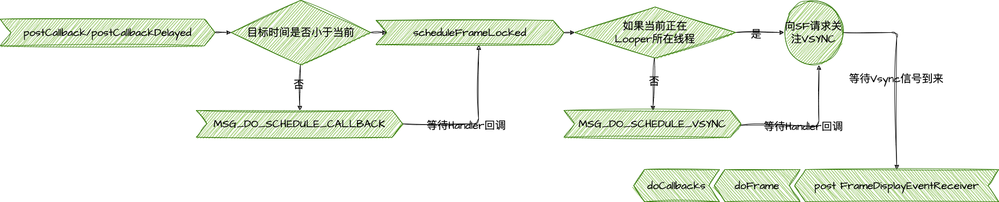
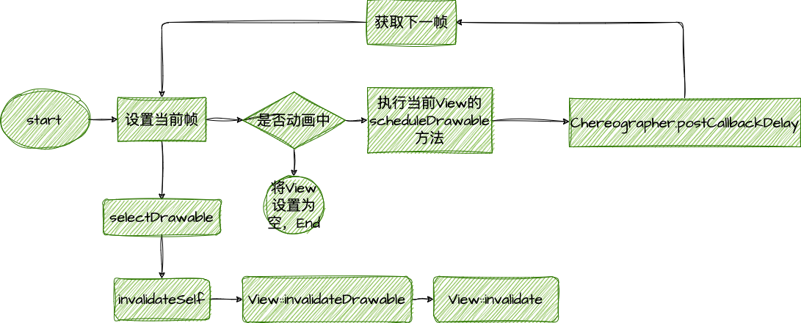
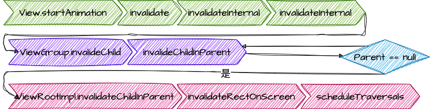
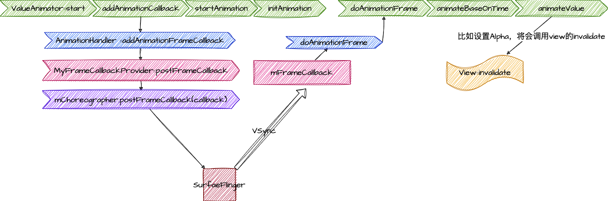

# Android Choreographer 原理
Choreographer负责编排 一个应用整体的ui表现。我们先来看整体的流程示意图


*总结：* 
- Choreographer：使用GPU或者CPU的绘制，是在VSync信号到来时才开始。在Choreographer创建的时候，会同SurfaceFlinger建立一个链接 [源码](http://aospxref.com/android-12.0.0_r3/xref/frameworks/base/core/jni/android_view_DisplayEventReceiver.cpp)。调用 postcallback之后，会发送requestNextSync，请求关注下一个Vsync
- 

## 源码解析 

### [Choreographer](http://aospxref.com/android-12.0.0_r3/xref/frameworks/base/core/java/android/view/Choreographer.java)  

```java
//Choreographer 
public final class Choreographer {
    public static final int VSYNC_SOURCE_APP = 0;
    // 使用ThreadLocal 来保存 choreographer，以确保主线程只有一份 chereographer
    private static final ThreadLocal<Choreographer> sThreadInstance =
            new ThreadLocal<Choreographer>() {
        @Override
        protected Choreographer initialValue() {
            Looper looper = Looper.myLooper();
            if (looper == null) {
                throw new IllegalStateException("The current thread must have a looper!");
            }
            Choreographer choreographer = new Choreographer(looper, VSYNC_SOURCE_APP);
            if (looper == Looper.getMainLooper()) {
                mMainInstance = choreographer;
            }
            return choreographer;
        }
    };
    public static Choreographer getInstance() {
        return sThreadInstance.get();
    }
    
    private Choreographer(Looper looper, int vsyncSource) {
        mLooper = looper;
        mHandler = new FrameHandler(looper);
        // USE_VSYNC 在4.0以后默认开启vsync
        mDisplayEventReceiver = USE_VSYNC
                ? new FrameDisplayEventReceiver(looper, vsyncSource)
                : null;
        mLastFrameTimeNanos = Long.MIN_VALUE;
        // getRefreshRate() ：获取默认屏幕的刷新瓶绿
        mFrameIntervalNanos = (long)(1000000000 / getRefreshRate());
        // 创建根据callback的数值创建CallbackQueue
        mCallbackQueues = new CallbackQueue[CALLBACK_LAST + 1];
        // 创建5条queue
        for (int i = 0; i <= CALLBACK_LAST; i++) {
            mCallbackQueues[i] = new CallbackQueue();
        }
    }
}
// 
```
#### CALLBACK
```java
public static final int CALLBACK_INPUT = 0; // 输入事件的callback，最紧急，需要最先运行。
public static final int CALLBACK_ANIMATION = 1; // 动画的callback，次于CALLBACK_INPUT 运行。
public static final int CALLBACK_INSETS_ANIMATION = 2; // inset window animation，由于输入事件和动画能影响此callback，所以位置排在这里。具体可以看这里（https://github.com/android/user-interface-samples/tree/master/WindowInsetsAnimation）
public static final int CALLBACK_TRAVERSAL = 3; // 刷新整个view树，在所有的异步方法最后执行。
public static final int CALLBACK_COMMIT = 4; // 在 其他提交的callback，在CALLBACK_TRAVERSAL之后执行。
```

### [FrameDisplayEventReceiver](http://aospxref.com/android-12.0.0_r3/xref/frameworks/base/core/java/android/view/Choreographer.java#973)
```java

private final class FrameDisplayEventReceiver extends DisplayEventReceiver
        implements Runnable { 
    private VsyncEventData mLastVsyncEventData = new VsyncEventData();

    public FrameDisplayEventReceiver(Looper looper, int vsyncSource) {
        super(looper, vsyncSource, 0);
    }
 
    // 收到vsync信号的回调
    @Override
    public void onVsync(long timestampNanos, long physicalDisplayId, int frame,
            VsyncEventData vsyncEventData) {
        try {
          
            long now = System.nanoTime();
            if (timestampNanos > now) { 
                timestampNanos = now;
            }

            if (!mHavePendingVsync) {  
                mHavePendingVsync = true;
            }

            mTimestampNanos = timestampNanos;
            mFrame = frame;
            mLastVsyncEventData = vsyncEventData;
            Message msg = Message.obtain(mHandler, this);
            msg.setAsynchronous(true);
            mHandler.sendMessageAtTime(msg, timestampNanos / TimeUtils.NANOS_PER_MS);
        } finally { 
        }
    }

    @Override
    public void run() {
        mHavePendingVsync = false;
        doFrame(mTimestampNanos, mFrame, mLastVsyncEventData);
    }
} 

```

### FrameHandler
```java
private final class FrameHandler extends Handler {
    public FrameHandler(Looper looper) {
        super(looper);
    }

    @Override
    public void handleMessage(Message msg) {
        switch (msg.what) {
            case MSG_DO_FRAME:
                doFrame(System.nanoTime(), 0, new DisplayEventReceiver.VsyncEventData());
                break;
            case MSG_DO_SCHEDULE_VSYNC:
                doScheduleVsync();
                break;
            case MSG_DO_SCHEDULE_CALLBACK:
                doScheduleCallback(msg.arg1);
                break;
        }
    }
}
```


## 动画原理
动画分为三种，帧动画、补间动画、属性动画。

### 帧动画 

主要类为 [AnimationDrawable](http://aospxref.com/android-12.0.0_r3/xref/frameworks/base/graphics/java/android/graphics/drawable/AnimationDrawable.java)。
```java
// frameworks/base/graphics/java/android/graphics/drawable/AnimationDrawable.java
public class AnimationDrawable extends DrawableContainer implements Runnable, Animatable {
    public void start() {
        mAnimating = true;
        if (!isRunning()) { 
            setFrame(0, false, mAnimationState.getChildCount() > 1
                    || !mAnimationState.mOneShot);
        }
    }
    // 设置当前帧
    private void setFrame(int frame, boolean unschedule, boolean animate) {
        if (frame >= mAnimationState.getChildCount()) {
            return;
        }
        mAnimating = animate;
        mCurFrame = frame;
        // 设置Drawable，最终会触发View的invalidate
        selectDrawable(frame);
        if (unschedule || animate) {
            unscheduleSelf(this);
        }
        // 如果在动画中，执行scheduleSelf 方法
        if (animate) { 
            mCurFrame = frame;
            mRunning = true;
            scheduleSelf(this, SystemClock.uptimeMillis() + mAnimationState.mDurations[frame]);
        }
    }
}
// frameworks/base/graphics/java/android/graphics/drawable/Drawable.java
public void scheduleSelf(@NonNull Runnable what, long when) {
    final Callback callback = getCallback();
    if (callback != null) {
        // callback 就是view，这里就是调用View的scheduleDrawable
        callback.scheduleDrawable(this, what, when);
    }
}
// frameworks/base/core/java/android/view/View.java
public void scheduleDrawable(@NonNull Drawable who, @NonNull Runnable what, long when) {
    // what 即为 AnimationDrawable 中的run
    if (verifyDrawable(who) && what != null) {
        final long delay = when - SystemClock.uptimeMillis();
        if (mAttachInfo != null) {
            // 执行Choreographer：：postCallbackDelayed 方法
            mAttachInfo.mViewRootImpl.mChoreographer.postCallbackDelayed(
                    Choreographer.CALLBACK_ANIMATION, what, who,
                    Choreographer.subtractFrameDelay(delay));
        } else { 
            getRunQueue().postDelayed(what, delay);
        }
    }
}
// frameworks/base/graphics/java/android/graphics/drawable/AnimationDrawable.java
// 等待 AnimationDrawable中的run被调用执行。
public void run() {
    // 获取下一帧
    nextFrame(false);
}    
private void nextFrame(boolean unschedule) {
    int nextFrame = mCurFrame + 1;
    final int numFrames = mAnimationState.getChildCount();
    final boolean isLastFrame = mAnimationState.mOneShot && nextFrame >= (numFrames - 1);
 
    if (!mAnimationState.mOneShot && nextFrame >= numFrames) {
        nextFrame = 0;
    }
    // 回到最开始的 setFrame，一个循环建立了
    setFrame(nextFrame, unschedule, !isLastFrame);
}
```
### 补间动画
   
```java
// frameworks/base/core/java/android/view/View.java
public void startAnimation(Animation animation) {
    ...
    invalidate(true);
}
public void invalidate(boolean invalidateCache) {
    invalidateInternal(0, 0, mRight - mLeft, mBottom - mTop, invalidateCache, true);
}
void invalidateInternal(int l, int t, int r, int b, boolean invalidateCache, boolean fullInvalidate) {
    ...
    final AttachInfo ai = mAttachInfo;
    final ViewParent p = mParent;
    if (p != null && ai != null && l < r && t < b) {
        final Rect damage = ai.mTmpInvalRect;
        damage.set(l, t, r, b);
        p.invalidateChild(this, damage);
    }
}
// frameworks/base/core/java/android/view/ViewGroup.java
public final void invalidateChild(View child, final Rect dirty) {
    final AttachInfo attachInfo = mAttachInfo;
    if (attachInfo != null) {
       do {
            // 一直往上找找到 viewrootImpl 调用ViewRootImpl的invalidateChildInParent方法
            // 依据当前的动画的进度，判断当前的ViewGroup会不会被污染。如何需要设置一个martix变化矩阵
            parent = parent.invalidateChildInParent(location, dirty);
            if (view != null) {
                // Account for transform on current parent
                Matrix m = view.getMatrix();
                if (!m.isIdentity()) {
                    RectF boundingRect = attachInfo.mTmpTransformRect;
                    boundingRect.set(dirty);
                    m.mapRect(boundingRect);
                    dirty.set((int) Math.floor(boundingRect.left),
                            (int) Math.floor(boundingRect.top),
                            (int) Math.ceil(boundingRect.right),
                            (int) Math.ceil(boundingRect.bottom));
                }
            }
        } while (parent != null);
    }
}
// frameworks/base/core/java/android/view/ViewRootImpl.java#invalidateChildInParent
public ViewParent invalidateChildInParent(int[] location, Rect dirty) {
    checkThread();
    /***部分代码省略***/
    invalidateRectOnScreen(dirty);
    return null;
}

private void invalidateRectOnScreen(Rect dirty) {
    /***部分代码省略***/
    if (!mWillDrawSoon && (intersected || mIsAnimating)) {
        //开始View的绘制任务
        scheduleTraversals();
    }
}
```
此处触发了viewrootimpl对于整个viewtree的重绘。  
但是对于补间动画，Android做了优化，他不会真正的调用子view的draw，而是在父或者父的父中，draw的时候使用transfrom做转化。  

```java
public class View implements Drawable.Callback, KeyEvent.Callback,
        AccessibilityEventSource {    
    //部分代码省略
    public void draw(Canvas canvas) {
        /***部分代码省略***/
        //如果有子 View(DecorView当然有子View)，就会调用dispatchDraw() 将绘制事件通知给子 View。
        //ViewGroup 重写了 dispatchDraw()，调用了 drawChild()
        //drawChild() 调用了子 View 的 draw(Canvas, ViewGroup, long)
    }
    boolean draw(Canvas canvas, ViewGroup parent, long drawingTime) {
        final boolean hardwareAcceleratedCanvas = canvas.isHardwareAccelerated();
        /***部分代码省略***/
        Transformation transformToApply = null;
        boolean concatMatrix = false;
        final boolean scalingRequired = mAttachInfo != null && mAttachInfo.mScalingRequired;
        final Animation a = getAnimation();
        if (a != null) {
            more = applyLegacyAnimation(parent, drawingTime, a, scalingRequired);
            concatMatrix = a.willChangeTransformationMatrix();
            if (concatMatrix) {
                mPrivateFlags3 |= PFLAG3_VIEW_IS_ANIMATING_TRANSFORM;
            }
            transformToApply = parent.getChildTransformation();
        } else {
            /***部分代码省略***/
        }
        /***部分代码省略***/
        // 动画数据应用在RenderNode或者Canvas上的!!!!
        if (transformToApply != null) {
            if (concatMatrix) {
                if (drawingWithRenderNode) {
                    // 应用动画数据
                    renderNode.setAnimationMatrix(transformToApply.getMatrix());
                } else {
                    canvas.translate(-transX, -transY);
                    // 应用动画数据
                    canvas.concat(transformToApply.getMatrix());
                    canvas.translate(transX, transY);
                }
                parent.mGroupFlags |= ViewGroup.FLAG_CLEAR_TRANSFORMATION;
            }
    
            float transformAlpha = transformToApply.getAlpha();
            if (transformAlpha < 1) {
                // 应用动画数据
                alpha *= transformAlpha;
                parent.mGroupFlags |= ViewGroup.FLAG_CLEAR_TRANSFORMATION;
            }
        }
    }

    private boolean applyLegacyAnimation(ViewGroup parent, long drawingTime,
            Animation a, boolean scalingRequired) {
        /***部分代码省略***/
        //绘制动画的当前帧，并获取当前动画的状态（是否继续运行）
        boolean more = a.getTransformation(drawingTime, t, 1f);
        if (scalingRequired && mAttachInfo.mApplicationScale != 1f) {
            if (parent.mInvalidationTransformation == null) {
                parent.mInvalidationTransformation = new Transformation();
            }
            invalidationTransform = parent.mInvalidationTransformation;
            a.getTransformation(drawingTime, invalidationTransform, 1f);
        } else {
            invalidationTransform = t;
        }
        //如果动画没有结果
        if (more) {
            if (!a.willChangeBounds()) {
                if ((flags & (ViewGroup.FLAG_OPTIMIZE_INVALIDATE | ViewGroup.FLAG_ANIMATION_DONE)) ==
                        ViewGroup.FLAG_OPTIMIZE_INVALIDATE) {
                    parent.mGroupFlags |= ViewGroup.FLAG_INVALIDATE_REQUIRED;
                } else if ((flags & ViewGroup.FLAG_INVALIDATE_REQUIRED) == 0) {
                    // The child need to draw an animation, potentially offscreen, so
                    // make sure we do not cancel invalidate requests
                    parent.mPrivateFlags |= PFLAG_DRAW_ANIMATION;
                    //进行绘制
                    parent.invalidate(mLeft, mTop, mRight, mBottom);
                }
            } else {
                /***部分代码省略***/
                //进行绘制
                parent.invalidate(left, top, left + (int) (region.width() + .5f),
                        top + (int) (region.height() + .5f));
            }
        }
        return more;
    }
}
```


**小结：**  
补间动画依赖于使用Transformation，而这个计算中只使用了martix和alpha两种变化。所以，补间动画只能实现Alpha，Scale，Translate，Rotate的动画效果。  
其原理是通过Choreographer post TraversalCallback来实现。

### 属性动画 [ValueAnimator](http://aospxref.com/android-12.0.0_r3/xref/frameworks/base/core/java/android/animation/ValueAnimator.java)


```java
// frameworks/base/core/java/android/animation/ValueAnimator.java
public void start() {
    start(false);
}
private void start(boolean playBackwards) {
    // 由于属性动画是利用Choreographer作为循环的支持，所以需要在此处要求使用 Looper线程，即主线程或者HandlerThread
    if (Looper.myLooper() == null) {
        throw new AndroidRuntimeException("Animators may only be run on Looper threads");
    } 
    /**忽略部分代码**/
    addAnimationCallback(0); 
    if (mStartDelay == 0 || mSeekFraction >= 0 || mReversing) { 
        /**忽略部分代码**/
        startAnimation(); 
        /**忽略部分代码**/
    }
}
private void addAnimationCallback(long delay) {
    /**忽略部分代码**/
    getAnimationHandler().addAnimationFrameCallback(this, delay);
}
private void startAnimation() {
    // 初始化属性属性设置器
    initAnimation();
}
void initAnimation() {
    if (!mInitialized) {
        int numValues = mValues.length;
        for (int i = 0; i < numValues; ++i) {
            mValues[i].init();
        }
        mInitialized = true;
    }
}
// frameworks/base/core/java/android/animation/AnimationHandler.java
private final Choreographer.FrameCallback mFrameCallback = new Choreographer.FrameCallback() {
    @Override
    public void doFrame(long frameTimeNanos) {
        // 执行AnimationHanlder内部的doAnimationFrame，最终会调用到View的doAnimationFrame
        doAnimationFrame(getProvider().getFrameTime());
        if (mAnimationCallbacks.size() > 0) {
            // 动画循环接力
            getProvider().postFrameCallback(this);
        }
    }
};
private AnimationFrameCallbackProvider getProvider() {
    if (mProvider == null) {
        mProvider = new MyFrameCallbackProvider();
    }
    return mProvider;
}
private class MyFrameCallbackProvider implements AnimationFrameCallbackProvider {
    final Choreographer mChoreographer = Choreographer.getInstance();
    @Override
    public void postFrameCallback(Choreographer.FrameCallback callback) {
        // 发送的callback类型为 CALLBACL_ANIMATION 
        mChoreographer.postFrameCallback(callback);
    }
}
public void addAnimationFrameCallback(final AnimationFrameCallback callback, long delay) {
    if (mAnimationCallbacks.size() == 0) {
        // 发送choreographer的callback，开始循环
        getProvider().postFrameCallback(mFrameCallback);
    }
    if (!mAnimationCallbacks.contains(callback)) {
        // callback等vsync到来，会循环执行该callback
        mAnimationCallbacks.add(callback);
    }
}
private void doAnimationFrame(long frameTime) {
    long currentTime = SystemClock.uptimeMillis();
    final int size = mAnimationCallbacks.size();
    for (int i = 0; i < size; i++) {
        final AnimationFrameCallback callback = mAnimationCallbacks.get(i);
        if (callback == null) {
            continue;
        }
        if (isCallbackDue(callback, currentTime)) {
            //  callback就是view
            callback.doAnimationFrame(frameTime);
            
        }
    }
    cleanUpList();
}
// frameworks/base/core/java/android/animation/ValueAnimator.java
public final boolean doAnimationFrame(long frameTime) {
    /**忽略部分代码**/
    final long currentTime = Math.max(frameTime, mStartTime);
    boolean finished = animateBasedOnTime(currentTime);
    return finished;
}
boolean animateBasedOnTime(long currentTime) {
    boolean done = false;
    if (mRunning) {
        /**忽略部分代码**/
        animateValue(currentIterationFraction);
    }
    return done;
}
void animateValue(float fraction) {
    // 应用差值器
    fraction = mInterpolator.getInterpolation(fraction);
    mCurrentFraction = fraction;
    int numValues = mValues.length;
    for (int i = 0; i < numValues; ++i) {
        // 计算修改属性值，该属性值如果不能调用到view.invalidate 动画也不会生效
        mValues[i].calculateValue(fraction);
    }
    if (mUpdateListeners != null) {
        int numListeners = mUpdateListeners.size();
        for (int i = 0; i < numListeners; ++i) {
            mUpdateListeners.get(i).onAnimationUpdate(this);
        }
    }
}
``` 

## 参考资料
- [choreographer](https://ljd1996.github.io/2020/09/07/Android-Choreographer%E5%8E%9F%E7%90%86/)
- [动画原理](https://www.jianshu.com/p/038472aff2d2)
- [属性动画概览](https://developer.android.com/guide/topics/graphics/prop-animation?hl=zh-cn)