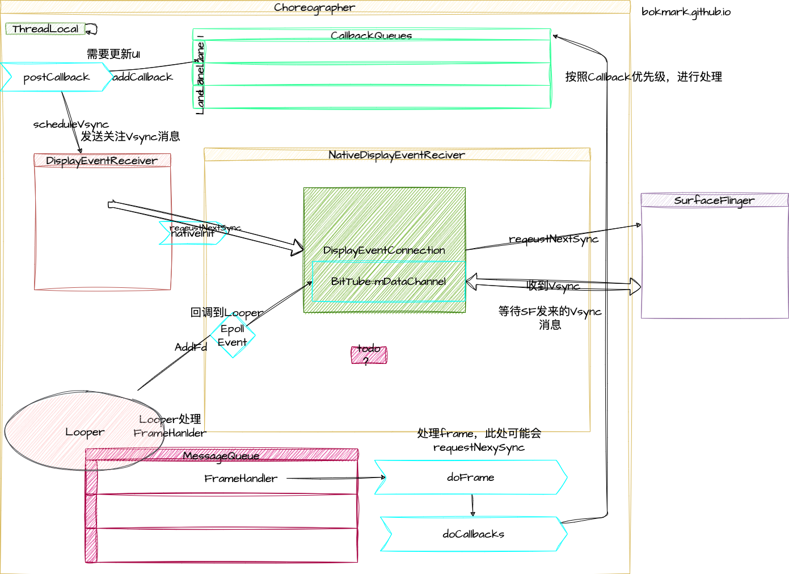

# Android Choreographer 原理
Choreographer负责编排 一个应用整体的ui表现。我们先来看整体的流程示意图



*总结：* 
- Choreographer：
- 

## 源码解析 

### [Choreographer](http://aospxref.com/android-13.0.0_r3/xref/frameworks/base/core/java/android/view/Choreographer.java)  

```java
//Choreographer 
public final class Choreographer {
    public static final int VSYNC_SOURCE_APP = 0;
    // 使用ThreadLocal 来保存 choreographer，以确保主线程只有一份 chereographer
    private static final ThreadLocal<Choreographer> sThreadInstance =
            new ThreadLocal<Choreographer>() {
        @Override
        protected Choreographer initialValue() {
            Looper looper = Looper.myLooper();
            if (looper == null) {
                throw new IllegalStateException("The current thread must have a looper!");
            }
            Choreographer choreographer = new Choreographer(looper, VSYNC_SOURCE_APP);
            if (looper == Looper.getMainLooper()) {
                mMainInstance = choreographer;
            }
            return choreographer;
        }
    };
    public static Choreographer getInstance() {
        return sThreadInstance.get();
    }
    
    private Choreographer(Looper looper, int vsyncSource) {
        mLooper = looper;
        mHandler = new FrameHandler(looper);
        // USE_VSYNC 在4.0以后默认开启vsync
        mDisplayEventReceiver = USE_VSYNC
                ? new FrameDisplayEventReceiver(looper, vsyncSource)
                : null;
        mLastFrameTimeNanos = Long.MIN_VALUE;
        // getRefreshRate() ：获取默认屏幕的刷新瓶绿
        mFrameIntervalNanos = (long)(1000000000 / getRefreshRate());
        // 创建根据callback的数值创建CallbackQueue
        mCallbackQueues = new CallbackQueue[CALLBACK_LAST + 1];
        // 创建5条queue
        for (int i = 0; i <= CALLBACK_LAST; i++) {
            mCallbackQueues[i] = new CallbackQueue();
        }
    }
}
// 
```
#### CALLBACK
```java
public static final int CALLBACK_INPUT = 0; // 输入事件的callback，最紧急，需要最先运行。
public static final int CALLBACK_ANIMATION = 1; // 动画的callback，次于CALLBACK_INPUT 运行。
public static final int CALLBACK_INSETS_ANIMATION = 2; // inset window animation，由于输入事件和动画能影响此callback，所以位置排在这里。具体可以看这里（https://github.com/android/user-interface-samples/tree/master/WindowInsetsAnimation）
public static final int CALLBACK_TRAVERSAL = 3; // 刷新整个view树，在所有的异步方法最后执行。
public static final int CALLBACK_COMMIT = 4; // 在 其他提交的callback，在CALLBACK_TRAVERSAL之后执行。
```

### [FrameDisplayEventReceiver](http://aospxref.com/android-13.0.0_r3/xref/frameworks/base/core/java/android/view/Choreographer.java#1157)
```java

private final class FrameDisplayEventReceiver extends DisplayEventReceiver
        implements Runnable { 
    private VsyncEventData mLastVsyncEventData = new VsyncEventData();

    public FrameDisplayEventReceiver(Looper looper, int vsyncSource) {
        super(looper, vsyncSource, 0);
    }
 
    // 收到vsync信号的回调
    @Override
    public void onVsync(long timestampNanos, long physicalDisplayId, int frame,
            VsyncEventData vsyncEventData) {
        try {
          
            long now = System.nanoTime();
            if (timestampNanos > now) { 
                timestampNanos = now;
            }

            if (!mHavePendingVsync) {  
                mHavePendingVsync = true;
            }

            mTimestampNanos = timestampNanos;
            mFrame = frame;
            mLastVsyncEventData = vsyncEventData;
            Message msg = Message.obtain(mHandler, this);
            msg.setAsynchronous(true);
            mHandler.sendMessageAtTime(msg, timestampNanos / TimeUtils.NANOS_PER_MS);
        } finally { 
        }
    }

    @Override
    public void run() {
        mHavePendingVsync = false;
        doFrame(mTimestampNanos, mFrame, mLastVsyncEventData);
    }
} 

```

### FrameHandler
```java
private final class FrameHandler extends Handler {
    public FrameHandler(Looper looper) {
        super(looper);
    }

    @Override
    public void handleMessage(Message msg) {
        switch (msg.what) {
            case MSG_DO_FRAME:
                doFrame(System.nanoTime(), 0, new DisplayEventReceiver.VsyncEventData());
                break;
            case MSG_DO_SCHEDULE_VSYNC:
                doScheduleVsync();
                break;
            case MSG_DO_SCHEDULE_CALLBACK:
                doScheduleCallback(msg.arg1);
                break;
        }
    }
}
```
## 类图


classDiagram

ViewManager <|-- WindowManager  
WindowManager <|.. WindowManagerImpl
WindowManagerImpl *--> WindowManagerGlobal

WindowManagerImpl : WindowManagerGlobal mGlobal
 