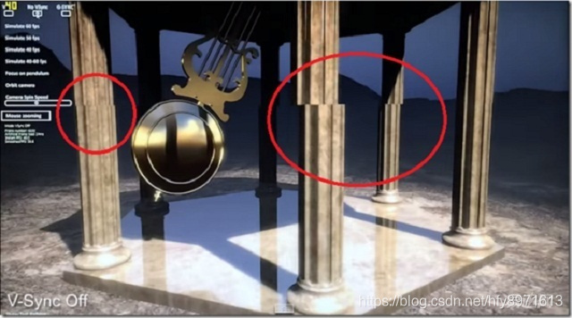
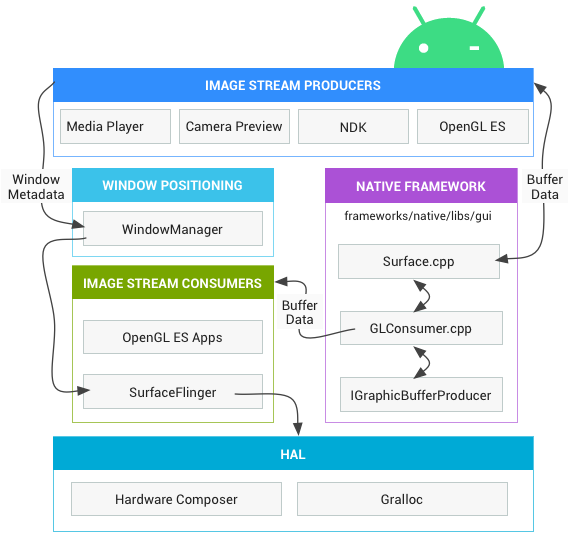
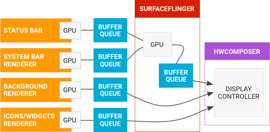
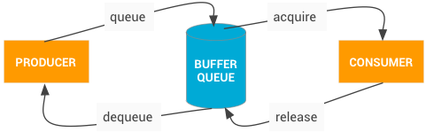

# Android GUI 综述

Android的显示系统由很多的模块组成，其中有负责合成各个图层的**SurfaceFlinger**，负责编排单一图层的**Choreographer**，负责将具体展示画面展示到硬件屏幕上的**HWComposer**【Hardware Compose】，也有**WMS**参与Window的管理等等。  
我将基于 [http://aospxref.com/android-13.0.0_r3/](http://aospxref.com/android-13.0.0_r3/) 的代码对其中的重要模块进行详细的分析。  
最终的目的是建立起对整个Android图像显示系统的完整理解和工作流程梳理。  

涉及到的文章有  
- [wms](../wms)。
- [SurfaceFlinger](../sufaceFlinger)
- [choreographer](../choreographer)
- [surface](../surface)

## Android 显示基础
> [参考来源：“终于懂了” 系列：Android屏幕刷新机制—VSync、Choreographer 全面理解！](https://juejin.cn/post/6863756420380196877#heading-1)

在一个典型的显示系统中，一般包括CPU、GPU、Display三个部分， CPU负责计算帧数据，把计算好的数据交给GPU，GPU会对图形数据进行渲染，渲染好后放到buffer(图像缓冲区)里存起来，然后Display（屏幕或显示器）负责把buffer里的数据呈现到屏幕上。如下图：

### 基础概念
其中有几个重要概念需要解释清楚。
- **屏幕刷新频率** 一秒内屏幕刷新的次数，即一秒内显示多少帧的图像，单位Hz（赫兹）。这是由屏幕的硬件固定参数决定的，不可以修改。
- **逐行扫描** 在显示设备上更新图像的一种方式，和*隔行扫描*相对。显示器并不是把所有的图画一次性全部显示完成，而是一行一行的显示。
- **帧率** Frame Rate， 表示一秒内GPU绘制的帧数，单位FPS。帧率是动态变化的，如果屏幕内容没有变化相应的帧率将会下降。理论上帧率的上限为屏幕的刷新频率。
- **画面撕裂** 由于屏幕刷新采用的是缓冲区的数据，如果缓冲区的数据没有及时更新，将会照成*画面撕裂*的现象。

### 双缓冲

由于屏幕的刷新频率是硬件的固有属性，比如Android的16ms，每16ms屏幕就会从FrameBuffer中一行一行的取数据，最终显示完一帧的画面。  
理论上每绘制一帧就显示一帧，但是由于CPU或者GPU绘制单帧数据的时间并不可控，导致了屏幕刷新的时候读到的Buffer肯恩更不是完整的一帧数据。  

**如何解决这个问题？答案是双缓存技术。**  
*双缓存*技术，即设置两个缓存区，CPU或者GPU绘制背后的缓存区，显示设备读取前置的缓存区，当一帧数据绘制完成时，将前后缓冲区地址互换即完成前后缓冲数据交换。如图

**当出现双缓冲技术之后，随之而来的问题就是什么时候进行交换？**  
如果是等后缓冲区数据完成就进行交换，那么必然会有上一帧的数据还没有显示完成的情况。  
所以还是得等显示设备显示完一帧数据之后，显示下一帧数据之前才是交换缓冲区的好时机。而这个时间就是最是发出VSync信号的最佳时间。

VSync(垂直同步)是VerticalSynchronization的简写，它利用VBI时期出现的vertical sync pulse（垂直同步脉冲）来保证双缓冲在最佳时间点才进行交换。

### Android 是如何进行屏幕的刷新的？

具体到Android中，在Android4.1之前，屏幕刷新也遵循 上面介绍的 双缓存+VSync 机制。如下图：

以时间的顺序来看下将会发生的过程：

- Display显示第0帧数据，此时CPU和GPU渲染第1帧画面，且在Display显示下一帧前完成
- 因为渲染及时，Display在第0帧显示完成后，也就是第1个VSync后，缓存进行交换，然后正常显示第1帧
- 接着第2帧开始处理，是直到第2个VSync快来前才开始处理的。
- 第2个VSync来时，由于第2帧数据还没有准备就绪，缓存没有交换，显示的还是第1帧。这种情况被Android开发组命名为“Jank”，即发生了丢帧。
- 当第2帧数据准备完成后，它并不会马上被显示，而是要等待下一个VSync 进行缓存交换再显示。

所以总的来说，就是屏幕平白无故地多显示了一次第1帧。原因是 第2帧的CPU/GPU计算 没能在VSync信号到来前完成 。  

**该如何解决这个问题呢？** 

我们知道，双缓存的交换 是在Vsyn到来时进行。交换后屏幕会取前缓冲区内的新数据，于此同时后缓冲区就可以供GPU准备下一帧数据了。 如果 Vsync到来时CPU/GPU就开始操作的话，是有完整的16.6ms的。  

**该如何做呢？**  

Google在Android 4.1系统中对Android Display系统进行了重构，实现了Project Butter（黄油工程）：系统在收到VSync pulse后，将马上开始下一帧的渲染。即一旦收到VSync通知（16ms触发一次），CPU和GPU 才立刻开始计算然后把数据写入buffer。如下图：

保证CPU和GPU有充足的16ms来处理数据，可以减少Jank。

**如果CPU和GPU处理数据时间过长，长于一个周期怎么办？**  

- 在第二个时间段内，但却因 GPU 还在处理 B 帧，缓存没能交换，导致 A 帧被重复显示。
- 而B完成后，又因为缺乏VSync pulse信号，它只能等待下一个signal的来临。于是在这一过程中，有一大段时间是被浪费的。
- 当下一个VSync出现时，CPU/GPU马上执行操作（A帧），且缓存交换，相应的显示屏对应的就是B。这时看起来就是正常的。只不过由于执行时间仍然超过16ms，导致下一次应该执行的缓冲区交换又被推迟了——如此循环反复，便出现了越来越多的“Jank”。

**为什么 CPU 不能在第二个 16ms 处理绘制工作呢？**  
原因是只有两个缓冲区，后缓冲区正在被GPU用来处理B帧的数据，前缓冲区的内容用于Display的显示，这样两个buffer都被占用，CPU 则无法准备下一帧的数据。 那么，如果再提供一个buffer，CPU、GPU 和显示设备都能使用各自的buffer工作，互不影响。

**三缓冲**

三缓存就是在双缓冲机制基础上增加了一个 Graphic Buffer 缓冲区，这样可以最大限度的利用空闲时间，带来的坏处是多使用的一个 Graphic Buffer 所占用的内存。

- 第一个Jank，是不可避免的。但是在第二个 16ms 时间段，CPU/GPU 使用 第三个 Buffer 完成C帧的计算，虽然还是会多显示一次 A 帧，但后续显示就比较顺畅了，有效避免 Jank 的进一步加剧。
- 注意在第3段中，A帧的计算已完成，但是在第4个vsync来的时候才显示，如果是双缓冲，那在第三个vynsc就可以显示了。

三缓冲有效利用了等待vysnc的时间，减少了jank，但是带来了延迟。 所以，是不是 Buffer 越多越好呢？这个是否定的，Buffer 正常还是两个，当出现 Jank 后三个足以。

### 显示基础小结
- VSync 是有屏幕发出的信号，是有屏幕的固定属性-屏幕刷新率，来决定频率的。
- 4.1之后，CPU和GPU对于屏幕数据的绘制需要立刻进行。
- Android使用三缓冲技术，可以最大程度的避免丢帧。
- 只有VSync信号出现的时候，才会进行前后缓冲区的交换，也就意味着只有VSync信号才能改变当前的显示。

## 各个GUI组件之前的关系
> [Android 官方文档](https://source.android.com/docs/core/graphics?hl=zh-cn)  

### Android 图形相关的组件
开发者有三种方式 [Canvas](https://source.android.com/devices/graphics/arch-sh#canvas), [OpenGL ES](https://source.android.com/docs/core/graphics/arch-egl-opengl?hl=zh-cn) 或 [Vulkan](https://source.android.com/docs/core/graphics/arch-vulkan?hl=zh-cn) 将图像渲染到屏幕上。
无论开发者使用什么渲染 API，一切内容都会渲染到 **Surface** 上。Surface 表示 BufferQueue 中的生产方，而 BufferQueue 通常会被 SurfaceFlinger 消耗。在 Android 平台上创建的每个 Window 都由 Surface 提供支持。所有被渲染的可见 Surface 都被 SurfaceFlinger 合成到屏幕。  

下图显示了关键组件如何协同工作：  

主要组件如下所述：

#### 图像流生产方【IMAGE STREAM PRODUCERS】  
图像流生产方可以是生成图形缓冲区以供消耗的任何内容。例如 OpenGL ES、Canvas 2D 和 mediaserver 视频解码器。

#### 图像流消耗方【IMAGE STREAM COMSUMERS】  
图像流的最常见消耗方是 SurfaceFlinger，该系统服务会消耗当前可见的 Surface，并使用窗口管理器中提供的信息将它们合成到屏幕。SurfaceFlinger 是可以修改所显示部分内容的唯一服务。SurfaceFlinger 使用 OpenGL 和 Hardware Composer 来合成一组 Surface。

其他 OpenGL ES 应用也可以消耗图像流，例如相机应用会消耗相机预览图像流。非 GL 应用也可以是使用方，例如 ImageReader 类。

#### 硬件混合渲染器 【Hardware-composer】
显示子系统的硬件抽象实现。SurfaceFlinger 可以将某些合成工作委托给硬件混合渲染器，以分担 OpenGL 和 GPU 上的工作量。SurfaceFlinger 只是充当另一个 OpenGL ES 客户端。因此，在 SurfaceFlinger 将一个或两个缓冲区合成到第三个缓冲区中的过程中，它会使用 OpenGL ES。这会让合成的功耗比通过 GPU 执行所有计算时更低。

> [硬件混合渲染器](https://source.android.com/docs/core/graphics/hwc?hl=zh-cn) HAL 则进行另一半的工作，是所有 Android 图形渲染的中心点。Hardware Composer 必须支持事件，其中之一是 VSYNC（另一个是支持即插即用 HDMI 的热插拔）。  
> 
> 硬件混合渲染器 (HWC) HAL 是通过使用确定的可用硬件来合成缓冲区的最有效方法。作为 HAL，其实现是特定于设备的，而且通常由显示硬件原始设备制造商 (OEM) 完成。   
> 
> 当您考虑使用HWC来叠加Layer时，很容易发现这种方法的好处，它会在显示硬件（而不是 GPU）中合成多个缓冲区。例如，假设有一部普通 Android 手机，其屏幕方向为纵向，状态栏在顶部，导航栏在底部，其他区域显示应用内容。每个层的内容都在单独的缓冲区中。您可以使用以下任一方法处理合成：
> - 将应用内容渲染到暂存缓冲区中，然后在其上渲染状态栏，再在其上渲染导航栏，最后将暂存缓冲区传送到显示硬件。
> - 将三个缓冲区全部传送到显示硬件，并指示它从不同的缓冲区读取屏幕不同部分的数据。
> 明显，后一种方法效率更高。
> 
> 显示处理器功能差异很大。叠加层的数量（无论层是否可以旋转或混合）以及对定位和重叠的限制很难通过 API 表达。为了适应这些选项，HWC 会执行以下计算：
> 1. SurfaceFlinger 向 HWC 提供一个完整的层列表，并询问“您希望如何处理这些层？”
> 2. HWC 的响应方式是将每个层标记为HWC来合成还是由客户端合成。
> 3. SurfaceFlinger 会处理所有标记为客户端合成的层，将输出缓冲区传送到 HWC，并让 HWC 处理其余部分。
>
> 由于硬件供应商可以定制决策代码，因此可以在每台设备上实现最佳性能。  
> 
> 当屏幕上的内容没有变化时，叠加平面的效率可能会低于 GL 合成。当叠加层内容具有透明像素且叠加层混合在一起时，尤其如此。在此类情况下，HWC 可以为部分或全部层请求 GLES 合成，并保留合成的缓冲区。如果 SurfaceFlinger 要求合成同一组缓冲区，HWC 可以显示先前合成的暂存缓冲区。这可以延长闲置设备的电池续航时间。  
>
> Android 设备通常支持 4 个叠加平面。尝试合成的层数多于叠加层数会导致系统对其中一些层使用 GLES 合成，这意味着应用使用的层数会对能耗和性能产生重大影响。

#### Gralloc
需要使用图形内存分配器 (Gralloc) 来分配图像生产方请求的内存。有关详情，请参阅 [Gralloc HAL](https://source.android.com/docs/core/graphics/arch-bq-gralloc?hl=zh-cn)。

### 数据流
有关 Android 图形管道的描述，请参见下图：
  
左侧的对象是生成图形缓冲区的渲染器，如主屏幕、状态栏和系统界面。SurfaceFlinger 是合成器，而硬件混合渲染器是混合渲染器。

#### [BufferQueue](https://source.android.com/docs/core/graphics/arch-bq-gralloc?hl=zh-cn)
BufferQueues 是 Android 图形组件之间的粘合剂。它们是一对队列，可以调解缓冲区从生产方到消耗方的固定周期。一旦生产方移交其缓冲区，SurfaceFlinger 便会负责将所有内容合成到显示部分。  
有关 BufferQueue 通信过程，请参见下图。  

BufferQueue 包含将图像流生产方与图像流消耗方结合在一起的逻辑。图像生产方的一些示例包括由相机 HAL 或 OpenGL ES 游戏生成的相机预览。图像消耗方的一些示例包括 SurfaceFlinger 或显示 OpenGL ES 流的另一个应用，如显示相机取景器的相机应用。

BufferQueue 是将缓冲区池与队列相结合的数据结构，它使用 Binder IPC 在进程之间传递缓冲区。生产方接口，或者您传递给想要生成图形缓冲区的某个人的内容，即是 IGraphicBufferProducer（SurfaceTexture 的一部分）。BufferQueue 通常用于渲染到 Surface，并且与 GL 消耗方及其他任务一起消耗内容。

BufferQueue 可以在三种不同的模式下运行：

- 类同步模式 - 默认情况下，BufferQueue 在类同步模式下运行，在该模式下，从生产方进入的每个缓冲区都在消耗方那退出。在此模式下不会舍弃任何缓冲区。如果生产方速度太快，创建缓冲区的速度比消耗缓冲区的速度更快，它将阻塞并等待可用的缓冲区。
- 非阻塞模式 - BufferQueue 还可以在非阻塞模式下运行，在此类情况下，它会生成错误，而不是等待缓冲区。在此模式下也不会舍弃缓冲区。这有助于避免可能不了解图形框架的复杂依赖项的应用软件出现潜在死锁现象。
- 舍弃模式 - 最后，BufferQueue 可以配置为丢弃旧缓冲区，而不是生成错误或进行等待。例如，如果对纹理视图执行 GL 渲染并尽快绘制，则必须丢弃缓冲区。

为了执行这项工作的大部分环节，SurfaceFlinger 就像另一个 OpenGL ES 客户端一样工作。例如，当 SurfaceFlinger 正在积极地将一个缓冲区或两个缓冲区合成到第三个缓冲区中时，它使用的是 OpenGL ES。

Hardware Composer HAL 执行另一半工作。该 HAL 充当所有 Android 图形渲染的中心点。

