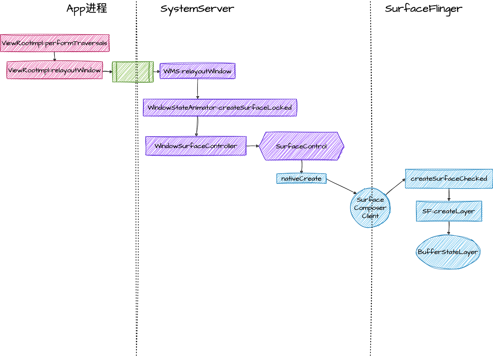

# Surface 
> Surface的创建分为三个部分
> 
> 1. APP进程。Surface本质上是一个BufferQueue, 里面保存着需要显示的数据，通常是三缓冲 triple-buffers 以防止丢帧。理所应当地由app进程自己负责创建，创建完成之后，在对应的canvas上画图等，最终都会保存到surface中的buffer里，最后交由surface flinger合成并显示。
> 
> 2. WMS。 负责接收app发起的请求，向SF请求创建Surface，并且由WMS辅助创建Surface的辅助管理类，比如SurfaceControl。APP为什么不直接和SF沟通，而是要从WMS走一下，这是因为涉及到surface的zorder和systemui的管理，需要由WMS统一管理。
> 
> 3. SF。APP申请创建的Surface会在SF中有一个对应的LAYER，这些LAYER由SurfaceFlinger管理，按条件合成等。



## APP端是如何处理和Surface相关的内容的

在ViewRootImpl创建的时候初始化一个Surface和SurfaceControl。
```java
// frameworks/base/core/java/android/view/ViewRootImpl.java#226
public final class ViewRootImpl implements ViewParent, ... {
    public final Surface mSurface = new Surface();
    private final SurfaceControl mSurfaceControl = new SurfaceControl();  
    。。。。
    private final SurfaceSession mSurfaceSession = new SurfaceSession();
    private final Transaction mTransaction = new Transaction();
}
```
这就代表了这个window对应的surface。在经历View的三阶段之后，走到了draw方法
```java
private void performDraw() {
    if (mSurfaceHolder != null && mSurface.isValid()) {
        SurfaceCallbackHelper sch = new SurfaceCallbackHelper(this::postDrawFinished);
        SurfaceHolder.Callback callbacks[] = mSurfaceHolder.getCallbacks();

        sch.dispatchSurfaceRedrawNeededAsync(mSurfaceHolder, callbacks);
    } else if (!usingAsyncReport) {
        if (mAttachInfo.mThreadedRenderer != null) {
            mAttachInfo.mThreadedRenderer.fence();
        }
        pendingDrawFinished();
    }
}
```


### ViewRootImpl
Surface 有很多的创建native object的方式，在native层都大同小异，我们就以最常见的 `copyFromSurfaceControl` 的方式来实现。
先跳过其他步骤我们直接来看Surface的创建。
```java
// frameworks/base/core/java/android/view/ViewRootImpl.java#226
public final class ViewRootImpl implements ViewParent, ... {
    public final Surface mSurface = new Surface();
    private final SurfaceControl mSurfaceControl = new SurfaceControl();  
}
// frameworks/base/core/java/android/view/Surface.java#298
public class Surface implements Parcelable {
    private static native long nativeCreateFromSurfaceControl(long surfaceControlNativeObject);
}
// frameworks/base/core/jni/android_view_Surface.cpp
static jlong nativeCreateFromSurfaceControl(JNIEnv* env, jclass clazz,
        jlong surfaceControlNativeObj) {
    sp<SurfaceControl> ctrl(reinterpret_cast<SurfaceControl *>(surfaceControlNativeObj));
    sp<Surface> surface(ctrl->createSurface());
    if (surface != NULL) {
        surface->incStrong(&sRefBaseOwner);
    }
    return reinterpret_cast<jlong>(surface.get());
}
// frameworks/native/libs/gui/SurfaceControl.cpp
sp<Surface> SurfaceControl::createSurface()
{
    return getSurface();
}
sp<Surface> SurfaceControl::getSurface()
{
    Mutex::Autolock _l(mLock);
    if (mSurfaceData == nullptr) {
        return generateSurfaceLocked();
    }
    return mSurfaceData;
}
sp<Surface> SurfaceControl::generateSurfaceLocked()
{
    uint32_t ignore;
    auto flags = mCreateFlags & (ISurfaceComposerClient::eCursorWindow |
                                 ISurfaceComposerClient::eOpaque);
    // 关键带你在这里，使用mClinet去创建了一个surface。mClient的类型是SurfaceComposerClient
    mBbqChild = mClient->createSurface(String8("bbq-wrapper"), 0, 0, mFormat,
                                       flags, mHandle, {}, &ignore);
    mBbq = sp<BLASTBufferQueue>::make("bbq-adapter", mBbqChild, mWidth, mHeight, mFormat);
  
    mSurfaceData = mBbq->getSurface(true);

    return mSurfaceData;
}
```


## WMS如何处理Surface相关内容的

## SF是如何处理Surface相关内容的

## 其中的小细节


## 参考资料
- [Surface 和 SurfaceHolder](https://source.android.com/docs/core/graphics/arch-sh?hl=zh-cn)
- [Android-Surface原理解析](https://ljd1996.github.io/2020/11/09/Android-Surface%E5%8E%9F%E7%90%86%E8%A7%A3%E6%9E%90/)
- [HardwareScalerActivity](https://github.com/google/grafika/blob/master/app/src/main/java/com/android/grafika/HardwareScalerActivity.java) 
- [SurfaceView 和 GLSurfaceView](https://source.android.com/docs/core/graphics/arch-sv-glsv?hl=zh-cn) 
- [Android Surface创建](https://www.jianshu.com/p/64e5c866b4ae)
- [BlastBufferQueue](https://www.jianshu.com/p/cdc60627df90)