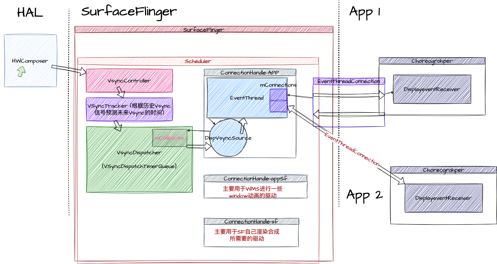

 
# Surface Flinger
> 什么是SurfaceFlinger？ SurfaceFlinger 接受图像的缓冲，对它们进行合成，然后发送到屏幕。   
> 
> SurfaceFlinger 可通过两种方式接受缓冲区：通过 BufferQueue 和 SurfaceControl，或通过 ASurfaceControl。   
> 
> 虽然应用可以随时提交缓冲区，但 SurfaceFlinger 仅能在屏幕处于两次刷新之间时唤醒，以接受缓冲区，这会因设备而异。这样可以最大限度地减少内存使用量，并避免屏幕上出现可见的撕裂现象。  
> 
> 在屏幕处于两次刷新之间时，屏幕会向 SurfaceFlinger 发送 VSYNC 信号。VSYNC 信号表明可对屏幕进行刷新而不会产生撕裂。当 SurfaceFlinger 接收到 VSYNC 信号后，SurfaceFlinger 会遍历其层列表，以查找新的缓冲区。如果 SurfaceFlinger 找到新的缓冲区，SurfaceFlinger 会获取缓冲区；否则，SurfaceFlinger 会继续使用上一次获取的那个缓冲区。SurfaceFlinger 必须始终显示内容，因此它会保留一个缓冲区。如果在某个层上没有提交缓冲区，则该层会被忽略。  
> 
> SurfaceFlinger 在收集可见层的所有缓冲区之后，便会询问硬件混合渲染器 (HWC) 应如何进行合成。如果 HWC 将层合成类型标记为客户端合成，则 SurfaceFlinger 将合成这些层。然后，SurfaceFlinger 会将输出缓冲区传递给 HWC。  


## SurfaceFlinger怎么启动


由init进程通过解析surfaceflinger.rc文件，启动surfacefligner /system/bin/surfaceflinger 进程。[main_surfaceflinger.cpp](http://aospxref.com/android-12.0.0_r3/xref/frameworks/native/services/surfaceflinger/main_surfaceflinger.cpp) 就是这个进程的入口
```c++
// frameworks/native/services/surfaceflinger/main_surfaceflinger.cpp
int main(int, char**) { 

    // 当SF启动的时候，限制binder线程池上限为4。
    ProcessState::self()->setThreadPoolMaxThreadCount(4);

    // 启动Binder服务端
    sp<ProcessState> ps(ProcessState::self());
    ps->startThreadPool();

    // 实例化 surfaceflinger
    sp<SurfaceFlinger> flinger = surfaceflinger::createSurfaceFlinger();
    
    // 初始化
    flinger->init();

    // publish 到 ServiceManager
    sp<IServiceManager> sm(defaultServiceManager());
    sm->addService(String16(SurfaceFlinger::getServiceName()), flinger, false,
                   IServiceManager::DUMP_FLAG_PRIORITY_CRITICAL | IServiceManager::DUMP_FLAG_PROTO);

    // 启动显示器服务
    startDisplayService(); // dependency on SF getting registered above
    
    // 进入SurfaceFlinger的主循环
    flinger->run();

    return 0;
}
```
> `SurfaceFlinger`的 servicename是 “SurfaceFlinger”，对应的binder对象是 `android.ui.ISurfaceComposer`

### SurfaceFlinger的定义
[SurfaceFlinger.h](http://aospxref.com/android-12.0.0_r3/xref/frameworks/native/services/surfaceflinger/SurfaceFlinger.h)
```c++
  class SurfaceFlinger : public BnSurfaceComposer,
                         public PriorityDumper,
                         private IBinder::DeathRecipient,
                         private HWC2::ComposerCallback, 
                         private ISchedulerCallback {
```
- `BnSurfaceComposer` surfaceComposer的binder服务端。  
- `PriorityDumper` 用于dump信息。
- `DeathRecipient` binder服务端挂掉之后，用于通知客户端。
- `HWC2::ComposerCallback` 注册了HWC2的composercallback的回调，可以用于监听来自HWC2的事件，比如VSync事件。 
- `ISchedulerCallback` 设置一些Scheduler 用于vsync相关的callback
```c++
struct ISchedulerCallback {
    virtual void setVsyncEnabled(bool) = 0;
    virtual void changeRefreshRate(const scheduler::RefreshRateConfigs::RefreshRate&,
                                   scheduler::RefreshRateConfigEvent) = 0;
    virtual void repaintEverythingForHWC() = 0;
    virtual void kernelTimerChanged(bool expired) = 0;
    virtual void triggerOnFrameRateOverridesChanged() = 0;

protected:
    ~ISchedulerCallback() = default;
};
```

### 创建实例对象 [SurfaceFlingerFactory.cpp](http://aospxref.com/android-12.0.0_r3/xref/frameworks/native/services/surfaceflinger/SurfaceFlingerFactory.cpp?fi=createSurfaceFlinger#createSurfaceFlinger)
```c++
// frameworks/native/services/surfaceflinger/SurfaceFlingerFactory.cpp
sp<SurfaceFlinger> createSurfaceFlinger() {
    // /frameworks/native/services/surfaceflinger/SurfaceFlingerDefaultFactory.cpp
    // 提供了默认的创建各种实例的工厂方法
    static DefaultFactory factory;

    return new SurfaceFlinger(factory);
}
// frameworks/native/services/surfaceflinger/SurfaceFlinger.cpp
SurfaceFlinger::SurfaceFlinger(Factory& factory) : SurfaceFlinger(factory, SkipInitialization) {
    ALOGI("SurfaceFlinger is starting");
    // 主要是配置一些属性，此处与主流程无关，跳过。
}

```
主要是配置一些属性，具体感兴趣可以查看这篇文章。
- [AndroidR 11 系统属性sysprop_library研究及其与SystemProperties的关系](https://blog.csdn.net/askfgx2010/article/details/112308665)

### 初始化
```c++
void SurfaceFlinger::init() { 
    Mutex::Autolock _l(mStateLock);

    // 设置渲染引擎 
   mCompositionEngine->setRenderEngine(renderengine::RenderEngine::create(
            renderengine::RenderEngineCreationArgs::Builder()
                    .setPixelFormat(static_cast<int32_t>(defaultCompositionPixelFormat))
                    .setImageCacheSize(maxFrameBufferAcquiredBuffers)
                    .setUseColorManagerment(useColorManagement)
                    .setEnableProtectedContext(enable_protected_contents(false))
                    .setPrecacheToneMapperShaderOnly(false)
                    .setSupportsBackgroundBlur(mSupportsBlur)
                    .setContextPriority(
                            useContextPriority
                                    ? renderengine::RenderEngine::ContextPriority::REALTIME
                                    : renderengine::RenderEngine::ContextPriority::MEDIUM)
                    .build()));
 
    // 创建和 hwc hal层的接口
    mCompositionEngine->setHwComposer(getFactory().createHWComposer(mHwcServiceName));
    // 将sf设置成hwc的回调方法，接收hwc传过来的VSYNC等信号
    mCompositionEngine->getHwComposer().setCallback(this); 
 

    // 处理 任何初始热插拔和显示更改的结果。
    // 在注册hwcomposer的callback之后，如果有显示设备将会立刻收到一个热插拔事件。而在这里将会调用initScheduler
    processDisplayHotplugEventsLocked(); 
 
    // 初始化Display信息
    initializeDisplays(); 

    const bool presentFenceReliable =
            !getHwComposer().hasCapability(Capability::PRESENT_FENCE_IS_NOT_RELIABLE);
    mStartPropertySetThread = getFactory().createStartPropertySetThread(presentFenceReliable);

    // 启动属性设置线程，这里面包含了启动开机动画的逻辑
    if (mStartPropertySetThread->Start() != NO_ERROR) {
        ALOGE("Run StartPropertySetThread failed!");
    }
    ALOGV("Done initializing");
}
void SurfaceFlinger::onFirstRef() {
    // 初始化 messagequeue
    mEventQueue->init(this);
}
```
在这一步中，SF主要做了以下几件事
- 配置及创建渲染引擎，用于GPU合成模式。（SF，在渲染多层layer的时候可能会将合并工作交给HWC去实现，但是会有一部分工作由SF自己来做，此处的渲染引擎就是用来做这个的）
- 创建HWComposer注册回调接口，用于接收VSync，hotplug等信号。
- 处理显示器的热插拔等事件。
- 初始化显示设备。
- 开始一个属性设置线程。这里面会启动开机动画。

### mCompositionEngine->getHwComposer().setCallback(*this); 
在这里注册了回调时，hwc将会立刻回调热插拔的状态。而这一步也将导致后续调用到 processDisplayHotplugEventsLocked。这一步将会一直走到 processDisplayAdded。

### processDisplayHotplugEventsLocked
```c++
void SurfaceFlinger::processDisplayHotplugEventsLocked() {
    for (const auto& event : mPendingHotplugEvents) {
        std::optional<DisplayIdentificationInfo> info =
                getHwComposer().onHotplug(event.hwcDisplayId, event.connection);
        if (event.connection == hal::Connection::CONNECTED) { 

            if (it == mPhysicalDisplayTokens.end()) { 

                sp<IBinder> token = new BBinder();
                mCurrentState.displays.add(token, state);
                mPhysicalDisplayTokens.emplace(displayId, std::move(token));
                // scheduler 管理Vsync的类
                if (event.hwcDisplayId == getHwComposer().getInternalHwcDisplayId()) {
                    initScheduler(state);
                }

                mInterceptor->saveDisplayCreation(state);
            }  
        }
        // 配置display
        processDisplayChangesLocked();
    }
}
void SurfaceFlinger::processDisplayChangesLocked() {
    。。。
    if (!curr.isIdenticalTo(draw)) {
        for (size_t i = 0; i < curr.size(); i++) {
            const wp<IBinder>& displayToken = curr.keyAt(i);
            if (draw.indexOfKey(displayToken) < 0) {
                // 如果没有添加过display，在这里配置 display
                processDisplayAdded(displayToken, curr[i]);
            }
        }
    }
}
void SurfaceFlinger::processDisplayAdded(const wp<IBinder>& displayToken,
                                         const DisplayDeviceState& state) {
   

    compositionengine::DisplayCreationArgsBuilder builder;
    if (const auto& physical = state.physical) {
        builder.setId(physical->id);
        builder.setConnectionType(physical->type);
    } else {
        builder.setId(acquireVirtualDisplay(resolution, pixelFormat, state.layerStack));
    }

    builder.setPixels(resolution);
    builder.setIsSecure(state.isSecure);
    builder.setLayerStackId(state.layerStack);
    builder.setPowerAdvisor(&mPowerAdvisor);
    builder.setName(state.displayName);
    auto compositionDisplay = getCompositionEngine().createDisplay(builder.build());
    compositionDisplay->setLayerCachingEnabled(mLayerCachingEnabled);
    // 创建一个用于渲染的surface，以及相关bufferqueue的producer和consumer
    sp<compositionengine::DisplaySurface> displaySurface;
    sp<IGraphicBufferProducer> producer;
    sp<IGraphicBufferProducer> bqProducer;
    sp<IGraphicBufferConsumer> bqConsumer;
    getFactory().createBufferQueue(&bqProducer, &bqConsumer, /*consumerIsSurfaceFlinger =*/false);

    if (state.isVirtual()) {
        const auto displayId = VirtualDisplayId::tryCast(compositionDisplay->getId()); 
        auto surface = sp<VirtualDisplaySurface>::make(getHwComposer(), *displayId, state.surface,
                                                       bqProducer, bqConsumer, state.displayName);
        displaySurface = surface;
        producer = std::move(surface);
    } else { 
        const auto displayId = PhysicalDisplayId::tryCast(compositionDisplay->getId());
        LOG_FATAL_IF(!displayId);
        displaySurface =
                sp<FramebufferSurface>::make(getHwComposer(), *displayId, bqConsumer,
                                             state.physical->activeMode->getSize(),
                                             ui::Size(maxGraphicsWidth, maxGraphicsHeight));
        producer = bqProducer;
    }

    LOG_FATAL_IF(!displaySurface);
    const auto display = setupNewDisplayDeviceInternal(displayToken, std::move(compositionDisplay),
                                                       state, displaySurface, producer);
    mDisplays.emplace(displayToken, display);
    if (!state.isVirtual()) {
        dispatchDisplayHotplugEvent(display->getPhysicalId(), true);
    }
    // 根据硬件的size修改display以及surface的size
    if (display->isPrimary()) {
        mScheduler->onPrimaryDisplayAreaChanged(display->getWidth() * display->getHeight());
        getRenderEngine().onPrimaryDisplaySizeChanged(display->getSize());
    }
}
```


### flinger->run
initScheduler完成之后就是调用`SurfaceFlinger::run`
```c++
// frameworks/native/services/surfaceflinger/SurfaceFlinger.cpp
void SurfaceFlinger::run() {
    while (true) {
        mEventQueue->waitMessage();
    }
}
// frameworks/native/services/surfaceflinger/Scheduler/MessageQueue.cpp
void MessageQueue::waitMessage() {
    do {
        IPCThreadState::self()->flushCommands();
        int32_t ret = mLooper->pollOnce(-1);
        switch (ret) {
           
        }
    } while (true);
}
```
从这里我们可以看到，就是在等待通过Binder通信以及Messagequeue的消息传递了。


## MessageQueue

我们了解了SF的启动过程，得知最后SF是进入了mq的循环。虽然这个mq不是我们熟知的Java端mq，但是两者的运行逻辑是一样的。那么接下来就是开始观察mq的运行逻辑了。

### MessageQueue的创建
[MessagqQueue\Looper\Handler 参考文档](https://www.cnblogs.com/roger-yu/p/15099541.html)
```c++
// frameworks/native/services/surfaceflinger/SurfaceFlingerDefaultFactory.cpp
std::unique_ptr<MessageQueue> DefaultFactory::createMessageQueue() { 
    return std::make_unique<android::impl::MessageQueue>();
}

// frameworks/native/services/surfaceflinger/Scheduler/MessageQueue.cpp
void MessageQueue::init(const sp<SurfaceFlinger>& flinger) {
    // SF的引用
    mFlinger = flinger;
    // looper 用于循环 和JAVA端的android.os.Looper 不是同一个东西，但是实现的思想是差不多的
    mLooper = new Looper(true);
    // MessageHandler
    mHandler = new Handler(*this);
    
}
```
我们这里的message最主要执行的事情有refresh和invaidate。
```c++
void MessageQueue::Handler::handleMessage(const Message& message) {
    switch (message.what) {
        case INVALIDATE:
            mEventMask.fetch_and(~eventMaskInvalidate);
            mQueue.mFlinger->onMessageReceived(message.what, mVsyncId, mExpectedVSyncTime);
            break;
        case REFRESH:
            mEventMask.fetch_and(~eventMaskRefresh);
            mQueue.mFlinger->onMessageReceived(message.what, mVsyncId, mExpectedVSyncTime);
            break;
    }
}
```

我们以refresh事件来理一下messagequeue在sf中的作用

### 以refresh的流程来理解MQ在SF中的作用

- 第一步，收到binder的请求
```c++
// frameworks/native/services/surfaceflinger/SurfaceFlinger.cpp
status_t SurfaceFlinger::onTransact(uint32_t code, const Parcel& data, Parcel* reply, uint32_t flags) {
    switch (code) {
        case 1006:{ // send empty update
            signalRefresh();
            return NO_ERROR;
        }
    }
}

void SurfaceFlinger::signalRefresh() {
    mRefreshPending = true;
    mEventQueue->refresh();
}
```
- 第二步，mq发送refresh
```c++
// frameworks/native/services/surfaceflinger/Scheduler/MessageQueue.cpp
void MessageQueue::refresh() {
    mHandler->dispatchRefresh();
}
void MessageQueue::Handler::dispatchRefresh() {
    if ((mEventMask.fetch_or(eventMaskRefresh) & eventMaskRefresh) == 0) {
        mQueue.mLooper->sendMessage(this, Message(MessageQueue::REFRESH));
    }
}
// sflooper在不断的循环读取mq，所以这里会被走到，最终来到mFlinger的onMessageReceived方法,本方法在sf的主线程中运行。
void MessageQueue::Handler::handleMessage(const Message& message) {
    switch (message.what) {
        case INVALIDATE:
            mEventMask.fetch_and(~eventMaskInvalidate);
            mQueue.mFlinger->onMessageReceived(message.what, mVsyncId, mExpectedVSyncTime);
            break;
        case REFRESH:
            mEventMask.fetch_and(~eventMaskRefresh);
            mQueue.mFlinger->onMessageReceived(message.what, mVsyncId, mExpectedVSyncTime);
            break;
    }
}
```
- 第三步，SF 执行 onMessageReceived
```c++
// frameworks/native/services/surfaceflinger/SurfaceFlinger.cpp#1862
void SurfaceFlinger::onMessageReceived(int32_t what, int64_t vsyncId, nsecs_t expectedVSyncTime) {
    switch (what) {
        case MessageQueue::INVALIDATE: {
            onMessageInvalidate(vsyncId, expectedVSyncTime);
            break;
        }
        case MessageQueue::REFRESH: {
            onMessageRefresh();
            break;
        }
    }
}
void SurfaceFlinger::onMessageRefresh() {
}
```

## VSYNC 信号的完整链路

先看图，我们再结合图一步一步的来分析信号的走势




### 第一步，等待HWCompser信号的回调（这一步一定会发生）
```c++
// frameworks/native/services/surfaceflinger/SurfaceFlinger.cpp#1718
void SurfaceFlinger::onComposerHalVsync(hal::HWDisplayId hwcDisplayId, int64_t timestamp,
                                        std::optional<hal::VsyncPeriodNanos> vsyncPeriod) {
    // 忽略其他代码
    mScheduler->addResyncSample(timestamp, vsyncPeriod, &periodFlushed);
}
// frameworks/native/services/surfaceflinger/Scheduler/Scheduler.cpp?fi=addResyncSample#addResyncSample
void Scheduler::addResyncSample(nsecs_t timestamp, std::optional<nsecs_t> hwcVsyncPeriod,
                                bool* periodFlushed) {
    // 忽略其他代码
    needsHwVsync = mVsyncSchedule.controller->addHwVsyncTimestamp(timestamp, hwcVsyncPeriod,
                                                                        periodFlushed);
}
```
这里我们必须介绍一下 `mScheduler` 才能继续往下走了
#### Scheduler的前世今生

##### `processDisplayHotplugEventsLocked`  
 前面说到当sf第一次注册上硬件显示器的时候，会收到一个热热插拔的事件。  
 这个事件中，就包含了`initScheduler`的方法
 ```c++
 void SurfaceFlinger::initScheduler(const DisplayDeviceState& displayState) {
    if (mScheduler) {
        // 如果当前显示器已经生产过 scheduler，那么无需再次init。initScheduler会在热插拔事件发生的时候重复调用 
        return;
    }
    // 刷新率的配置信息，里面包含了当前的屏幕刷频率，刷新周期等信息 
    mRefreshRateConfigs =
            std::make_unique<scheduler::RefreshRateConfigs>(displayState.physical->supportedModes,
                                                            displayState.physical->activeMode
                                                                    ->getId(),
                                                            config);
    const auto currRefreshRate = displayState.physical->activeMode->getFps();
    mRefreshRateStats = std::make_unique<scheduler::RefreshRateStats>(*mTimeStats, currRefreshRate,
                                                                      hal::PowerMode::OFF);

    // mVsyncConfiguration 是一个 VsyncConfiguration object
    // VsyncConfiguration 类中封装了不同刷新率下的VSYNC配置信息。app phase 就是vsyncSrc偏移量，sf phase 是sfVsyncSrc偏移量，
    mVsyncConfiguration = getFactory().createVsyncConfiguration(currRefreshRate);
    // VsyncModulator object,VSYNC调制器，根据事务调度和刷新率的变化调整VSYNC偏移量。 
    mVsyncModulator = sp<VsyncModulator>::make(mVsyncConfiguration->getCurrentConfigs());

    // start the EventThread
    // 创建Scheduler
    mScheduler = getFactory().createScheduler(*mRefreshRateConfigs, *this);
    const auto configs = mVsyncConfiguration->getCurrentConfigs();
    const nsecs_t vsyncPeriod = currRefreshRate.getPeriodNsecs();
    // 创建一个用于和应用通信 Vsync 信号 的链接
    mAppConnectionHandle =
            mScheduler->createConnection("app", mFrameTimeline->getTokenManager(),
                                         /*workDuration=*/configs.late.appWorkDuration,
                                         /*readyDuration=*/configs.late.sfWorkDuration,
                                         impl::EventThread::InterceptVSyncsCallback());
    // 创建一个用于和wms通信 Vsync 信号 的链接，主要用于驱动窗口动画等，以后不再赘述
    mSfConnectionHandle =
            mScheduler->createConnection("appSf", mFrameTimeline->getTokenManager(),
                                         /*workDuration=*/std::chrono::nanoseconds(vsyncPeriod),
                                         /*readyDuration=*/configs.late.sfWorkDuration,
                                         [this](nsecs_t timestamp) {
                                             mInterceptor->saveVSyncEvent(timestamp);
                                         });
    // 注册一个callback到VsyncDispatch上去，将会调用MessageQueue::vsyncCallback 方法 
    mEventQueue->initVsync(mScheduler->getVsyncDispatch(), *mFrameTimeline->getTokenManager(),
                           configs.late.sfWorkDuration); 
}
 ```

##### `getFactory().createScheduler()`
```c++
 // frameworks/native/services/surfaceflinger/SurfaceFlingerDefaultFactory.cpp
std::unique_ptr<Scheduler> DefaultFactory::createScheduler(
        const scheduler::RefreshRateConfigs& configs, ISchedulerCallback& callback) {
    return std::make_unique<Scheduler>(configs, callback); // 创建Scheduler对象，callback指向一个SurfaceFlinger::mFlinger
}
// /frameworks/native/services/surfaceflinger/Scheduler/Scheduler.cpp
Scheduler::Scheduler(const scheduler::RefreshRateConfigs& configs, ISchedulerCallback& callback): xxx {
}
Scheduler::Scheduler(const scheduler::RefreshRateConfigs& configs, ISchedulerCallback& callback,
                     Options options)
        //createVsyncSchedule 很重要，创建了一个VsyncSchedule
      : Scheduler(createVsyncSchedule(options.supportKernelTimer), configs, callback,
                  createLayerHistory(configs), options) {
    ...
}
Scheduler::Scheduler(VsyncSchedule schedule, const scheduler::RefreshRateConfigs& configs,
                     ISchedulerCallback& schedulerCallback,
                     std::unique_ptr<LayerHistory> layerHistory, Options options)
      : mOptions(options),
        mVsyncSchedule(std::move(schedule)),
        mLayerHistory(std::move(layerHistory)),
        mSchedulerCallback(schedulerCallback),
        mRefreshRateConfigs(configs),
        mPredictedVsyncTracer(
                base::GetBoolProperty("debug.sf.show_predicted_vsync", false)
                        ? std::make_unique<PredictedVsyncTracer>(*mVsyncSchedule.dispatch)
                        : nullptr) {
    mSchedulerCallback.setVsyncEnabled(false);// 注意这里，设置了 VSync Enable False，关闭了硬件VSync
}
// frameworks/native/services/surfaceflinger/Scheduler/Scheduler.cpp#118
// 创建了一个 VSyncTracker， VSyncDispatch和 VSyncController
Scheduler::VsyncSchedule Scheduler::createVsyncSchedule(bool supportKernelTimer) { 
    auto tracker = createVSyncTracker();
    auto dispatch = createVSyncDispatch(*tracker);
 
    constexpr size_t pendingFenceLimit = 20;
    auto controller =
            std::make_unique<scheduler::VSyncReactor>(std::move(clock), *tracker, pendingFenceLimit,
                                                      supportKernelTimer);
    return {std::move(controller), std::move(tracker), std::move(dispatch)};
}
```
这三个内部怎么实现有空再来了解，先看三个接口的作用。  
总结：  
    `VSyncTracker`：基于历史Vsync数据，对后续的Vsync信号时间进行预判。实现类为`VsyncPredictor`。  
    `VSyncController`：纠合各种需要的数据提供给 VSyncTracker 让其可以进行数据模型的训练。实现类为`VSyncReactor`。  
    `VSyncDispatch`：负责分发事件。实现类为`VSyncDispatchTimerQueue`。  
其中 `VSyncDispatchTimerQueue` 负责分发VSync回调事件，需要接收VSync事件的模块可以通过registerCallback向其中注册回调函数，所有的回调都保存在了CallbackMap mCallbacks，当到了VSync发生的时间就会遍历注册的回调，把VSync事件分发出去。

> 我们知道，应用需要调用requestNextSync 才可以接受到下一个 Vsync信号，而这段相关逻辑就是在 `VSyncDispatchTimerQueue` 中实现。
`VSyncDispatchTimerQueue` 中的`schedule`方法被调用之后，会设置一个timer，到时间了才会发生回调。

##### `mScheduler->createConnection("app", xxx)`
```c++
// frameworks/native/services/surfaceflinger/Scheduler/Scheduler.cpp#118
Scheduler::ConnectionHandle Scheduler::createConnection(
        const char* connectionName, frametimeline::TokenManager* tokenManager,
        std::chrono::nanoseconds workDuration, std::chrono::nanoseconds readyDuration,
        impl::EventThread::InterceptVSyncsCallback interceptCallback) {
    // 创建一个DispSyncSource
    auto vsyncSource = makePrimaryDispSyncSource(connectionName, workDuration, readyDuration); 
    // 创建一个EventThread
    auto eventThread = std::make_unique<impl::EventThread>(std::move(vsyncSource), tokenManager,
                                                           std::move(interceptCallback),
                                                           std::move(throttleVsync),
                                                           std::move(getVsyncPeriod));
    return createConnection(std::move(eventThread));
}

Scheduler::ConnectionHandle Scheduler::createConnection(std::unique_ptr<EventThread> eventThread) {
     // 记录一个handle id，作为key
    const ConnectionHandle handle = ConnectionHandle{mNextConnectionHandleId++};
    ALOGV("Creating a connection handle with ID %" PRIuPTR, handle.id);

    auto connection = createConnectionInternal(eventThread.get());

    std::lock_guard<std::mutex> lock(mConnectionsLock);
    // 已key-value的形式，保存在map中
    mConnections.emplace(handle, Connection{connection, std::move(eventThread)});
    return handle;
}

sp<EventThreadConnection> Scheduler::createConnectionInternal(
        EventThread* eventThread, 
        // 默认参数eventRegistration = {}，只处理vsync events
        ISurfaceComposer::EventRegistrationFlags eventRegistration) {
    //创建EventThreadConnection对象，
    return eventThread->createEventConnection([&] { resync(); }, eventRegistration);
} 
```
这里创建了一个DispSyncSource和EventThread，然后返回一个handlerid，根据id从mConnections 中能找到 eventThreadConnection

那么什么是 DispSyncSource ？
```c++
std::unique_ptr<VSyncSource> Scheduler::makePrimaryDispSyncSource(
        const char* name, std::chrono::nanoseconds workDuration,
        std::chrono::nanoseconds readyDuration, bool traceVsync) {
    // mVsyncSchedule.dispatch 就是在Scheduler创建时，创建的VSyncDispatchTimerQueue对象
    return std::make_unique<scheduler::DispSyncSource>(*mVsyncSchedule.dispatch, workDuration,
                                                       readyDuration, traceVsync, name);
}
```
具体代码就不看了，具体的内容就是将vsync的信号包装起来，作为一个信号源，向`VsyncDispatch`发送周期性的vsync信号。内部作了信号的延迟。
> 
[Android上进行高频率渲染](https://zhuanlan.zhihu.com/p/142212769)
 
而最后Vsync会发送到EventThread上去。
```c++
 // frameworks/native/services/surfaceflinger/Scheduler/EventThread.cpp#403
void EventThread::onVSyncEvent(nsecs_t timestamp, nsecs_t expectedVSyncTimestamp,
                               nsecs_t deadlineTimestamp) {
    std::lock_guard<std::mutex> lock(mMutex);

    LOG_FATAL_IF(!mVSyncState);
    const int64_t vsyncId = [&] {
        if (mTokenManager != nullptr) {
            return mTokenManager->generateTokenForPredictions(
                    {timestamp, deadlineTimestamp, expectedVSyncTimestamp});
        }
        return FrameTimelineInfo::INVALID_VSYNC_ID;
    }();

    mPendingEvents.push_back(makeVSync(mVSyncState->displayId, timestamp, ++mVSyncState->count,
                                       expectedVSyncTimestamp, deadlineTimestamp, vsyncId));
    mCondition.notify_all();
}

EventThread::EventThread(std::unique_ptr<VSyncSource> vsyncSource,
                         android::frametimeline::TokenManager* tokenManager,
                         InterceptVSyncsCallback interceptVSyncsCallback,
                         ThrottleVsyncCallback throttleVsyncCallback,
                         GetVsyncPeriodFunction getVsyncPeriodFunction)
      : mVSyncSource(std::move(vsyncSource)), // 保存 DispVSyncSource 对象
        mTokenManager(tokenManager),
        mInterceptVSyncsCallback(std::move(interceptVSyncsCallback)),
        mThrottleVsyncCallback(std::move(throttleVsyncCallback)),
        mGetVsyncPeriodFunction(std::move(getVsyncPeriodFunction)),
        mThreadName(mVSyncSource->getName()) {

    LOG_ALWAYS_FATAL_IF(getVsyncPeriodFunction == nullptr,
            "getVsyncPeriodFunction must not be null");

    mVSyncSource->setCallback(this); // 为 DispVSyncSource 设置回调
    // 开启新线程，执行threadMain
    mThread = std::thread([this]() NO_THREAD_SAFETY_ANALYSIS {
        std::unique_lock<std::mutex> lock(mMutex);
        threadMain(lock);
    });
    ...
}
```
- `DispSyncSource` 回调到`EventThread`::`onVSyncEvent`。
- `EventThread`创建一个Parcelable的VSync数据包加入`mPendingEvents`,然后通知thread唤醒
- `threadMain` 从`mPendingEvents`取出信号发给关注者，然后在阻塞自己等待下一个信号

##### `mEventQueue->initVsync`
先看下具体的代码
```c++
mEventQueue->initVsync(mScheduler->getVsyncDispatch(), *mFrameTimeline->getTokenManager(),
                           configs.late.sfWorkDuration);
```
再关注下`initVsync`
```c++
// frameworks/native/services/surfaceflinger/Scheduler/MessageQueue.cpp
void MessageQueue::initVsync(scheduler::VSyncDispatch& dispatch,
                             frametimeline::TokenManager& tokenManager,
                             std::chrono::nanoseconds workDuration) {
    setDuration(workDuration);// mVsync.scheduled初始为false, setDuration中只是保存mVsync.workDuration = workDuration;
    mVsync.tokenManager = &tokenManager;
    mVsync.registration = std::make_unique<
            scheduler::VSyncCallbackRegistration>(dispatch, // 向 VSyncDispatch 中注册回调，绑定到 MessageQueue::vsyncCallback 
                                                  std::bind(&MessageQueue::vsyncCallback, this,
                                                            std::placeholders::_1,
                                                            std::placeholders::_2,
                                                            std::placeholders::_3),
                                                  "sf");
}
```
向VsyncDispatch 注册了回调，这里是用于SF自己需要的VSync信号周期。

### 第二步，VsyncSchedule内部传递
controller接受信号，tracker内部的数据模型进行分析和预测，dispatch内部定时根据需要定时分发。

### 第三步，DispSyncSource接受dispatch的回调
创建一个信号源，添加偏移值发送EventThread。
其他具体的略，之后补充。

### 第四步，通过连接发送给app
通过bittube发送sync的数据给app端。这一步是怎么实现的？我们需要具体讲讲

## app如何与SF建立连接
[choreographer](/p/fwk/choreographer) app端的详细内容可以查看这一部分。  
从上面的文章我们可以看到app端和sf建立连接用的是DispalyEventDispatcher。

### app端发起连接请求
我们跳过java端的代码直接进入native代码
```c++
// frameworks/native/libs/gui/DisplayEventReceiver.cpp#35
DisplayEventReceiver::DisplayEventReceiver(
        ISurfaceComposer::VsyncSource vsyncSource,
        ISurfaceComposer::EventRegistrationFlags eventRegistration) {
    // 这个sf 就是surfaceflinger的binder client端
    sp<ISurfaceComposer> sf(ComposerService::getComposerService());
    if (sf != nullptr) {
        // 调用sf的createDisplayEventConnection 方法 
        mEventConnection = sf->createDisplayEventConnection(vsyncSource, eventRegistration);
        if (mEventConnection != nullptr) {
            mDataChannel = std::make_unique<gui::BitTube>();
            mEventConnection->stealReceiveChannel(mDataChannel.get());
        }
    }
}
// frameworks/native/services/surfaceflinger/SurfaceFlinger.cpp#createDisplayEventConnection
sp<IDisplayEventConnection> SurfaceFlinger::createDisplayEventConnection(
        ISurfaceComposer::VsyncSource vsyncSource,
        ISurfaceComposer::EventRegistrationFlags eventRegistration) {
    const auto& handle =
            vsyncSource == eVsyncSourceSurfaceFlinger ? mSfConnectionHandle : mAppConnectionHandle;

    return mScheduler->createDisplayEventConnection(handle, eventRegistration);
}
// frameworks/native/services/surfaceflinger/Scheduler/EventThread.cpp?fi=createEventConnection#EventThreadConnection
sp<EventThreadConnection> EventThread::createEventConnection(
        ResyncCallback resyncCallback,
        ISurfaceComposer::EventRegistrationFlags eventRegistration) const {
    return new EventThreadConnection(const_cast<EventThread*>(this),
                                     IPCThreadState::self()->getCallingUid(),
                                     std::move(resyncCallback), eventRegistration);
}

status_t EventThreadConnection::stealReceiveChannel(gui::BitTube* outChannel) {
    outChannel->setReceiveFd(mChannel.moveReceiveFd());
    outChannel->setSendFd(base::unique_fd(dup(mChannel.getSendFd())));
    return NO_ERROR;
}
```
从这里我们可以看到，`EventThreadConnection` 创建了一个全双工的通道，
> [BitTube](https://www.cnblogs.com/roger-yu/p/16158539.html)


SurfaceFlinger的内容到此为止。

 

## 参考资料
- [SurfaceFlinger 和 WindowManager](https://source.android.com/docs/core/graphics/surfaceflinger-windowmanager?hl=zh-cn)
- [Android 显示系统：SurfaceFlinger详解](https://www.cnblogs.com/blogs-of-lxl/p/11272756.html) 
- [Android-SurfaceFlinger启动与绘图原理](https://ljd1996.github.io/2020/11/02/Android-SurfaceFlinger%E5%90%AF%E5%8A%A8%E4%B8%8E%E7%BB%98%E5%9B%BE%E5%8E%9F%E7%90%86/)
- [Android GUI系统之SurfaceFlinger](https://blog.51cto.com/u_14344871/3369982)
- [Android 12(S) 图像显示系统 - 开篇](https://www.cnblogs.com/roger-yu/p/15641545.html)
- [VSYNC1](https://www.cnblogs.com/roger-yu/p/16075956.html)
- [VSYNC2](https://www.cnblogs.com/roger-yu/p/16167404.html)
- [SurfaceView 与 BufferQueue](https://www.cnblogs.com/roger-yu/p/16041250.html)