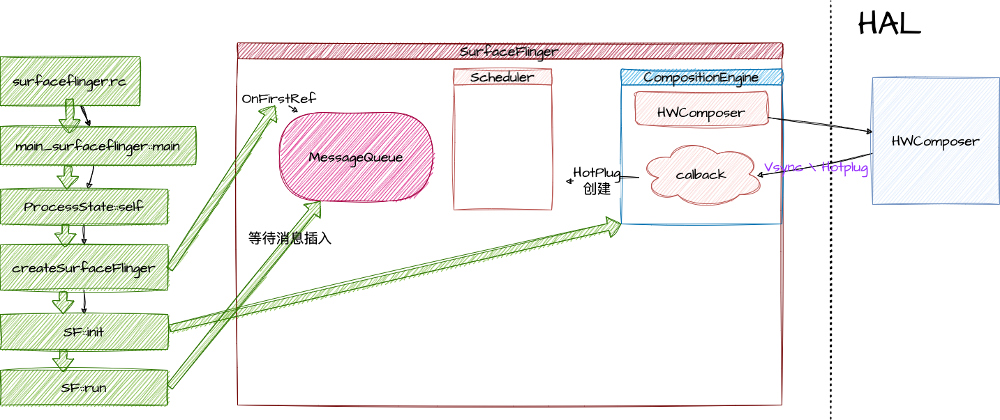

 
# Surface Flinger
> 什么是SurfaceFlinger？ SurfaceFlinger 接受图像的缓冲，对它们进行合成，然后发送到屏幕。  

SurfaceFlinger 可通过两种方式接受缓冲区：通过 BufferQueue 和 SurfaceControl，或通过 ASurfaceControl。  

虽然应用可以随时提交缓冲区，但 SurfaceFlinger 仅能在屏幕处于两次刷新之间时唤醒，以接受缓冲区，这会因设备而异。这样可以最大限度地减少内存使用量，并避免屏幕上出现可见的撕裂现象。

在屏幕处于两次刷新之间时，屏幕会向 SurfaceFlinger 发送 VSYNC 信号。VSYNC 信号表明可对屏幕进行刷新而不会产生撕裂。当 SurfaceFlinger 接收到 VSYNC 信号后，SurfaceFlinger 会遍历其层列表，以查找新的缓冲区。如果 SurfaceFlinger 找到新的缓冲区，SurfaceFlinger 会获取缓冲区；否则，SurfaceFlinger 会继续使用上一次获取的那个缓冲区。SurfaceFlinger 必须始终显示内容，因此它会保留一个缓冲区。如果在某个层上没有提交缓冲区，则该层会被忽略。

SurfaceFlinger 在收集可见层的所有缓冲区之后，便会询问硬件混合渲染器 (HWC) 应如何进行合成。如果 HWC 将层合成类型标记为客户端合成，则 SurfaceFlinger 将合成这些层。然后，SurfaceFlinger 会将输出缓冲区传递给 HWC。


## SurfaceFlinger怎么启动



由init进程通过解析surfaceflinger.rc文件，启动surfacefligner /system/bin/surfaceflinger 进程。[main_surfaceflinger.cpp](http://aospxref.com/android-12.0.0_r3/xref/frameworks/native/services/surfaceflinger/main_surfaceflinger.cpp) 就是这个进程的入口
```c++
// frameworks/native/services/surfaceflinger/main_surfaceflinger.cpp
int main(int, char**) { 

    // 当SF启动的时候，限制binder线程池上限为4。
    ProcessState::self()->setThreadPoolMaxThreadCount(4);

    // 启动Binder服务端
    sp<ProcessState> ps(ProcessState::self());
    ps->startThreadPool();

    // 实例化 surfaceflinger
    sp<SurfaceFlinger> flinger = surfaceflinger::createSurfaceFlinger();
    
    // 初始化
    flinger->init();

    // publish 到 ServiceManager
    sp<IServiceManager> sm(defaultServiceManager());
    sm->addService(String16(SurfaceFlinger::getServiceName()), flinger, false,
                   IServiceManager::DUMP_FLAG_PRIORITY_CRITICAL | IServiceManager::DUMP_FLAG_PROTO);

    // 启动显示器服务
    startDisplayService(); // dependency on SF getting registered above
    
    // 进入SurfaceFlinger的主循环
    flinger->run();

    return 0;
}
```
> `SurfaceFlinger`的 servicename是 “SurfaceFlinger”，对应的binder对象是 `android.ui.ISurfaceComposer`

### SurfaceFlinger的定义
[SurfaceFlinger.h](http://aospxref.com/android-12.0.0_r3/xref/frameworks/native/services/surfaceflinger/SurfaceFlinger.h)
```c++
  class SurfaceFlinger : public BnSurfaceComposer,
                         public PriorityDumper,
                         private IBinder::DeathRecipient,
                         private HWC2::ComposerCallback, 
                         private ISchedulerCallback {
```
- `BnSurfaceComposer` surfaceComposer的binder服务端。  
- `PriorityDumper` 用于dump信息。
- `DeathRecipient` binder服务端挂掉之后，用于通知客户端。
- `HWC2::ComposerCallback` 注册了HWC2的composercallback的回调，可以用于监听来自HWC2的事件，比如VSync事件。 
- `scheduler::ISchedulerCallback` 设置一些Scheduler 会用到的属性
```c++
struct ISchedulerCallback {
    virtual void setVsyncEnabled(bool) = 0;
    virtual void changeRefreshRate(const scheduler::RefreshRateConfigs::RefreshRate&,
                                   scheduler::RefreshRateConfigEvent) = 0;
    virtual void repaintEverythingForHWC() = 0;
    virtual void kernelTimerChanged(bool expired) = 0;
    virtual void triggerOnFrameRateOverridesChanged() = 0;

protected:
    ~ISchedulerCallback() = default;
};
```

### 创建实例对象 [SurfaceFlingerFactory.cpp](http://aospxref.com/android-12.0.0_r3/xref/frameworks/native/services/surfaceflinger/SurfaceFlingerFactory.cpp?fi=createSurfaceFlinger#createSurfaceFlinger)
```c++
// frameworks/native/services/surfaceflinger/SurfaceFlingerFactory.cpp
sp<SurfaceFlinger> createSurfaceFlinger() {
    // /frameworks/native/services/surfaceflinger/SurfaceFlingerDefaultFactory.cpp
    // 提供了默认的创建各种实例的工厂方法
    static DefaultFactory factory;

    return new SurfaceFlinger(factory);
}
// frameworks/native/services/surfaceflinger/SurfaceFlinger.cpp
SurfaceFlinger::SurfaceFlinger(Factory& factory) : SurfaceFlinger(factory, SkipInitialization) {
    ALOGI("SurfaceFlinger is starting");
    // 主要是配置一些属性，此处与主流程无关，跳过。
}

```
主要是配置一些属性，具体感兴趣可以查看这篇文章。
- [AndroidR 11 系统属性sysprop_library研究及其与SystemProperties的关系](https://blog.csdn.net/askfgx2010/article/details/112308665)

### 初始化
```c++
void SurfaceFlinger::init() { 
    Mutex::Autolock _l(mStateLock);

    // 设置渲染引擎 
   mCompositionEngine->setRenderEngine(renderengine::RenderEngine::create(
            renderengine::RenderEngineCreationArgs::Builder()
                    .setPixelFormat(static_cast<int32_t>(defaultCompositionPixelFormat))
                    .setImageCacheSize(maxFrameBufferAcquiredBuffers)
                    .setUseColorManagerment(useColorManagement)
                    .setEnableProtectedContext(enable_protected_contents(false))
                    .setPrecacheToneMapperShaderOnly(false)
                    .setSupportsBackgroundBlur(mSupportsBlur)
                    .setContextPriority(
                            useContextPriority
                                    ? renderengine::RenderEngine::ContextPriority::REALTIME
                                    : renderengine::RenderEngine::ContextPriority::MEDIUM)
                    .build()));
 
    // 创建和 hwc hal层的接口
    mCompositionEngine->setHwComposer(getFactory().createHWComposer(mHwcServiceName));
    // 将sf设置成hwc的回调方法，接收hwc传过来的VSYNC等信号
    mCompositionEngine->getHwComposer().setCallback(this); 
 

    // 处理 任何初始热插拔和显示更改的结果
    processDisplayHotplugEventsLocked();
    const auto display = getDefaultDisplayDeviceLocked();
    LOG_ALWAYS_FATAL_IF(!display, "Missing primary display after registering composer callback.");
    const auto displayId = display->getPhysicalId();
    LOG_ALWAYS_FATAL_IF(!getHwComposer().isConnected(displayId),
                        "Primary display is disconnected.");

    // initialize our drawing state
    mDrawingState = mCurrentState;

    // 初始化Display信息
    initializeDisplays(); 

    const bool presentFenceReliable =
            !getHwComposer().hasCapability(Capability::PRESENT_FENCE_IS_NOT_RELIABLE);
    mStartPropertySetThread = getFactory().createStartPropertySetThread(presentFenceReliable);

    // 启动属性设置线程，这里面包含了启动开机动画的逻辑
    if (mStartPropertySetThread->Start() != NO_ERROR) {
        ALOGE("Run StartPropertySetThread failed!");
    }
    ALOGV("Done initializing");
}
```
在这一步中，SF主要做了以下几件事
- 配置及创建渲染引擎，用于GPU合成模式。（SF，在渲染多层layer的时候可能会将合并工作交给HWC去实现，但是会有一部分工作由SF自己来做，此处的渲染引擎就是用来做这个的）
- 创建HWComposer注册回调接口，用于接收VSync，hotplug等信号。
- 处理显示器的热插拔等事件。
- 初始化显示设备。
- 开始一个属性设置线程。这里面会启动开机动画。

### mCompositionEngine->getHwComposer().setCallback(*this); 
在这里注册了回调时，hwc将会立刻回调热插拔的状态。而这一步也将导致后续调用到 processDisplayHotplugEventsLocked。这一步将会一直走到 processDisplayAdded。


### flinger->run
initScheduler完成之后就是调用`SurfaceFlinger::run`
```c++
// frameworks/native/services/surfaceflinger/SurfaceFlinger.cpp
void SurfaceFlinger::run() {
    mScheduler->run();
}
// frameworks/native/services/surfaceflinger/Scheduler/Scheduler.cpp
void Scheduler::run() {
    while (true) {
        mEventQueue->waitMessage();
    }
}
// frameworks/native/services/surfaceflinger/Scheduler/MessageQueue.cpp
void MessageQueue::waitMessage() {
    do {
        IPCThreadState::self()->flushCommands();
        int32_t ret = mLooper->pollOnce(-1);
        switch (ret) {
           
        }
    } while (true);
}
```
从这里我们可以看到，就是在等待通过Binder通信以及Messagequeue的消息传递了。

## MessageQueue

```c++
// frameworks/native/services/surfaceflinger/Scheduler/MessageQueue.h

namespace impl {

class MessageQueue : public android::MessageQueue {

    sp<SurfaceFlinger> mFlinger;
    sp<Looper> mLooper;
    
    sp<Handler> mHandler;
    
  ...
    void init(const sp<SurfaceFlinger>& flinger) override;
    void initVsync(scheduler::VSyncDispatch&, frametimeline::TokenManager&,
                   std::chrono::nanoseconds workDuration) override;
    void setDuration(std::chrono::nanoseconds workDuration) override;
    void setInjector(sp<EventThreadConnection>) override;
    void waitMessage() override;
    void postMessage(sp<MessageHandler>&&) override;

    // sends INVALIDATE message at next VSYNC
    void invalidate() override;

    // sends REFRESH message at next VSYNC
    void refresh() override;
}
```
MessageQueue 包含有以下几个变量
- mFlinger sp的引用。
- mLooper 维护了消息队列和待检测的fd队列
- mHandler 处理消息的handler


## VSync 信号是如何产生并且传送到app端的？

#### initScheduler 
创建Scheduler，处理VSYNC信号
```c++

```

#### processDisplayAdded
```c++
void SurfaceFlinger::processDisplayAdded(const wp<IBinder>& displayToken,
                                         const DisplayDeviceState& state) {
    
 
    auto compositionDisplay = getCompositionEngine().createDisplay(builder.build());
    compositionDisplay->setLayerCachingEnabled(mLayerCachingEnabled);

    sp<compositionengine::DisplaySurface> displaySurface;
    // 创建 和 hwc 交互的bufferqueue相关的producer和consumer
    sp<IGraphicBufferProducer> producer;
    sp<IGraphicBufferProducer> bqProducer;
    sp<IGraphicBufferConsumer> bqConsumer;
    // 创建和hwc交互的 用于 合成client的 bufferqueue
    getFactory().createBufferQueue(&bqProducer, &bqConsumer, /*consumerIsSurfaceFlinger =*/false);

    // 如果是虚拟设备，直接全部使用 client合成
    if (state.isVirtual()) {
        const auto displayId = VirtualDisplayId::tryCast(compositionDisplay->getId());
        LOG_FATAL_IF(!displayId);
        auto surface = sp<VirtualDisplaySurface>::make(getHwComposer(), *displayId, state.surface,
                                                       bqProducer, bqConsumer, state.displayName);
        displaySurface = surface;
        producer = std::move(surface);
    } else {
        ALOGE_IF(state.surface != nullptr,
                 "adding a supported display, but rendering "
                 "surface is provided (%p), ignoring it",
                 state.surface.get());
        const auto displayId = PhysicalDisplayId::tryCast(compositionDisplay->getId());
        LOG_FATAL_IF(!displayId);
        displaySurface =
                sp<FramebufferSurface>::make(getHwComposer(), *displayId, bqConsumer,
                                             state.physical->activeMode->getResolution(),
                                             ui::Size(maxGraphicsWidth, maxGraphicsHeight));
        producer = bqProducer;
    }

    // 配置display
    LOG_FATAL_IF(!displaySurface);
    auto display = setupNewDisplayDeviceInternal(displayToken, std::move(compositionDisplay), state,
                                                 displaySurface, producer);
  
    // 热插拔事件的再次分发
    if (!state.isVirtual()) {
        dispatchDisplayHotplugEvent(display->getPhysicalId(), true);
    } 
    mDisplays.try_emplace(displayToken, std::move(display));
}
```

#### initScheduler
```c++
// frameworks/native/services/surfaceflinger/SurfaceFlinger.cpp#initScheduler
void SurfaceFlinger::initScheduler(const sp<DisplayDevice>& display) {
    if (mScheduler) {
        //如果scheduler已经注册过，还要再次注册，说明我我们再次收到了热插拔事件，我们只需要更新一下配置即可。
        ALOGW("Scheduler already initialized, updating instead");
        mScheduler->setRefreshRateConfigs(display->holdRefreshRateConfigs());
        return;
    }

    const auto currRefreshRate = display->getActiveMode()->getFps(); 

    mScheduler = std::make_unique<scheduler::Scheduler>(static_cast<ICompositor&>(*this),
                                                        static_cast<ISchedulerCallback&>(*this),
                                                        features);
    {
        auto configs = display->holdRefreshRateConfigs();
       
        // 创建 Vsync 相关的Schedule
        mScheduler->createVsyncSchedule(features);
        mScheduler->setRefreshRateConfigs(std::move(configs));
    }
    // 设置不接收来自HWC的Vsync信号
    setVsyncEnabled(false);
    // 
    mScheduler->startTimers();

    const auto configs = mVsyncConfiguration->getCurrentConfigs();
    const nsecs_t vsyncPeriod = currRefreshRate.getPeriodNsecs();
    // 创建与app客户端链接的connect 服务端
    mAppConnectionHandle =
            mScheduler->createConnection("app", mFrameTimeline->getTokenManager(),
                                         /*workDuration=*/configs.late.appWorkDuration,
                                         /*readyDuration=*/configs.late.sfWorkDuration,
                                         impl::EventThread::InterceptVSyncsCallback());
    // 创建与sf的connect 服务端
    mSfConnectionHandle =
            mScheduler->createConnection("appSf", mFrameTimeline->getTokenManager(),
                                         /*workDuration=*/std::chrono::nanoseconds(vsyncPeriod),
                                         /*readyDuration=*/configs.late.sfWorkDuration,
                                         [this](nsecs_t timestamp) {
                                             mInterceptor->saveVSyncEvent(timestamp);
                                         });

    // 初始化 VSync 派发器
    mScheduler->initVsync(mScheduler->getVsyncDispatch(), *mFrameTimeline->getTokenManager(),
                          configs.late.sfWorkDuration);

    mRegionSamplingThread =
            new RegionSamplingThread(*this, RegionSamplingThread::EnvironmentTimingTunables());
    mFpsReporter = new FpsReporter(*mFrameTimeline, *this); 
    mScheduler->onPrimaryDisplayModeChanged(mAppConnectionHandle, display->getActiveMode());
}
```
**为什么有 mAppConnectionHandle 与 mSfConnectionHandle？** 
这里有一个优化策略，当Vsync到来的时候，如果同时给APP和SF发送Vsync，那么就很有可能照成，app绘制和SF绘制同时发生，这就照成了两个CPU密集型任务一起工作，导致CPU资源的竞争，从而影响效率。
这里会给两个vsync源分别加上过一个偏移量，以错开两个绘制的同时发生。

#### 


我们知道，VSync是由屏幕在交换缓冲区时发出的信号，在Android的图形系统中，HWC是显示器的抽象，SurfaceFlinger的VSync来之HWC的回调。
### HWC的回调
```c++
// frameworks/native/services/surfaceflinger/DisplayHardware/HWC2.h
struct ComposerCallback {
    virtual void onComposerHalHotplug(hal::HWDisplayId, hal::Connection) = 0;
    virtual void onComposerHalRefresh(hal::HWDisplayId) = 0;
    virtual void onComposerHalVsync(hal::HWDisplayId, int64_t timestamp,
                                    std::optional<hal::VsyncPeriodNanos>) = 0;
    virtual void onComposerHalVsyncPeriodTimingChanged(hal::HWDisplayId,
                                                       const hal::VsyncPeriodChangeTimeline&) = 0;
    virtual void onComposerHalSeamlessPossible(hal::HWDisplayId) = 0;
    virtual void onComposerHalVsyncIdle(hal::HWDisplayId) = 0;

protected:
    ~ComposerCallback() = default;
};
```
当VSync到来时，将会回调 `onComposerHalVsync`
```c++
// rameworks/native/services/surfaceflinger/SurfaceFlinger.cpp#1851

void SurfaceFlinger::onComposerHalVsync(hal::HWDisplayId hwcDisplayId, int64_t timestamp,
                                        std::optional<hal::VsyncPeriodNanos> vsyncPeriod) {
    Mutex::Autolock lock(mStateLock);
     
    mScheduler->addResyncSample(timestamp, vsyncPeriod, &periodFlushed);
     
}

```


## 参考资料
- [SurfaceFlinger 和 WindowManager](https://source.android.com/docs/core/graphics/surfaceflinger-windowmanager?hl=zh-cn)
- [Android 显示系统：SurfaceFlinger详解](https://www.cnblogs.com/blogs-of-lxl/p/11272756.html) 
- [Android-SurfaceFlinger启动与绘图原理](https://ljd1996.github.io/2020/11/02/Android-SurfaceFlinger%E5%90%AF%E5%8A%A8%E4%B8%8E%E7%BB%98%E5%9B%BE%E5%8E%9F%E7%90%86/)
- [Android GUI系统之SurfaceFlinger](https://blog.51cto.com/u_14344871/3369982)
- [Android 12(S) 图像显示系统 - 开篇](https://www.cnblogs.com/roger-yu/p/15641545.html)
- [VSYNC1](https://www.cnblogs.com/roger-yu/p/16075956.html)
- [VSYNC2](https://www.cnblogs.com/roger-yu/p/16167404.html)
- [SurfaceView 与 BufferQueue](https://www.cnblogs.com/roger-yu/p/16041250.html)