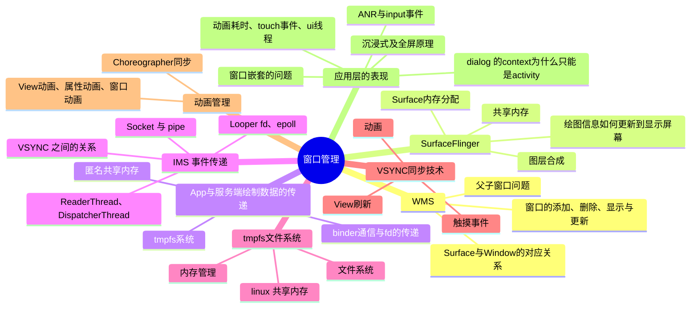
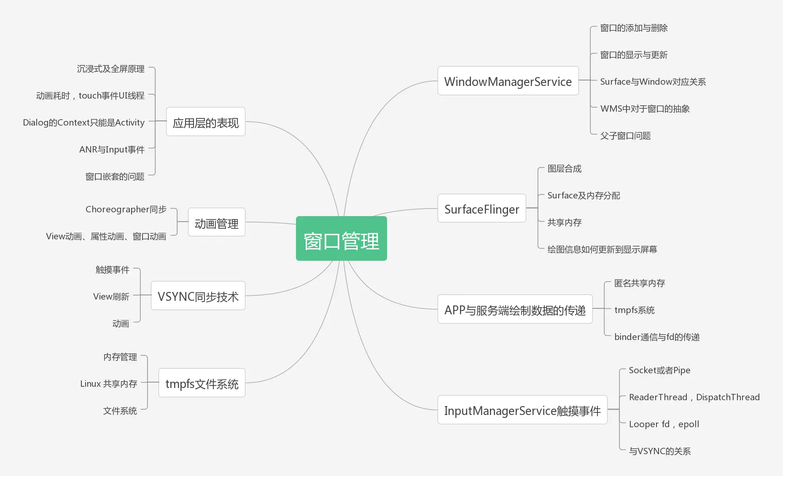

# 画面显示内容 所包含的内容 

```mermaid
mindmap
root((窗口管理))
    WMS
      窗口的添加、删除、显示与更新
      Surface与Window的对应关系
      父子窗口问题
    SurfaceFlinger
      图层合成
      Surface内存分配
      共享内存
      绘图信息如何更新到显示屏幕
    App与服务端绘制数据的传递
      匿名共享内存
      tmpfs系统
      binder通信与fd的传递
    IMS 事件传递 
      Socket 与 pipe
      ReaderThread、DispatcherThread
      Looper fd、epoll
      VSYNC 之间的关系
    tmpfs文件系统
      内存管理
      linux 共享内存
      文件系统
    VSYNC同步技术
      触摸事件
      View刷新
      动画
    动画管理
      Choreographer同步
      View动画、属性动画、窗口动画
    应用层的表现
      沉浸式及全屏原理
      动画耗时、touch事件、ui线程
      dialog 的context为什么只能是activity
      ANR与input事件
      窗口嵌套的问题
```

 
## [IMS](/p/fwk/ims)