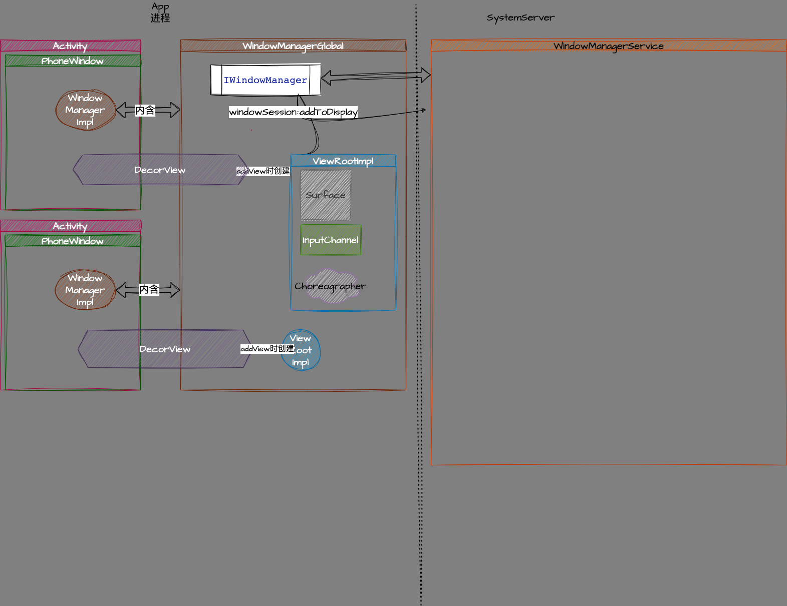
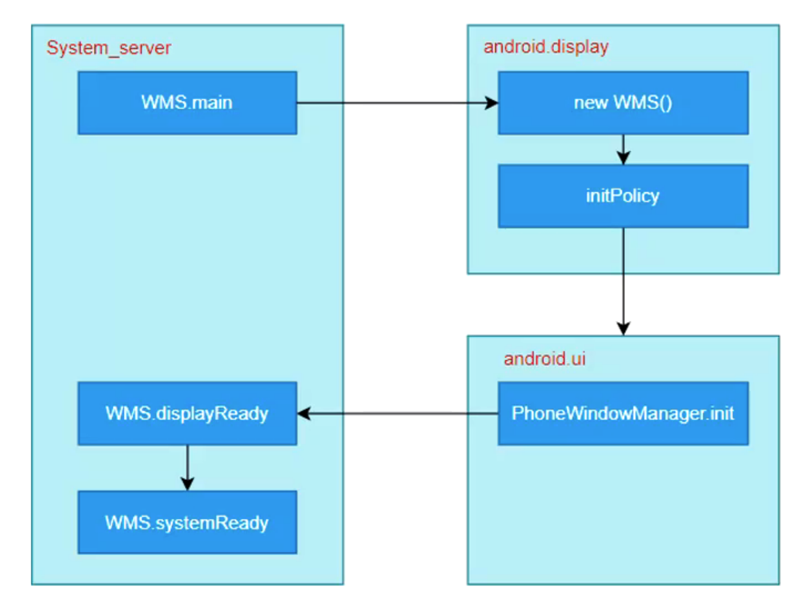

# window manager service 以及应用侧的内容


## 应用侧 - 相关的类图


classDiagram

ViewManager <|-- WindowManager  
WindowManager <|.. WindowManagerImpl
WindowManagerImpl *--> WindowManagerGlobal

WindowManagerImpl : WindowManagerGlobal mGlobal



## 应用侧 - 相关类的具体职责

### ViewRootImpl 
- 管理View和View树的树根DecorView
- 触发测绘，布局，绘制
- wms传递的事件的中转站 
- wms的交互


## 应用侧 - 从ams出发的源码解析

### ActivityThread::handleLaunchActivity
```java
public Activity handleLaunchActivity(ActivityClientRecord r,
        PendingTransactionActions pendingActions, Intent customIntent) { 
    // windowmanagerglobal 保存了wms的binder。
    WindowManagerGlobal.initialize();
    ...
    final Activity a = performLaunchActivity(r, customIntent);
    ...
    return a;
}
```

#### WindowManagerGlobal::initialize
初始化 wms的在app进程的binder
```java
public static void initialize() {
    getWindowManagerService();
}

public static IWindowManager getWindowManagerService() {
    synchronized (WindowManagerGlobal.class) {
        if (sWindowManagerService == null) {
            sWindowManagerService = IWindowManager.Stub.asInterface(
                    ServiceManager.getService("window"));
            try {
                if (sWindowManagerService != null) {
                    ValueAnimator.setDurationScale(
                            sWindowManagerService.getCurrentAnimatorScale());
                }
            } catch (RemoteException e) {
                throw e.rethrowFromSystemServer();
            }
        }
        return sWindowManagerService;
    }
}

```
 
### ActivityThread::performLaunchActivity
从activity的启动创建开始查看window的启动创建
```java
/**  Core implementation of activity launch. */
private Activity performLaunchActivity(ActivityClientRecord r, Intent customIntent) {
    ActivityInfo aInfo = r.activityInfo;
    ...
    try {
        // 创建application，
        Application app = r.packageInfo.makeApplication(false, mInstrumentation); 
        Activity activity = null;
        try {
            // 使用反射创建activity
            java.lang.ClassLoader cl = appContext.getClassLoader();
            activity = mInstrumentation.newActivity(
                    cl, component.getClassName(), r.intent);
        } catch (Exception e) {
        }
 
        // 在这里，如activity 不为空
        if (activity != null) { 
            Window window = null;  
            ...
            // 进入activity的attach
            activity.attach(appContext, this, getInstrumentation(), r.token,
                    r.ident, app, r.intent, r.activityInfo, title, r.parent,
                    r.embeddedID, r.lastNonConfigurationInstances, config,
                    r.referrer, r.voiceInteractor, window, r.configCallback);
            // instrumentation
            if (r.isPersistable()) {
                mInstrumentation.callActivityOnCreate(activity, r.state, r.persistentState);
            } else {
                mInstrumentation.callActivityOnCreate(activity, r.state);
            } 
            r.activity = activity;
        }
        r.setState(ON_CREATE); 
    }   
    return activity;
}
```

#### Activity:attach
```java
final void attach(Context context, ActivityThread aThread,
        ...
        Window window, ActivityConfigCallback activityConfigCallback) {
    attachBaseContext(context);
 
    mWindow = new PhoneWindow(this, window, activityConfigCallback);
    mWindow.setWindowControllerCallback(this);
    mWindow.setCallback(this);
    
    mUiThread = Thread.currentThread();

    mWindow.setWindowManager(
            (WindowManager)context.getSystemService(Context.WINDOW_SERVICE),
            mToken, mComponent.flattenToString(),
            (info.flags & ActivityInfo.FLAG_HARDWARE_ACCELERATED) != 0);
    
    mWindowManager = mWindow.getWindowManager();
    
}

```

#### Activity.mWindow = new PhoneWindow(this, window, activityConfigCallback)
让我们来看看PhoneWindow的内容.
```java
public class PhoneWindow extends Window implements MenuBuilder.Callback {
    private DecorView mDecor;
    private LayoutInflater mLayoutInflater;
    public PhoneWindow(Context context) {
        super(context);
        mLayoutInflater = LayoutInflater.from(context);
    }
    // Activity的setContentView 就是调用了Window的setContentView
    public void setContentView(int layoutResID) { 
        if (mContentParent == null) {
            installDecor();
        }  
        if (...) {
            mLayoutInflater.inflate(layoutResID, mContentParent);
        } 
        ...
    }
    private void installDecor() {
        mForceDecorInstall = false;
        if (mDecor == null) {
            mDecor = generateDecor(-1);
            mDecor.setDescendantFocusability(ViewGroup.FOCUS_AFTER_DESCENDANTS);
            mDecor.setIsRootNamespace(true);
            if (!mInvalidatePanelMenuPosted && mInvalidatePanelMenuFeatures != 0) {
                mDecor.postOnAnimation(mInvalidatePanelMenuRunnable);
            }
        }  
    }
    protected DecorView generateDecor(int featureId) {
        return new DecorView(context, featureId, this, getAttributes());
    }
}
```
从上面就可以看出phonewindow的大致内容为创建decorview以及相关的一些属性的配置。


### ActivityThread::handleResumeActivity

```java 
public void handleResumeActivity(IBinder token, boolean finalStateRequest, boolean isForward, String reason) {  
    // 回调resume
    final ActivityClientRecord r = performResumeActivity(token, finalStateRequest, reason);
    if (r.window == null && !a.mFinished && willBeVisible) {
        r.window = r.activity.getWindow();
        View decor = r.window.getDecorView();
        decor.setVisibility(View.INVISIBLE);
        ViewManager wm = a.getWindowManager();
        WindowManager.LayoutParams l = r.window.getAttributes();
        a.mDecor = decor;

        if (a.mVisibleFromClient) {
            if (!a.mWindowAdded) {
                a.mWindowAdded = true;
                // 将decorview 添加到windowmanager上
                wm.addView(decor, l);
            } 
            ...
        }
        ...
    }
  
    Looper.myQueue().addIdleHandler(new Idler());
}

```

#### WindowManagerGlobal::addView

```java
public void addView(View view, ViewGroup.LayoutParams params, Display display, Window parentWindow) {

    final WindowManager.LayoutParams wparams = (WindowManager.LayoutParams) params;

    ViewRootImpl root;
    View panelParentView = null;

    synchronized (mLock) {
        root = new ViewRootImpl(view.getContext(), display);
        view.setLayoutParams(wparams);
        mViews.add(view);
        mRoots.add(root);
        mParams.add(wparams);

        try {
            root.setView(view, wparams, panelParentView);
        } catch (RuntimeException e) {
            ...
        }
    }
}
```
通过加锁，将DecorView 和 ViewRootImpl 一一对应。
#### ViewRootImpl::setView
```java
// http://aospxref.com/android-9.0.0_r61/xref/frameworks/base/core/java/android/view/ViewRootImpl.java
public final class ViewRootImpl implements ViewParent, View.AttachInfo.Callbacks, ThreadedRenderer.DrawCallbacks {
   public void setView(View view, WindowManager.LayoutParams attrs, View panelParentView) {
     res = mWindowSession.addToDisplay(mWindow, mSeq, mWindowAttributes,
                              getHostVisibility(), mDisplay.getDisplayId(), mWinFrame,
                              mAttachInfo.mContentInsets, mAttachInfo.mStableInsets,
                              mAttachInfo.mOutsets, mAttachInfo.mDisplayCutout, mInputChannel);
   }
}
```


将数据传输到wms 

## SystemServer - WMS 启动流程


### WindowSeeion::addToDisplay
```java
// http://aospxref.com/android-9.0.0_r61/xref/frameworks/base/services/core/java/com/android/server/wm/Session.java#201
public int addToDisplay(IWindow window, int seq, WindowManager.LayoutParams attrs,
              int viewVisibility, int displayId, Rect outFrame, Rect outContentInsets,
              Rect outStableInsets, Rect outOutsets,
              DisplayCutout.ParcelableWrapper outDisplayCutout, InputChannel outInputChannel) {
    return mService.addWindow(this, window, seq, attrs, viewVisibility, displayId, outFrame,
            outContentInsets, outStableInsets, outOutsets, outDisplayCutout, outInputChannel);
}
```

### WMS::addWindow
```java
 public int addWindow(Session session, IWindow client, int seq,
            LayoutParams attrs, int viewVisibility, int displayId, Rect outFrame,
            Rect outContentInsets, Rect outStableInsets, Rect outOutsets,
            DisplayCutout.ParcelableWrapper outDisplayCutout, InputChannel outInputChannel) {
    int[] appOp = new int[1];
    // PhoneWindowManager::checkAddPermission 检查窗口类型 是否有权限进行添加
    int res = mPolicy.checkAddPermission(attrs, appOp);
    if (res != WindowManagerGlobal.ADD_OKAY) {
        return res;
    }
 
    synchronized(mWindowMap) {
        // 检查 display 是否准备好，由于 window是需要添加到display上去的
        if (!mDisplayReady) {
            throw new IllegalStateException("Display has not been initialialized");
        }

        // 子窗口 需要依赖父窗口。
        if (type >= FIRST_SUB_WINDOW && type <= LAST_SUB_WINDOW) {
            ...
        }

        AppWindowToken atoken = null;
        final boolean hasParent = parentWindow != null;
        // 子窗口 使用父窗口的token
        WindowToken token = displayContent.getWindowToken(
                hasParent ? parentWindow.mAttrs.token : attrs.token);
        // 子窗口 优先展示父窗口
        final int rootType = hasParent ? parentWindow.mAttrs.type : type; 

        if (token == null) {
            // 如果 token 为空，意味着是系统级别的窗口。需要做一些type的判断，然后创建token
            final IBinder binder = attrs.token != null ? attrs.token : client.asBinder(); 
            token = new WindowToken(this, binder, type, false, displayContent,
                    session.mCanAddInternalSystemWindow, isRoundedCornerOverlay);
        } else if (rootType >= FIRST_APPLICATION_WINDOW && rootType <= LAST_APPLICATION_WINDOW) {
            // 如果是 application window，做一些检查。
            atoken = token.asAppWindowToken();
        } else if (...) {
            // xxx 检查各类窗口类型
        } else if (token.asAppWindowToken() != null) {
            // 如果是其他类型的system window类型，不能使用app的token来展示窗口，需要新建一个
            attrs.token = null;
            token = new WindowToken(this, client.asBinder(), type, false, displayContent,
                    session.mCanAddInternalSystemWindow);
        }
        // 创建WindowsState。WindowState作为wms管理应用侧的window的包装类。用于提供便捷的关于window的炒作。
        final WindowState win = new WindowState(this, session, client, token, parentWindow,
                appOp[0], seq, attrs, viewVisibility, session.mUid,
                session.mCanAddInternalSystemWindow);
        
        // 状态栏调整
        final boolean hasStatusBarServicePermission =
                mContext.checkCallingOrSelfPermission(permission.STATUS_BAR_SERVICE)
                        == PackageManager.PERMISSION_GRANTED;
        mPolicy.adjustWindowParamsLw(win, win.mAttrs, hasStatusBarServicePermission);
        win.setShowToOwnerOnlyLocked(mPolicy.checkShowToOwnerOnly(attrs));

        // 添加前的所有准备
        res = mPolicy.prepareAddWindowLw(win, attrs);
        if (res != WindowManagerGlobal.ADD_OKAY) {
            return res;
        }

        final boolean openInputChannels = (outInputChannel != null
                && (attrs.inputFeatures & INPUT_FEATURE_NO_INPUT_CHANNEL) == 0);
        if  (openInputChannels) {
            win.openInputChannel(outInputChannel);
        }

        if (type == TYPE_TOAST) {
            。。。
            // 如果添加toast ，需要把原来的toast取消
            if (addToastWindowRequiresToken
                    || (attrs.flags & LayoutParams.FLAG_NOT_FOCUSABLE) == 0
                    || mCurrentFocus == null
                    || mCurrentFocus.mOwnerUid != callingUid) {
                mH.sendMessageDelayed(
                        mH.obtainMessage(H.WINDOW_HIDE_TIMEOUT, win),
                        win.mAttrs.hideTimeoutMilliseconds);
            }
        }
        ... 
        // 实际添加过程
    }
    return res;
}

```


## chatgpt 相关内容

- 什么是 Window Manager Service？它在 Android 系统中的作用是什么？
- Window Manager Service 的架构和工作流程是怎样的？
- 如何实现 Android 窗口的添加、移动和调整大小等操作？
- 如何实现 Android 窗口的层次和 Z 轴排序？
- 如何处理多个应用程序之间的窗口管理冲突？
- 如何实现 Android 窗口的动画效果？
- 如何对 Window Manager Service 进行性能优化？
- 如何在 Android 系统中实现全局键盘快捷键？
- 如何在 Android 系统中实现分屏功能？
- 如何在 Android 系统中实现虚拟键盘？