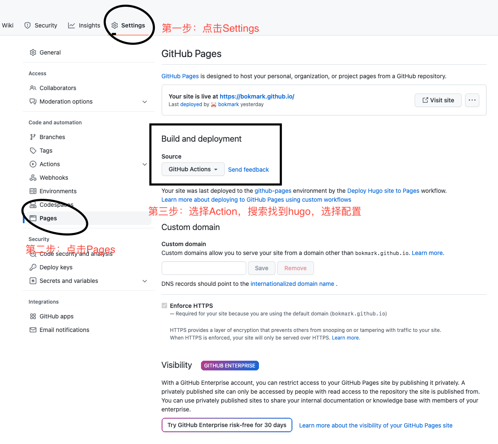

# 使用hugo构建博客 最新版本

本博客是使用hugo进行文档的构建，并且进行了很多的配置，特此来做个记录。

## hugo 搭建框架基础
[理论来源](https://gohugo.io/getting-started/quick-start/)

### [安装hugo](https://gohugo.io/installation/)
```bash
brew install hugo
```

### [安装Git](https://git-scm.com/book/en/v2/Getting-Started-Installing-Git)
```bash
brew install git
```

### 快速启动
```bash
# 新建site
hugo new site yoursite
# cd 进入site目录
cd yoursite
# 构建git，方便添加theme submodule
git init
# 添加theme
git submodule add https://github.com/CaiJimmy/hugo-theme-stack themes/stack
# 修改配置，后续使用theme的配置文件覆盖，这里先把博客搭建起来再说
echo "theme = 'stack'" >> config.toml
# 本地运行博客
hugo server
```


## 配置主题以[Stack](https://github.com/CaiJimmy/hugo-theme-stack) 为例

### 配置 *Waline*
[具体步骤按照官方地址即可](https://waline.js.org/guide/get-started/#vercel-%E9%83%A8%E7%BD%B2-%E6%9C%8D%E5%8A%A1%E7%AB%AF)  

最后将按照步骤得到的 `serverURL` 填入下面内容
```yaml
    waline:
        serverURL: https://waline-xxx-xxx.vercel.app/
        lang:
        pageview:
        emoji:
            - https://unpkg.com/@waline/emojis@1.0.1/weibo
        requiredMeta:
            - name
            - email
            - url
        locale:
            admin: Admin
            placeholder:
```

## 添加mermaid 支持 
[参考资料](https://www.bodunhu.com/blog/posts/add-mermaid-to-hugo-with-dark-mode/)

sequenceDiagram
    participant Alice
    participant Bob
    Alice->>John: Hello John, how are you?
    loop Healthcheck
        John->>John: Fight against hypochondria
    end
    Note right of John: Rational thoughts <br/>prevail!
    John-->>Alice: Great!
    John->>Bob: How about you?
    Bob-->>John: Jolly good!


## busuanzi
添加busuanzi 支持
```yaml
params:
    busuanzi:
        enable: true
```
在`layouts/partials/article/components/details.html`中添加
```html
<!-- busuanzi -->
{{ if .Site.Params.busuanzi.enable -}}
    <div  class="meta-item">&nbsp·&nbsp
        <span id="busuanzi_container_page_pv">本文阅读量<span id="busuanzi_value_page_pv"></span>次</span>
    </div>
{{- end }}
```
在`layouts/partials/footer/footer.html`中添加
```html
<!-- busuanzi -->
{{ if .Site.Params.busuanzi.enable -}}
    <section  class="powerby">
        <div class="busuanzi-footer">
        <span id="busuanzi_container_site_pv">
            本站总访问量<span id="busuanzi_value_site_pv"></span>次
        </span>

        <span id="busuanzi_container_site_uv">
            本站访客数<span id="busuanzi_value_site_uv"></span>人次
        </span>
        </div>
    </section>
{{- end -}}
```

在`layouts/partials/head/head.html`中添加
```html
<!-- busuanzi -->
{{- if .Site.Params.busuanzi.enable -}}
<script async src="//busuanzi.ibruce.info/busuanzi/2.3/busuanzi.pure.mini.js"></script>
<meta name="referrer" content="no-referrer-when-downgrade">
{{- end -}}
```

## github workflow
将代码加到github
```git
git remote add origin https://github.com/yourusername/yourrepo.git
git branch -M main
git push -u origin main
```
如果你将repo库的名字改成`yourusername.github.io`的话，你的博客地址就会变成`https://yourusername.github.io`.  
而如果你所传的repo库的名字不是上述的这个，那你的博客地址为`https://yourusername.github.io/yourreponame`.  
接下来


当你提交到main分支之后，github会自动depoly。

进入 [https://github.com/bokmark/bokmark.github.io/actions](https://github.com/bokmark/bokmark.github.io/actions) 