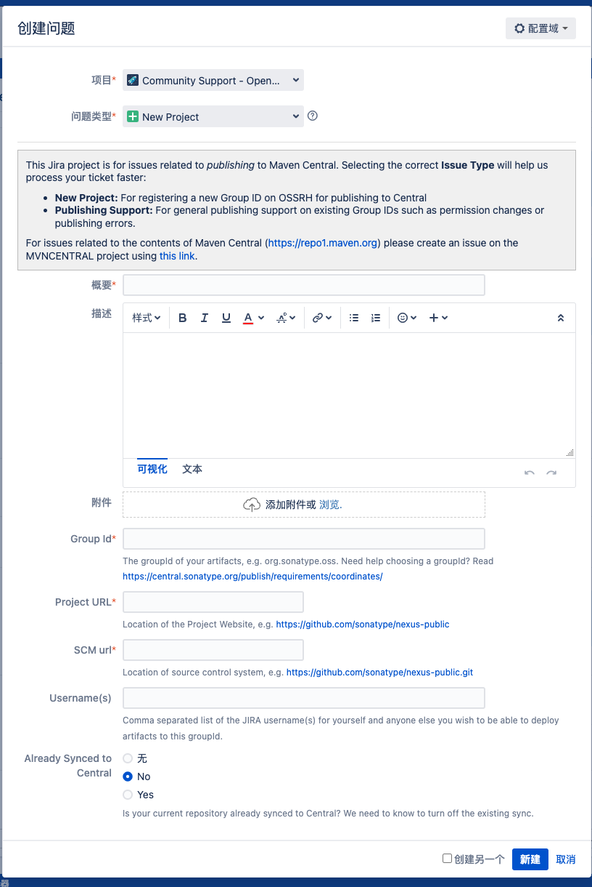
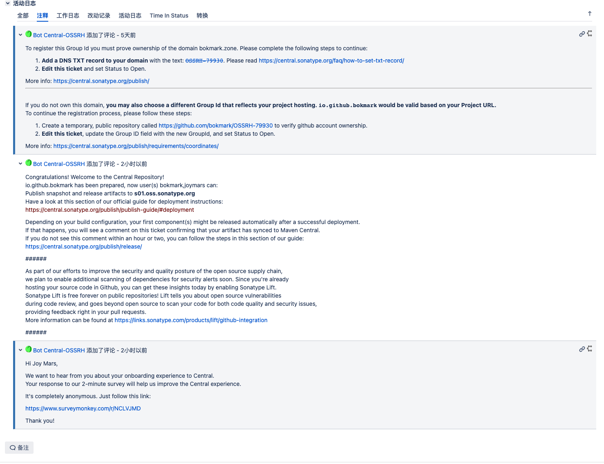

# Android 如何构建 Maven Push 的通道


## 创建 Sonatype 账号

[Sonatype](https://issues.sonatype.org/) 这个链接进行注册。


## 申请 Group Id
还是这个链接[Sonatype](https://issues.sonatype.org/)，点击顶部栏的新建按钮。

 

新建完之后等待后台的工作人员进行审核。

*sonatype* 要求你必须拥有你所申请的Group Id 的 domain。所以我这里用的是 github的免费 domain。

### 这是我申请的例子
 

## Android project 配置
[具体的代码可以参考我的这个项目](https://github.com/bokmark/espressoKit)

## Maven 后台管理地址

[后台管理地址](https://s01.oss.sonatype.org/#welcome)

## 配置密钥

```
brew install gpg
```

```
gpg --full-gen-key
```

```
gpg --export-secret-keys -o secring.gpg
```

## 参考文档

- [Android库发布至MavenCentral流程详解](https://juejin.cn/post/6953598441817636900)
- [mac上设置发布密钥的内容](https://www.jianshu.com/p/1c715203c7c6)