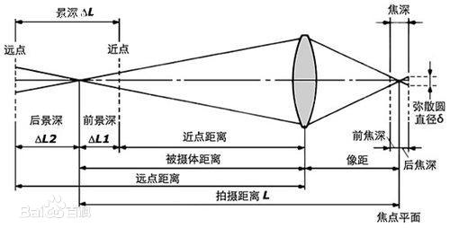

# 摄影基础知识

> 摄影理解为光的处理艺术
> 本人有一台Sony A7M2 全画幅微单。所以所有的概念都以这个相机作为基础。

来一个易理解的入门视频
> 

> [相机入门系列](https://space.bilibili.com/55801838/channel/seriesdetail?sid=404859)

> 以下为我自己的理解

## 镜头的基本概念

### 焦距

焦距可以理解为镜片中心到感光元件的距离。

 

根据小孔成像原理，可以得知，焦距越长，看到的景物越远。

### 景深

### 焦外

指镜头聚焦的景物之外的景色

### 光圈
在镜头中设计了光圈，用于控制光照射到CMOS上的光量。

## 曝光三要素

曝光可以理解为通过一个水漂往一个水桶里面加水。水的多少，就意味着光的多少。

### 光圈

### 快门速度

### ISO

## 来一个硬核科普视频
> 
