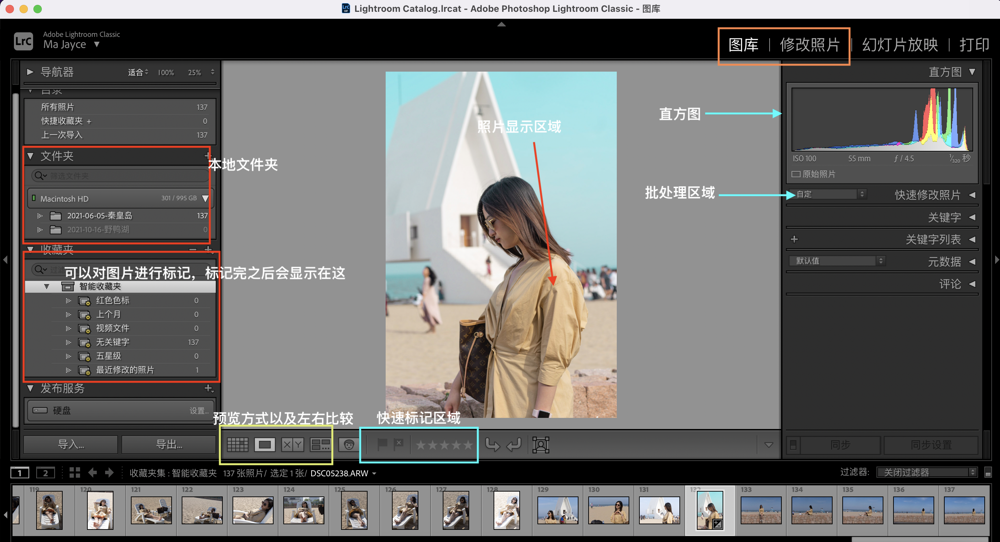

# Lightroom的安装以及入门

## Lightroom 的安装

> [链接](https://pan.baidu.com/s/10w_Pv101fq6fuGRHdRGDEw) 密码: 3b2t

我把我的安装文件共享在百度网盘了，如果链接失效可以通过评论联系我

```
// 设置允许来自任何来源安装
sudo spctl --master-disable 
// 去除dmg的相关属性 ，xxx.dmg 就是下载的安装文件的全路径
sudo xattr -r -d com.apple.quarantine xxx.dmg
```

最关键的一步，请断开wifi。然后打开dmg,点击install.app 一路next。


## Lightroom的入门

> 我的相关lightroom的知识都是来之 B站 up主 ： 摄影师泰罗的 lightroom 入门系列。
> [这里是链接](https://space.bilibili.com/110683415/channel/detail?cid=164307&ctype=0)

### 照片管理、筛选与批量处理

 

- 本地文件夹： 就是你的磁盘存储的实际路径
- 收藏夹：对照片进行区分的索引
- 照片底部的工具栏，可以通过鼠标悬浮的方式得知每个按钮的作用
- 图库：对导入的文件进行预览管理等动作
- 修改照片：找好待处理的照片，点击修改图片，进入调色阶段
- 左下角：过滤器
- 会有各种各样的快捷键，可以通过鼠标悬浮的方式查看

> 这是原视频
> 


### 直方图与曝光调整


> 这是原视频
> 

### 曲线是调色之王吗

> 这是原视频
> 

### 色温色调与分离色调

> 这是原视频
> 

### HSL调色的钥匙

> 这是原视频
> 

### 如何提升画面的清晰度

> 这是原视频
> 

### 提升摄影后期水准的3点建议

> 这是原视频
> 