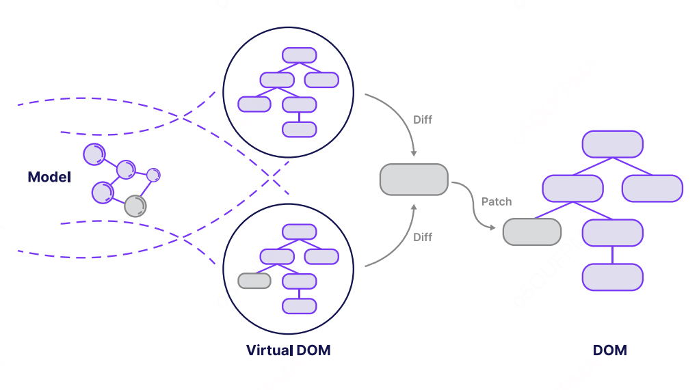

> [《React Native 优化终极指南》](https://5711799.fs1.hubspotusercontent-na1.net/hubfs/5711799/The%20Ultimate%20Guide%20to%20React%20Native%20Optimization%202024%20Edition.pdf)

# React Native 优化简介

## 一切都围绕着 TTI 和 FPS？

等等，这些奇怪的缩写到底是什么？！在考虑优化移动端 React Native 应用时，除了价值主张和用户参与度之外，我们需要承认两个最重要的指标——用户判断我们的应用是否快速流畅的依据——分别是交互时间（TTI，Time To Interactive）和每秒帧数（FPS，Frames Per Second）。

> 前者（TTI）衡量的是用户多快可以开始使用（或与）您的应用程序进行交互，主要关注启动时的性能。打开一个新的应用程序应该是快速的，这毫无疑问。而后者（FPS）则衡量的是应用程序界面对用户交互的响应速度，主要关注运行时的性能。使用应用程序的过程应该像骑自行车一样流畅——除非您开启了省电模式。优秀的应用程序将卓越的启动性能和运行性能结合起来，为用户提供最佳的端到端体验。

> 本指南中的几乎每条建议都将直接或间接影响这两个指标。而由于 React Native 为我们提供了构建原生 Android 和 iOS 应用的工具，并在其基础上加入了一些 JavaScript，这使得我们有许多机会可以从不同角度影响这些指标！

> 值得庆幸的是，大部分繁重的工作已经在框架层面为我们完成了，因此任何 React Native 开发者都可以从一个良好的性能基线开始。然而，随着您的应用变得越复杂，要维持健康的 TTI 和 FPS 基线性能可能会变得越具挑战性。

> 坦白说，优化并不只是围绕这两个指标。毕竟，如果您的应用在运行时崩溃，您还能测量交互过程中的 FPS 吗？优化是一个复杂且持续的过程，需要在多个层面不断进行，才能让产品取得成功。随着您深入阅读本指南，您将更清楚地了解哪些因素会影响用户体验、哪些因素对提供和感知更好的性能至关重要、为什么重要，以及如何解决阻碍用户在使用您的 React Native 应用时享受最佳体验的各种挑战。

### React Native 负责渲染，但性能仍是关键。

使用 React Native，您可以创建组件来描述界面的外观。在运行时，React Native 会将这些组件转换为平台特定的原生组件。与其直接与底层 API 对话，您更关注的是应用程序的用户体验。

然而，这并不意味着所有使用 React Native 开发的应用程序都同样快速，或者能够提供相同水平的用户体验。

#### 每种声明式方法（包括 React Native）都建立在命令式 API 之上，这需要特别注意。

当您以命令式方式构建应用程序时，您会仔细分析每个对外部 API 的调用点。例如，在多线程环境中编写代码时，您会在特定线程中安全地编写代码，同时清楚地了解代码运行的上下文以及其需要的资源。

尽管声明式和命令式方法在实现方式上存在诸多差异，但它们之间也有很多相似之处。每个声明式的抽象都可以被分解为若干命令式的调用。例如，React Native 在 iOS 上渲染应用程序时使用的 API，与原生开发者自己使用的 API 是相同的。

#### React Native 统一了性能，但并不保证性能无忧！

虽然您无需担心底层 iOS 和 Android API 调用的性能问题，但您如何组合组件却可能产生巨大的影响。您所有的组件都会提供相同水平的性能和响应能力。

#### 但“相同”是否等于“最佳”？答案是否定的。

这就是我们的清单发挥作用的时候。充分利用 React Native 的潜力。如前所述，React Native 是一个声明式框架，负责为您渲染应用程序。换句话说，您无需指定应用程序的渲染方式。

您的任务是定义 UI 组件，其他的交给框架处理。然而，这并不意味着您可以理所当然地忽略应用程序的性能。为了创建快速且响应迅速的应用程序，您需要以 React Native 的方式思考。您必须了解框架如何与底层平台 API 进行交互。

#### 如果您需要在性能、稳定性、用户体验或其他复杂问题上获得帮助，请联系我们！
作为 React Native 核心贡献者和社区领袖，我们将很乐意为您提供帮助。

## 第一章 通过了解 React Native 的实现细节来提升性能。

> 在本节中，我们将深入探讨最常见的性能瓶颈以及导致这些问题的 React Native 实现细节。这不仅是对一些高级 React Native 概念的平滑引入，还将通过一些小的调整和更改，让您提升应用程序的稳定性和性能。

> 接下来的部分将聚焦于性能优化策略清单中的第一个要点：UI 的重新渲染。这是 React Native 优化过程中非常重要的一部分，因为它可以减少设备的电量消耗，从而提升您的应用程序的用户体验。

### 第一节 注意 UI 的重新渲染
> 优化状态操作的次数，并使用记忆化组件，让您的应用以更少的资源运行得更快。

#### **问题：** 状态更新不正确导致多余的渲染周期，或者设备本身性能不足。

如前所述，React Native 会为您处理应用程序的渲染。您只需要定义所需的所有组件，并通过这些较小的构建块组合成最终的界面。在这种方法中，您无法控制应用程序的渲染生命周期。

换句话说，屏幕上的内容何时以及如何重绘完全是 React Native 的责任。React 会监测您对组件所做的更改，进行比较，并按照设计仅执行必要的、最少量的实际更新。

默认情况下，如果父组件重新渲染或传入的 props 发生变化，组件可能会重新渲染。这意味着即使组件的 props 未发生改变，其 render 方法有时仍然会运行。在大多数情况下，这是一种可以接受的权衡，因为比较两个对象（之前的 props 和当前的 props）可能会花费更多时间。

##### 对性能的负面影响、界面闪烁以及 FPS 的下降

虽然上述启发式规则在大多数情况下是正确的，但执行过多的操作可能会导致性能问题，尤其是在低端移动设备上。

因此，您可能会发现界面出现闪烁（更新发生时）或帧率下降（动画进行中同时发生更新）。

> 注意：过早进行优化可能会产生适得其反的效果。一旦在应用中发现掉帧或性能不佳的问题，应立即开始着手解决这些性能问题。

一旦您发现这些症状，就应该深入检查您的应用程序生命周期，寻找那些不必要的、意料之外的操作。
