> [《React Native 优化终极指南》](https://5711799.fs1.hubspotusercontent-na1.net/hubfs/5711799/The%20Ultimate%20Guide%20to%20React%20Native%20Optimization%202024%20Edition.pdf)

# React Native 优化简介

## 一切都围绕着 TTI 和 FPS？

等等，这些奇怪的缩写到底是什么？！在考虑优化移动端 React Native 应用时，除了价值主张和用户参与度之外，我们需要承认两个最重要的指标——用户判断我们的应用是否快速流畅的依据——分别是交互时间（TTI，Time To Interactive）和每秒帧数（FPS，Frames Per Second）。

> 前者（TTI）衡量的是用户多快可以开始使用（或与）您的应用程序进行交互，主要关注启动时的性能。打开一个新的应用程序应该是快速的，这毫无疑问。而后者（FPS）则衡量的是应用程序界面对用户交互的响应速度，主要关注运行时的性能。使用应用程序的过程应该像骑自行车一样流畅——除非您开启了省电模式。优秀的应用程序将卓越的启动性能和运行性能结合起来，为用户提供最佳的端到端体验。

> 本指南中的几乎每条建议都将直接或间接影响这两个指标。而由于 React Native 为我们提供了构建原生 Android 和 iOS 应用的工具，并在其基础上加入了一些 JavaScript，这使得我们有许多机会可以从不同角度影响这些指标！

> 值得庆幸的是，大部分繁重的工作已经在框架层面为我们完成了，因此任何 React Native 开发者都可以从一个良好的性能基线开始。然而，随着您的应用变得越复杂，要维持健康的 TTI 和 FPS 基线性能可能会变得越具挑战性。

> 坦白说，优化并不只是围绕这两个指标。毕竟，如果您的应用在运行时崩溃，您还能测量交互过程中的 FPS 吗？优化是一个复杂且持续的过程，需要在多个层面不断进行，才能让产品取得成功。随着您深入阅读本指南，您将更清楚地了解哪些因素会影响用户体验、哪些因素对提供和感知更好的性能至关重要、为什么重要，以及如何解决阻碍用户在使用您的 React Native 应用时享受最佳体验的各种挑战。

### React Native 负责渲染，但性能仍是关键。

使用 React Native，您可以创建组件来描述界面的外观。在运行时，React Native 会将这些组件转换为平台特定的原生组件。与其直接与底层 API 对话，您更关注的是应用程序的用户体验。

然而，这并不意味着所有使用 React Native 开发的应用程序都同样快速，或者能够提供相同水平的用户体验。

#### 每种声明式方法（包括 React Native）都建立在命令式 API 之上，这需要特别注意。

当您以命令式方式构建应用程序时，您会仔细分析每个对外部 API 的调用点。例如，在多线程环境中编写代码时，您会在特定线程中安全地编写代码，同时清楚地了解代码运行的上下文以及其需要的资源。

尽管声明式和命令式方法在实现方式上存在诸多差异，但它们之间也有很多相似之处。每个声明式的抽象都可以被分解为若干命令式的调用。例如，React Native 在 iOS 上渲染应用程序时使用的 API，与原生开发者自己使用的 API 是相同的。

#### React Native 统一了性能，但并不保证性能无忧！

虽然您无需担心底层 iOS 和 Android API 调用的性能问题，但您如何组合组件却可能产生巨大的影响。您所有的组件都会提供相同水平的性能和响应能力。

#### 但“相同”是否等于“最佳”？答案是否定的。

这就是我们的清单发挥作用的时候。充分利用 React Native 的潜力。如前所述，React Native 是一个声明式框架，负责为您渲染应用程序。换句话说，您无需指定应用程序的渲染方式。

您的任务是定义 UI 组件，其他的交给框架处理。然而，这并不意味着您可以理所当然地忽略应用程序的性能。为了创建快速且响应迅速的应用程序，您需要以 React Native 的方式思考。您必须了解框架如何与底层平台 API 进行交互。

#### 如果您需要在性能、稳定性、用户体验或其他复杂问题上获得帮助，请联系我们！

作为 React Native 核心贡献者和社区领袖，我们将很乐意为您提供帮助。

## 第二章 始终运行最新的 React Native 版本以访问新功能。

> 始终运行最新的 React Native 版本以访问新功能。

去年，开发者向 React Native 核心贡献了超过 3670 个提交。这个数字看起来很惊人，但实际上还更大，因为它并未包括 React Native Community 组织下的小规模贡献（9678 个提交）。

这一切证明了 React Native 正在以非常健康的速度发展。无论是社区还是 Meta 的贡献，都使得该框架能够支持越来越多的高级用例。一个很好的例子就是 Hermes——一个完全为 React Native 和 Android 构建和设计的全新 JavaScript 引擎。Hermes 旨在替代之前在 Android 和 iOS 上使用的 JavaScriptCore。它还通过改进 Android 应用程序的性能、启动时间和整体体积减少，带来了很多企业级优化。

在本节中，我们将向您展示一些您可以立即开启的功能，以开始优化过程。我们还鼓励您持续关注所有新的 React Native 功能，确保您能够充分发挥该框架的潜力。

### 第一节 将您的应用升级到最新版本，以获得更多功能和更好的支持

#### 问题：您正在运行旧版且不再受支持的 React Native，错失了新改进和功能。

保持应用程序与所使用的框架同步至关重要。这就是为什么您应该订阅最新的功能、性能改进和安全修复。

JavaScript 生态系统在这方面特别有趣，因为它发展非常迅速。如果您不定期更新应用程序，代码很可能会变得滞后，升级它将变得既痛苦又有风险。

每天，来自世界各地的开发者都会推出新功能、关键的错误修复和安全补丁。平均而言，每个版本包括大约 500 次提交。

多年来，React Native 已经取得了显著增长，这得益于开源贡献者和 Meta 致力于改善生态系统。以下是一些在 React Native 版本中引入的重要功能。

*** 快速刷新 ***

为了提高开发者体验和开发速度，React 团队为 React Native 引入了一个名为 Fast Refresh 的功能。每当您保存文件时，它可以快速地将代码反映到设备上，而无需重新构建或重新加载应用程序。它足够智能，可以在我们修复错误后决定何时重新加载，或者只是渲染其他内容。

这里有一个提示：函数组件和钩子的本地状态默认是被保留的。我们可以通过在文件中添加注释 `// @refresh reset` 来覆盖这一行为。而类组件则在重新渲染时不会保留状态。

*** 自动链接 ***
当我们将原生代码作为依赖添加到 React Native 应用时，它需要被链接。以前，链接是手动完成的，或者使用 react-native link dep-name 命令。React Native CLI 引入了自动链接功能，这样开发者就不需要自己手动链接库了。几年后，当 React Native 的重构版本发布给社区时，出现了需要自动链接 fabric 组件和 turbo 模块的需求，而这项工作被 CLI 团队优雅地处理了。他们发布了一个更新，以帮助提升开发者体验和开发速度。

*** FLIPPER ***

重要提示：在 React Native 0.73 中，使用 Flipper 调试 React Native 应用已被弃用。对于通过 Flipper 进行 JavaScript 调试的开箱支持，将在 0.74 版本中被移除。

Flipper 是调试 React Native 应用的一种方式。它内置了许多强大的工具，例如 ReactDevtools、网络检查器、原生布局检查器，以及用于测量 React Native 应用性能的插件。我们还可以直接在 Flipper 中查看 Metro 和设备日志。

*** 全新调试体验 ***

在 v0.73 中，React Native 引入了一个新的调试器，原生支持 Hermes 并支持 Chrome 调试协议（CDP）。开发者菜单现在更新为一键操作，直接进入全新的第一方调试器，取代了 Flipper。这个工作流程无需安装，只要您的系统上安装了 Google Chrome、Microsoft Edge 或任何基于 Chromium 的浏览器，就可以使用。新的调试器还可以通过 React Native CLI 使用“J”热键触发。新的调试系统的前端基于 Chrome 开发者工具，具有自定义的 UI，包含与 React Native 当前支持的调试功能相匹配的面板和菜单，仅此而已，所以您看到的内容就是可以工作的。由于该调试器基于 Chrome 开发者工具，它具有未来支持 Web 生态系统提供的丰富且全面调试功能的潜力。


*** 注意：请注意，在撰写本文时，该功能仍处于实验阶段。React Native 团队正在修复 bug，并确保在调试器完全发布时，它的功能将比当前的调试方法更加完善。 ***

您可以通过使用启动命令 --experimental-debugger 标志来选择启用新的调试器：
```
npx react-native start --experimental-debugger
```

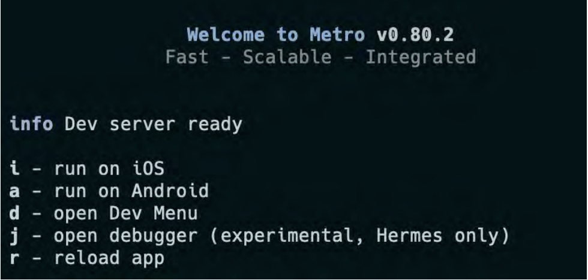
现在只需按下“J”键，就可以使用 Google Chrome 或 Microsoft Edge 启动新的调试器。


*** EXPO 开发工具插件 ***

对于使用 Expo 工具的应用程序，您已经可以使用并编写插件，这些插件利用了在 React Native 0.73 中引入的 Chrome 调试协议。Expo 的开发工具插件是调试您的 Expo 和 React Native 应用的一种可扩展方式。这些插件作为小型依赖项，可以安装到您的应用中。它们允许开发者实时检查应用的各个方面、触发测试行为等。

开发工具插件是创建桥接代码片段，将您的应用与 Chrome 窗口连接起来。这些桥接为应用检查和调试打开了无限可能，使整个过程更加简单和高效。

**** 可用插件 ****

尽管这是一个相对较新的功能，Expo 已经有一些内置的开发工具插件可以使用：
- React Navigation 插件：适用于使用 React Navigation 或 Expo Router 的应用程序，允许回滚导航历史记录，甚至发送深度链接。
- Apollo Client 插件：适用于使用 Apollo Client 的应用程序，提供查询和变更历史记录的洞察，以及缓存管理功能。

预计将随着时间推移添加更多开发工具插件。要查看完整列表，请访问这个 GitHub 仓库。

**** 集成插件 ****

将插件集成到您的 Expo 或 React Native 应用中非常简单。例如，假设您在应用中使用了导航库，如 Expo Router 或 React Navigation。您可以使用 @dev-plugins/react-navigation 来查看 React Navigation 的操作历史和状态。它还允许回滚到导航历史中的某个之前的点，甚至测试发送深度链接到您的应用。

要使用这个插件，请安装以下包：

```
npx expo install @dev-plugins/react-navigation
```

安装后，将必要的代码片段添加到您应用的根组件中。此设置确保您的应用与插件之间实现无缝的双向通信，丰富您的开发和调试过程。

在这个示例中，我们将在开发模式下运行时，将导航根节点传递给插件，在应用的入口点使用 React Navigation：

```javascript
import { NavigationContainer, useNavigationContainerRef } from '@react-navigation/native';
import { useReactNavigationDevTools } from '@dev-plugins/react-navigation';

export default function App() {
  const navigationRef = useNavigationContainerRef();
  useReactNavigationDevTools(navigationRef);
  return (
    <NavigationContainer ref={navigationRef}>{/* ... */}</NavigationContainer>
  );
}
```

您也可以在使用 Expo Router 导航时使用相同的插件，因为 Expo Router 在底层也使用了 React Navigation。然而，设置略有不同：

```javascript
import { useRef } from 'react';
import { useNavigationContainerRef, Slot } from 'expo-router';
import { useReactNavigationDevTools } from '@dev-plugins/react-navigation';
export default Layout() {
  const navigationRef = useNavigationContainerRef();
  useReactNavigationDevTools(navigationRef);
  return <Slot />;
}
```

一旦应用了这些代码更改，打开终端，运行 npx expo start，按下 shift + m 打开开发工具列表，然后选择 React Navigation 插件。这将打开插件的 Web 界面，显示您在应用中导航时的导航历史。

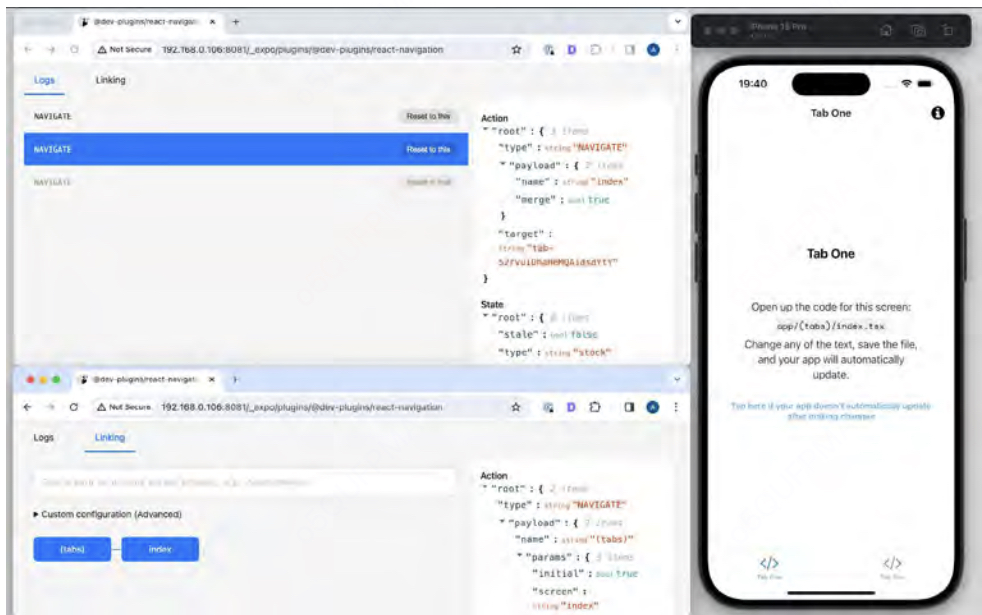

如果您还没有找到适合自己使用场景的插件，您也可以自己构建一个插件。

###### LOGBOX

React Native 重新设计了其错误和警告处理系统。他们对日志系统进行了从头到脚的重设计，因此开发者体验大大改善。开发者可以通过代码框架和组件栈轻松追踪错误的原因。语法错误格式化通过语法高亮帮助更快地理解问题。日志通知将警告和日志显示在屏幕底部，而不是覆盖整个屏幕。

###### HERMES
Hermes 是 Meta 为了优化 React Native 应用的性能而创建的一个 JavaScript 引擎，专注于减少 CPU 使用、内存消耗、应用大小和提高应用的交互时间（TTI）。最初，Hermes 仅支持 Android 设备，但在两年后，支持扩展到了 iOS 设备。

在发布之后的几个月，Hermes 引擎的垃圾回收器（GC）从 GenGC 替换为 Hades，Hades 是一种并发垃圾回收器，旨在提高性能。Meta 团队发现，这种改进能够将 CPU 密集型工作负载的性能提升 20-50%。

为了减少版本兼容性的问题，Meta 决定将 Hermes 引擎打包发布，而不是通过 NPM 下载。之前的做法导致了关于不同 Hermes 版本与 React Native 的兼容性问题。现在，React Native 和 Hermes 都共享相同的 JavaScript Interface (JSI) 代码，这使得两个项目的维护变得更加复杂。因此，每当 React Native 发布一个新版本时，也会发布与之兼容的 Hermes 版本，确保两者能够完全兼容并协同工作。

###### NEW ARCHITECTURE

[这部分有自己的文章](https://5711799.fs1.hubspotusercontent-na1.net/hubfs/5711799/The%20Ultimate%20Guide%20to%20React%20Native%20Optimization%202024%20Edition.pdf#page=1&zoom=100,0,0)

在 React Native 生态系统中，许多库并不向后兼容。新的功能通常使用了框架旧版本中无法获得的特性。这意味着，如果你的应用仍运行在较旧版本的 React Native 上，最终你将无法使用最新的改进和功能。

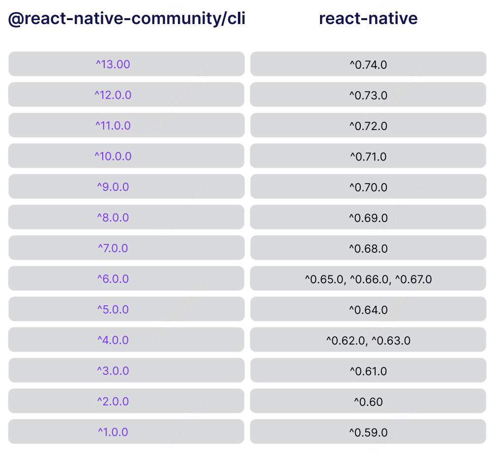

确实，尽管升级到最新的 React Native 版本可以带来很多好处，但这个过程往往并不简单。每次发布新版本时，都会涉及到对原生功能和核心模块的调整，而这些变更的复杂度会影响升级的难易程度。有时需要开发者详细分析并对比当前版本与新版本之间的差异，然后自己动手做出调整。

如果你已经熟悉原生开发环境，这项任务可能会相对容易，但对于大多数开发者来说，还是会面临一些挑战，尤其是在处理原生模块、第三方库和平台特定的兼容性问题时。每次升级时，都会有一些不可避免的 bug 修复、API 变更或者功能弃用，这可能需要花费不少时间进行调试和适配。

例如，您在代码中使用的模块和组件可能不再是 react-native 核心的一部分。

这将是由于 Meta 在名为 LEAN CORE 连接过程中引入的变更。该努力的目标是：
- 通过将部分核心功能提取并移动到 react-native-community 仓库，使 react-native 包更小、更灵活、更易于维护，
- 将提取出的模块的维护工作移交给社区。

这个过程加速了特定模块的增长，并使整个生态系统更加有序。但它也对 React Native 升级体验产生了一些负面影响。现在，您必须将提取出的包作为额外的依赖项安装，否则您的应用将无法编译或在运行时崩溃。

然而，从开发者的角度来看，迁移到社区包通常只是引入一个新依赖并重写导入语句。

另一个重要问题是第三方库的支持。您的代码通常依赖外部库，而这些库也有可能与最新版本的 React Native 不兼容。

解决这个问题至少有两种方法：
- 在升级之前，等待项目维护者进行必要的调整。
- 寻找替代方案或自己修补模块——可以使用一个名为 patch-package 的实用工具，或者创建一个临时的分支，包含必要的修复。

###### 运行旧版本意味着发布时可能带有问题，从而使用户产生反感。

如果您正在使用旧版本，您很可能落后于那些使用最新版本框架的竞争对手。

React Native 框架中修复、改进和进展的数量真的非常令人印象深刻。如果您只是想赶超，实际上您错过了很多能让您生活变得更轻松的更新。定期升级的工作量和成本总是能通过即时的开发者体验（DX）增强得到补偿。

在本节中，我们将介绍一些成熟的实践，帮助您更轻松地将 React Native 升级到最新版本。

#### 解决方案：升级到最新版本的 React Native（我们会告诉您如何做）。

升级 React Native 可能不是世界上最简单的事情。但是有一些工具可以简化这个过程，解决大部分问题。

实际的工作量将取决于变更的数量和您的基础版本。然而，本节中介绍的步骤可以应用于每次升级，无论您的应用程序当前的状态如何。

##### 准备升级

[React Native Upgrade Helper](https://react-native-community.github.io/upgrade-helper/) 是一个很好的起点。从高层次上讲，它为您提供了自上次升级本地版本以来，React Native 所发生的变化的概览。

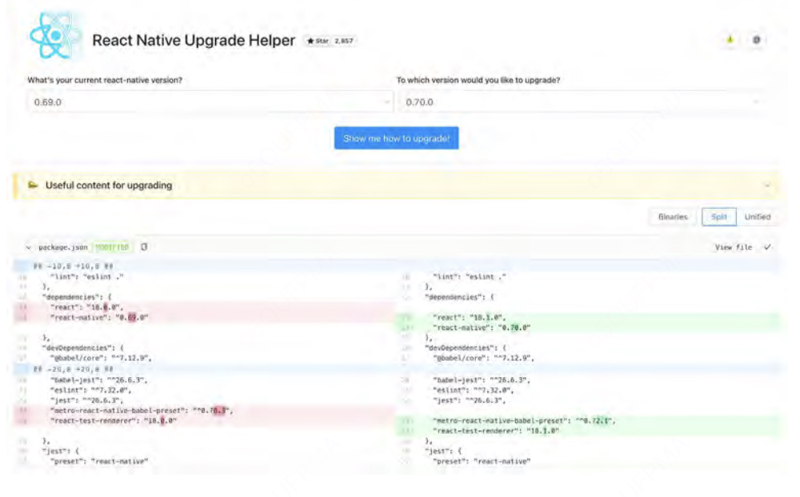

为此，Upgrade Helper 会将通过运行 npx react-native init 创建的基础 React Native 项目与您的版本和您要升级到的版本进行比较。接下来，它会显示项目之间的差异，让您了解在此期间发生的每个小修改。有些更改可能还会附带特殊注释，提供更多关于某些变动发生原因的上下文信息。

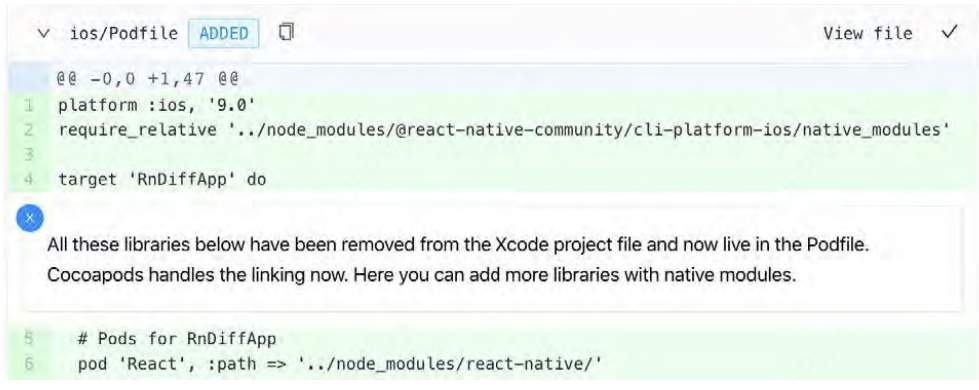

更好地了解变化将帮助您更快地行动，并更加自信地进行操作。

*** 注意：拥有更多的上下文信息非常重要，因为在升级过程中没有自动化工具可用——您需要自己手动应用这些更改。 ***

React Native 升级助手还会在升级过程中推荐有用的阅读内容。大多数情况下，这些内容包括 React Native 博客上发布的专门博客文章以及原始的变更日志。

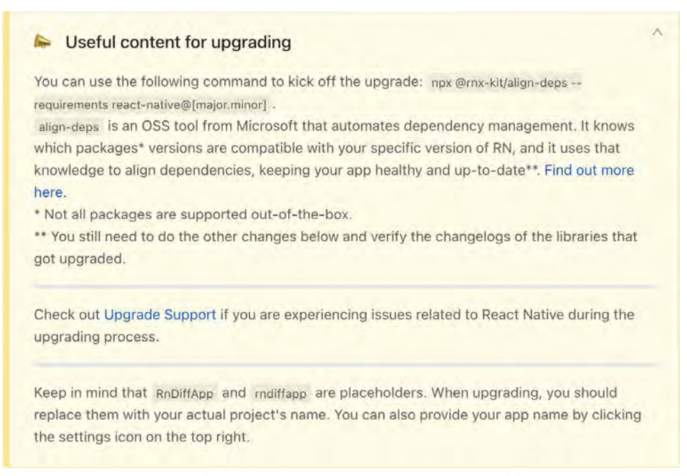

我们建议您阅读推荐的资源，以更好地了解即将发布的版本，并学习其重点内容。

通过这样做，您不仅能了解变更内容，还能理解背后的原因。这样，您就能为打开项目并开始工作做好准备。

##### 应用 JavaScript 更改

升级 React Native 的 JavaScript 部分与升级其他 JavaScript 框架类似。我们的建议是按步骤进行升级——一次更新一个库。作为经验法则，一旦升级完一个库，就将当前工作保存为一个提交，然后继续升级下一个库。我们认为，这种方法比一次性升级所有内容要好，因为它能让你更好地掌控进度，并且更容易发现回归问题。

第一步是将 React 和 React Native 的依赖更新到所需的版本，并执行必要的更改（包括破坏性更改）。为此，你可以查看 React Native Upgrade Helper 提供的建议并手动应用它们。完成后，确保重新安装 node_modules。

*** 注意：在执行升级时，您可能会看到很多来自 iOS 项目文件的更改（例如 .xcodeproj 中的所有文件，包括 .pbxproj）。这些是 Xcode 在您处理 React Native 应用程序的 iOS 部分时生成的文件。与直接修改源文件相比，更好的做法是通过 Xcode UI 来执行更改。升级到 React Native 0.60 时就是这种情况，并且相关操作已经在该问题中有所描述。 ***

最后，您应该尝试运行应用程序。如果一切正常——完美！升级顺利，您可以安心结束！不过，严肃一点说——现在您应该检查一下您使用的其他依赖项是否有更新版本！它们可能带来了重要的性能改进。

不幸的是，也有可能出现更为悲观的情况。您的应用可能根本无法构建，或者启动时立即崩溃并显示红屏。在这种情况下，很可能是您的某些第三方依赖项无法正常工作，因为有些依赖项包含了本地代码，支持新的操作系统功能，因此您需要使它们与您的 React Native 版本兼容。

*** 注意：如果在升级过程中遇到问题，可以查看 Upgrade Support 项目。这个仓库是开发者们分享经验、互相帮助解决与升级相关的一些最具挑战性的操作问题的地方。 ***

##### 升级第三方库

通常情况下，你应该首先查看 React Native 依赖项。与常规的 JavaScript/React 包不同，React Native 依赖项通常依赖于原生构建系统和更高级的 React Native API。这使得它们在框架逐渐成熟并变得更加稳定时，容易暴露出潜在的错误。

如果错误发生在构建时，将依赖项升级到最新版本通常能解决问题。但情况并不总是如此。为了确保你要升级的 React Native 版本与依赖项兼容，可以使用 Microsoft 开发者提供的 align-deps 项目。它允许你根据要求和预设规则保持依赖项在正确的版本上。该项目还提供了命令行工具（CLI），你可以将其集成到 CI 中，确保你的仓库或单体仓库中的任何人都不会不小心引入不兼容的包版本，从而导致应用崩溃。

一旦你的应用成功构建，你就可以查看变更日志，并熟悉公共 API 上发生的 JavaScript 变更。如果忽略这一步，可能会导致运行时异常。使用 Flow 或 TypeScript 可以帮助你确保这些变更已正确应用。

正如你所看到的，并没有什么魔法技巧可以自动修复所有错误并升级依赖项。这大多是需要耐心和细心完成的手动工作。它还需要大量的测试，以确保在升级过程中没有破坏任何功能。幸运的是，像 align-deps 这样的工具可以帮助你避免至少一些手动工作，从而显著改善升级体验。

#### 好处：你正在运行最新版本，这意味着更多的功能和更好的支持。

升级到最新的 React Native 版本不应与保持其他框架和库的更新有所不同。除了关键的性能和安全改进之外，新的 React Native 版本还解决了 iOS 和 Android 的最新底层变化。这包括适用于手机的重大变更，例如某些 API 被弃用时。

例如：在2019年，谷歌宣布所有在2019年8月1日之后提交到Google Play的安卓应用必须支持64位。为了继续开发应用并发布新功能，开发者需要升级到 React Native 0.59 并进行必要的调整。

类似的情况发生在2023年，当时谷歌宣布了一项新的目标API级别要求，要求开发者要么手动将 targetSdkVersion 更新为33，要么将其 React Native 应用升级到 v0.71 或更高版本。

像这样的升级对于保持用户满意度非常关键。毕竟，如果应用在新版本操作系统中崩溃，或者从应用商店下架，用户肯定会感到失望。每次发布可能会带来一些额外的工作量，但保持最新版本将带来更高的用户满意度、更稳定的应用和更好的开发体验。

### 第二节 如何通过 Flipper 更快、更好地进行调试

> 通过实现 Flipper 建立更好的反馈循环，让开发应用变得更加有趣

#### 问题：你正在使用 Chrome 远程调试器或其他临时方法来调试和分析 React Native 应用

调试是每个开发者日常工作中最具挑战性的部分之一，找出问题所在可能会让人感到非常沮丧。我们通常会尽快修复 bug，尤其是当它们影响应用功能时。时间在这一过程中至关重要，我们通常需要保持灵活，以便快速解决问题。然而，调试 React Native 并不是一件简单的事，因为你试图解决的问题可能出现在不同的层级上。具体来说，它可能由以下原因引起：
- JavaScript 层 —— 可能是你的应用代码或 React Native 本身的问题。
- 原生代码层 —— 可能是第三方库或 React Native 自身的问题。

当涉及到调试原生代码时，你需要使用 Android Studio 和 Xcode 内置的工具

当调试 JavaScript 代码时，你可能会遇到一些困难。最简单且直观的调试方式就是在代码中写 console.log，然后在终端查看日志。这种方法只适用于解决一些简单的 bug，或者采用“分而治之”的方法。在其他情况下，你可能需要使用外部调试器。

默认情况下，React Native 带有一些内置的调试工具。

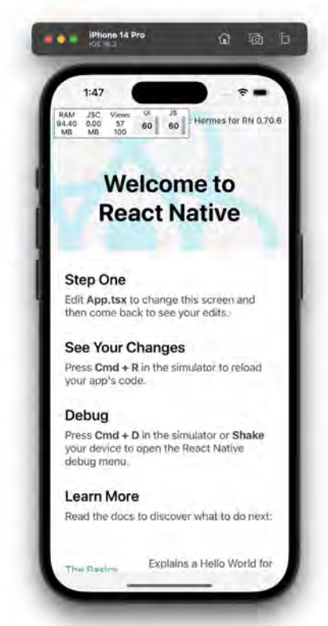

最常见的调试工具是 Google Chrome 远程调试器。它允许你在代码中设置断点，或比在终端中更方便地预览日志。不幸的是，使用远程调试器可能会导致一些难以发现的问题。这是因为你的代码是在 Chrome 的 V8 引擎中执行的，而不是在特定平台的引擎中，如 JSC 或 Hermes。

在 Chrome 中生成的指令通过 WebSocket 发送到模拟器或设备。这意味着你无法真正使用调试器来分析应用程序的性能问题。它可以给你一个大概的思路，帮助你推测问题可能的来源，但由于 WebSocket 消息传递的开销，你将无法调试到真正的原因。

另一个不便之处是，使用 Chrome 调试器时，你无法轻松调试网络请求（它需要额外的设置，并且仍然存在一些限制）。为了调试所有可能的请求，你必须通过模拟器的开发者菜单打开一个专用的网络调试工具。然而，由于模拟器屏幕的尺寸，其界面非常小且不方便使用。

通过开发者菜单，你可以访问其他调试工具，例如布局检查器或性能监视器。后者相对较为方便，因为它只显示少量信息。然而，使用前者就比较麻烦，因为它提供的工作空间非常有限。

##### 花费更多时间调试和寻找性能问题意味着更差的开发者体验和更低的满意度。
与原生开发者不同，React Native 开发者可以使用多种调试工具和技术。这些工具分别来自不同的生态系统，如 iOS、Android 或 JavaScript。虽然听起来很不错，但需要记住的是，每个工具都需要不同程度的原生开发知识。这使得大多数 JavaScript 开发者在选择工具时感到挑战重重。

不便的工具通常会降低团队的开发效率，导致团队成员感到沮丧。结果，开发效率不如预期，影响了应用的质量，也使得发布频率降低。

#### 解决方案：启动 Flipper，开始调试。

难道不希望有一个综合工具来处理上述所有用例吗？当然希望！这就是 Flipper 发挥作用的地方。


Flipper 是一个用于移动应用的调试平台。它也将 React Native 作为其首要支持的框架。自 2019 年 9 月发布以来，Flipper 从 React Native 0.62 版本开始默认集成。

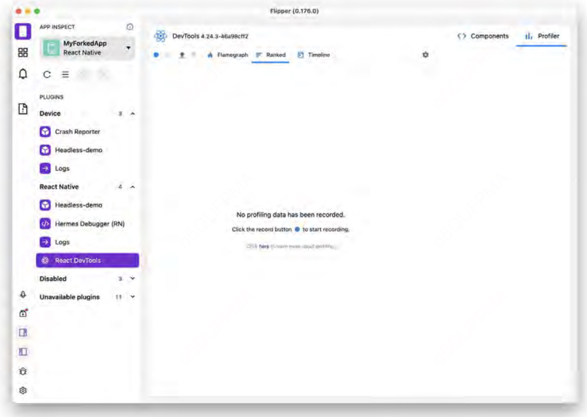

Flipper 是一款桌面应用，具有便捷的界面，可以直接与应用的 JS 和原生代码集成。这意味着你不再需要担心 JS 运行时差异或使用 Chrome Remote Debugger 时的性能问题。Flipper 提供了网络检查器、React DevTools，甚至还有原生视图层级工具。

更重要的是，Flipper 让你能够预览原生代码的日志并追踪原生崩溃，这样你就不必再启动 Android Studio 或 Xcode 来查看原生端发生了什么！Flipper 易于扩展，因此有很大的可能性会增加许多由社区开发的实用插件。目前，你可以使用 Flipper 执行如检测内存泄漏、预览共享偏好设置内容或检查加载的图像等任务。此外，React Native 的 Flipper 集成了 React DevTools、Hermes 调试器和 Metro bundler。

最令人兴奋的是，所有所需的工具都集中在一个桌面应用中。这大大减少了上下文切换的频率。如果没有 Flipper，一个开发者在调试与从后台获取的数据展示相关的问题时，可能需要使用 Chrome 调试器（查看日志）、模拟器内的网络请求调试器，可能还需要用模拟器中的布局检查器，或者使用独立的 React DevTools 应用。而 Flipper 将所有这些工具作为内建插件提供。它们可以轻松地从侧边栏访问，并且具有相似的 UI 和 UX。

#### 好处： 你将能更愉快地使用 React Native，并建立更好的反馈循环。

更好的调试流程使得应用开发周期更快且更可预测。这样，你的团队能够更容易地编写可靠的代码，并更快速地发现问题。将所有调试工具集成到一个界面中，显然更加符合人体工程学，而且不会打乱与模拟器或设备的交互。这个过程会让你的团队负担更小，进而积极影响产品开发和修复 bug 的速度。

### 第三节 避免未使用的原生依赖

> 通过移除未使用的依赖链接来提高应用的互动时间

#### 问题：你的项目中有很多依赖，但你不确定是否需要它们全部

每一项我们在应用中使用的本地代码都带有运行时开销，这包括读取、加载和执行这些代码。我们应用中的本地依赖越多，应用启动时就会变得越慢，这会影响交互时间（TTI，Time to Interactive），进而让用户等待更长时间才能开始使用应用，这会让他们感到沮丧。

在我们的React Native应用中，我们经常依赖于加载Kotlin、Java、Swift、Objective-C、JavaScript，最近更是C++等本地代码。这些依赖项被声明在package.json文件中，这使得JavaScript打包工具能够正确地发现并将它们的JS部分打包到最终的应用中。这个声明看起来可能有些反直觉，但它实际上也会影响到本地部分。这是因为React Native CLI的**自动链接（autolinking）**功能。

自动链接允许我们在React Native应用中自动链接本地依赖，而不需要触及像Cocoapods、CMake和Gradle这样的本地工具，我们只需要通过JavaScript享受其功能。如果你不熟悉Android或iOS工具链如何使用社区包，你可能会问：“我的应用中，什么会链接本地依赖呢？”事实上，并不是所有的React Native社区包都是纯JavaScript的，许多包需要编译本地代码——有时每个平台需要不同的本地代码——才能将这些功能传递给应用的JavaScript。当涉及到本地二进制文件时（无论是C++、Objective-C还是Swift），链接是本地工具链理解如何找到与我们希望应用使用的第三方依赖相关的实际代码的方式。这是必需的，长期以来，React Native开发者必须手动进行这一步。自React Native 0.60版本起，我们有了一个自动执行这一步骤的方式，这要归功于React Native CLI。

关于自动链接工作原理，有一个重要的事情需要知道：它会扫描你的package.json文件，然后进入node_modules寻找本地代码。该工具并不知道你是否在主动使用包含本地代码的库，它会自动将这些库链接进来。

那么，这如何影响应用的性能呢？所有通过自动链接发现的本地依赖都会被链接并包含在我们的应用包中。结果是：1.	应用程序的二进制文件大小会增加（这与JS包的大小是分开的）。2.	可能导致更差的交互时间（TTI），因为移动操作系统需要花费更多时间来加载本地二进制文件，导致用户看到启动画面的时间变长。

#### 解决方案：查找并移除未使用的依赖项

要查找项目中未使用的依赖项，我们可以使用 depcheck 工具。它非常有效，能够分析项目的依赖项，查看每个依赖项是如何被使用的，哪些依赖项是多余的，哪些依赖项在 package.json 中缺失。使用 depcheck 时，我们需要在项目根目录下运行 npx depcheck。以下是结果的示例：
```
Unused dependencies
* lottie-react-native
* react-native-gesture-handler
* react-native-maps
* react-natave-reanimated
* react-native-video
* react-native-webview
Unused devDependencies
* @babel/core
* @babel/runtime
* @react-native-community/eslint-config
* @tsconfig/react-native
* @types/jest
* @types/react-test-renderer
* babel-jest
* jest-circus
* metro-react-native-paper-preset
* typescript
```

开发依赖通常不会最终出现在 JS 包中，但如果它们的实现中包含原生代码，仍然可能会将原生代码链接到你的生产应用中。在这个例子中，列出的开发依赖是纯 JS，因此无需关注它们。结果显示我们有一些未使用的依赖项——更重要的是，在这个例子中，这些依赖项依赖于一些原生代码。现在，我们需要将它们移除，完成后就可以了！在示例应用中，从上面的截图中移除未使用的依赖项后，应用的大小减少了：


可能比减少应用大小更重要的是，在测试的 Android 设备上，Time to Interactive（TTI）明显提高，在本例中减少了 17%。你可能在想如何测量应用中的 TTI。其实有几种方法可以做到。无论你选择哪种方式，记住在处理绝对数值时，总是要在应用的发布版本上进行测量。

一种方法是使用秒表，测量应用展示第一个屏幕所花费的时间，如下所示。这完全是手动操作，但对于一次性测量来说通常能够完成任务。另一种手动方法是使用最近款的高帧率手机（例如 120fps），并录制你的应用在真实设备上的启动视频。然后，你可以加载视频，缩放到时间轴上，精确查看从点击应用图标到第一个有意义的渲染发生之间的时间差。我们曾使用这种数据驱动的方法，准确并反复观察到高达 50ms 的改进，虽然听起来很小，但通常是用户体验合格与令人惊艳之间的差别。

如果我们想获得更详细的输出，可以使用 Android 的 Perfetto。对于 iOS，我们可以在 DevMenu 中启用 Perf Monitor，然后双击监视窗口进行扩展。输出将如下所示：


我们也可以使用 Xcode Instruments 的 App launch，但需要注意的是，这与最终用户在其设备上的体验不同。你应该始终在零售设备上双重检查你的生产应用构建，以确保尽可能接近用户的设备体验。你需要做的就是通过配置文件将发布版构建安装到真实设备上。然后，从安装完成后自动出现的窗口中选择 App Launch。点击录制按钮，一旦应用启动，停止录制。你将获得类似以下的输出：

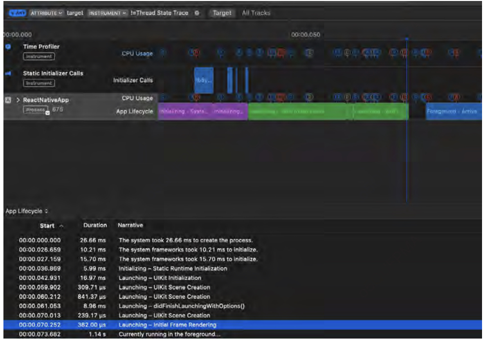

有两个阶段用于计算iOS应用启动时间。第一个阶段称为“主函数之前时间”（pre-main time），这是应用执行主函数之前的时间。它在上面的图表中标记为紫色区域——在这个阶段，应用需要进行初始化和库的链接等所有工作。

第二个阶段称为“主函数之后时间”（post-main time），是从执行应用主函数到展示第一个可交互视图给用户之间的时间。它在上面的图表中标记为绿色区域。总的应用启动时间是这两个指标的总和。如果你想了解更多关于测试应用启动时间的信息，这里有一篇很好的阅读资源。

值得一提的是，许多第三方工具帮助开发者从已经提交到Google Play和App Store的应用中获取大量的性能信息。最受欢迎的工具包括Firebase性能监控、Sentry和DataDog。使用这些工具的主要优势在于，它们能够从你真实用户所使用的各种设备中收集应用性能数据。

#### 好处：更小的包大小和更快的交互时间。

移除一些未使用的本地依赖项最终减少了应用包大小和TTI（交互时间）约17%。仅提供应用所需的资源可以改善交互时间指标，使用户因加载时间过长而不太可能卸载应用。

值得记住的是，尽管自动链接（autolinking）是一个很棒且强大的功能，但它在链接应用并不真正使用的代码时可能会过于积极。确保在重构时保持依赖项的最新状态，并清理掉未使用的依赖项。

### 第四节 通过使用 Hermes 优化应用启动时间

> 通过使用 Hermes 实现更好的应用性能

#### 问题：在启动时加载了大量不必要的 Android 包。此外，您使用的引擎并没有针对移动设备进行优化。

用户期望应用程序响应迅速且加载速度快。未能满足这些要求的应用可能会在应用商店或 Play 商店中收到差评。在最极端的情况下，它们甚至可能被用户抛弃，转而使用竞争对手的应用。

启动时间没有单一的定义，因为加载阶段的许多不同阶段可能会影响应用程序的“快”或“慢”感。例如，在 Lighthouse 报告中，有八个性能指标用于分析您的 Web 应用程序。其中一个是交互时间（TTI），它衡量应用程序准备好进行首次交互的时间。

从您首次点击应用图标开始，实际上发生了许多事情。

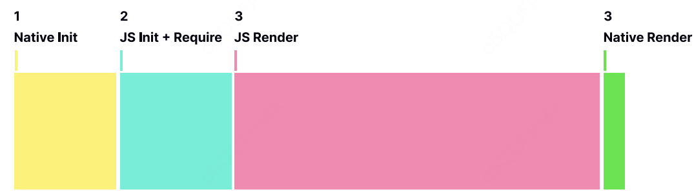

加载过程从本地初始化开始，加载 JavaScript 虚拟机并初始化所有本地模块（上图中的步骤 1）。然后，继续从磁盘读取 JavaScript，并将其加载到内存中，解析并开始执行（上图中的步骤 2）。此操作的详细内容在前面的“选择合适的库”部分中已经讨论过。

在下一步中，React Native 开始加载 React 组件，并将最终的一组指令发送到 UIManager（上图中的步骤 3）。最后，UIManager 处理从 JavaScript 接收到的信息，并开始执行本地指令，最终生成本地界面（上图中的步骤 4）。

如下面的图表所示，有两组操作会影响应用程序的整体启动时间。

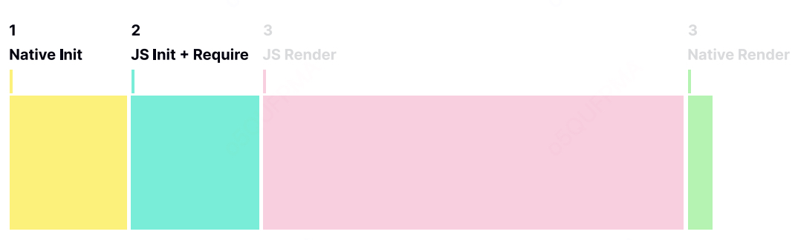

第一组涉及前两个操作（图中的步骤 1 和 2），描述了 React Native 启动所需的时间（即启动虚拟机并让虚拟机执行 JavaScript 代码）。第二组包括剩下的操作（图中的步骤 3 和 4），与您为应用程序创建的业务逻辑相关。第二组的时间长度高度依赖于组件的数量和应用程序的整体复杂性。

本节关注第一组——与配置相关的改进，而不是业务逻辑本身。如果您尚未测量应用程序的整体启动时间，或者还没有尝试过像 Hermes 这样的工具——继续阅读。

##### 长时间的启动时间和缓慢的用户体验可能是您的应用得到差评并最终被用户放弃的原因之一。

创建让人愉悦的应用程序是至关重要的，尤其是考虑到移动市场已经高度饱和的现状。如今，所有的移动应用不仅要直观，还必须在交互上让人愉快。

确实，随着移动市场的竞争愈加激烈，应用的用户体验变得尤为重要。除了直观的界面和流畅的功能，如何提升互动的愉悦感和响应速度，也越来越成为开发者关注的重点。

#### 解决方案：开启 Hermes 以获得更好的性能。

虽然 React Native 应用程序负责处理本地界面，但它仍然需要 JavaScript 逻辑在运行时执行。为此，它会启动自己的 JavaScript 虚拟机。直到最近，它一直使用 JavaScript Core（JSC）。这个引擎是 WebKit 的一部分——WebKit 驱动了 Safari 浏览器，并且默认仅在 iOS 上可用。长时间以来，React Native 在 Android 上使用 JSC 执行 JavaScript 也很合理。原因是，使用 V8 引擎（与 Chrome 一起发布的引擎）可能会加大 Android 和 iOS 之间的差异，从而使两个平台之间共享代码变得更加困难。

JavaScript 引擎需要执行各种复杂的操作。它们不断推出新的启发式算法，以提高整体性能，包括加载代码并执行它所需的时间。为了实现这一点，它们会基准测试常见的 JavaScript 操作，并挑战 CPU 和内存，以完成这一过程。

开发人员处理 JavaScript 引擎的工作大多是针对最流行的网站进行测试的，比如 Facebook 或 Twitter。毫不奇怪，React Native 使用 JavaScript 的方式有所不同。例如，专为 Web 开发的 JavaScript 引擎不需要太担心启动时间，因为在加载页面时，浏览器通常已经在运行。因此，JavaScript 引擎可以将重点放在整体 CPU 和内存消耗上，因为 Web 应用可以执行许多复杂的操作和计算，包括 3D 图形。

正如你在上一节中看到的性能图表所示，JavaScript 虚拟机占用了应用程序总加载时间的很大一部分。遗憾的是，除非你自己构建引擎，否则几乎没有什么方法可以优化这一点。这正是 Meta 团队最终所做的。

认识一下 Hermes —— 一个专门为 React Native 设计的 JavaScript 引擎。它经过针对移动端的优化，重点关注一些对 CPU 影响较小的指标，例如应用程序大小和内存消耗。你很可能已经在使用它了！从 v0.70 开始，React Native 默认启用 Hermes，这标志着该引擎稳定性的重要里程碑。

它已经从2019年开源的仅限Android的基础引擎，经过了很长一段路程，随着对JS特性支持集的精心挑选（由于大小限制），通过找到低占用空间的方式添加更多的EcmaScript规范特性，如Proxies和Intl，最终使其能够在macOS和iOS上使用。

如今，Hermes 依然足够小（约2 MB），能够显著改善应用程序的 TTI（交互时间），并提供了一套足够丰富的功能，可以应用于大多数现有的应用程序中。

在详细讲解如何在现有的 React Native 应用程序中启用 Hermes 之前，让我们先看看它的一些关键架构决策。

##### 字节码预编译

传统的 JavaScript 虚拟机通常在运行时解析 JavaScript 源代码，然后生成字节码。因此，代码的执行会延迟，直到解析完成。这种方法会导致应用启动时的延迟和性能问题。

然而，Hermes 的工作方式有所不同。为了减少引擎执行业务逻辑所需的时间，Hermes 在构建时就生成字节码。这样一来，应用启动时不需要再花费时间进行解析和编译，而是直接加载和执行预先编译好的字节码，从而大幅提高启动速度和应用性能。

这种预编译的方式不仅减少了启动时的延迟，还降低了应用在运行时的计算开销，使得用户能够更快地与应用交互。

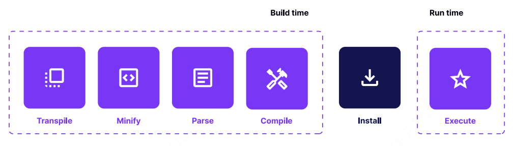

它可以花更多的时间使用各种技术来优化捆绑包，使其更小且更高效。例如，生成的字节码被设计成可以在内存中映射，而无需急于加载整个文件。优化这一过程带来了显著的 TTI 改进，因为移动设备上的 I/O 操作通常会增加整体的延迟。

##### 无 JIT（即时编译）

现代大多数浏览器引擎使用即时编译（JIT）编译器。这意味着代码会逐行翻译和执行。然而，JIT 编译器会跟踪“热代码段”（即执行多次的代码段）和“温暖代码段”（即执行几次的代码段）。这些频繁出现的代码段会被发送到编译器，根据它们在程序中出现的次数，将它们编译成机器码，并且可以进行一些优化。

与其他引擎不同，Hermes 是一个提前编译（AOT，ahead-of-time）引擎。这意味着整个捆绑包会提前编译成字节码。因此，JIT 编译器会对热代码段进行的某些优化在 Hermes 中是不可用的。

一方面，这使得 Hermes 的捆绑包在面向 CPU 的基准测试中表现不佳。然而，这些基准测试与真实的移动应用体验并不完全可比，因为在移动应用中，TTI（互动时间）和应用程序大小优先级更高。

另一方面，JIT 引擎由于需要时间来解析捆绑包并及时执行，因此会降低 TTI。它们还需要时间来“预热”，即必须运行代码几次以检测常见模式并开始优化它们。

如果你想在 Android 上开始使用 Hermes，请确保在 android/app/build.gradle 文件中将 enableHermes 标志设置为 true：

```javascript
project.ext.react = [
 entryFile: ''index.js'',
 enableHermes: true
]
```
对于 iOS， 请在 ios/Podfile 中将 hermes_enabled 标志设置为 true：
```javascript
use_react_native!(
  :path => config[:reactNativePath],
   # to enable hermes on iOS, change `false` to `true` and then install pods
  :hermes_enabled => true
)
```

在这两种情况下，每次切换 Hermes 标志时，确保按照本地文件中提供的说明重新构建项目。重新构建项目后，您现在可以享受更快的应用启动时间和可能更小的应用大小。

#### 好处：更好的启动时间带来更好的性能。这是一个永无止境的过程。

使您的应用程序加载更快是一个持续的努力，其最终结果将依赖于许多因素。
您可以通过调整应用程序的配置和编译源代码所使用的工具来控制其中的一些因素。
开启 Hermes 是今天就可以做的一项事情，它能够显著改善应用程序的某些性能指标，主要是 TTI。
除此之外，您还可以关注 Meta 团队发布的其他重要改进。要做到这一点，您可以阅读他们关于 React Native 性能的文章。通常，这是一项逐步改进的工作，当这些改进一次性应用时，能够产生巨大的差异。React Native 核心团队已发布了一个关于原生 RN 和启用 Hermes 的 RN 的性能基准对比报告：请点击这里。
正如我们在运行最新版本的 React Native 部分提到的那样，Hermes 是您可以利用的工具之一，只要您保持 React Native 版本的更新。
保持更新将帮助您的应用程序在性能上保持领先，并以最快的速度运行。

##### 未来与静态 Hermes（实验性）

在 2023 年 React Native EU 大会上，Hermes 的首席工程师 Tzvetan Mikov 宣布了一项名为“静态 Hermes”（Static Hermes）的实验性工具。这项技术推动了 Hermes 引擎的能力，能够将带有类型的 JavaScript 代码（基本上是 TypeScript 或 Flow）提前静态编译成本地汇编指令。这个想法是，应用程序不再需要依赖 Hermes 或任何其他 JavaScript 引擎来运行，因为它已经将本地代码嵌入其中。这听起来非常惊人。

静态 Hermes 目前仍处于实验阶段，但你今天就可以尝试使用它。你可以通过阅读 Hermes 的 GitHub 问题跟踪器来了解更多关于如何尝试静态 Hermes 的信息。

### 第五节 优化 Android 应用程序大小的一个有效方法是通过调整 Gradle 设置。

> 通过调整 Proguard 规则，你可以显著提高应用的 Time to Interactive (TTI)，减少内存使用，并减小应用的大小。

#### 解决方案：启用 ProGuard 进行发布构建并为不同的 CPU 架构创建 APK，以减小 APK 大小。

在每个 React Native 项目的开始阶段，通常不会太在意应用的大小。毕竟，在开发初期很难做出这样的预测。但是，只需添加几个额外的依赖，应用的大小就会从标准的 5 MB 增长到 10 MB、20 MB，甚至 50 MB，这取决于代码库的情况。

在超级快速的移动互联网和随处可得的 WiFi 时代，你真的需要在意应用的大小吗？为什么 bundle 大小会增长得如此迅速？我们将在本节中解答这些问题。但首先，让我们看一下一个典型的 React Native bundle 由哪些部分组成。

默认情况下，Android 上的 React Native 应用包含：
- 为不同 CPU 架构编译的四组二进制文件，
- 包含资源（如图片、字体等）的目录，
- 包含业务逻辑和 React 组件的 JavaScript bundle，
- 其他文件。

React Native 提供了一些优化，可以让你改善 bundle 的结构及其总体大小。但这些优化默认是禁用的。

如果你没有有效地使用这些优化，尤其是在应用程序增长时，你会不必要地增加应用程序的总体大小（以字节为单位）。这会对最终用户的体验产生负面影响。我们将在下一节讨论这个问题。

##### 更大的APK大小意味着从应用商店下载需要更多时间，并且需要加载更多的字节码到内存中。

很高兴你和你的团队使用的是最新的设备，并且有着快速稳定的网络连接。但你需要记住，并不是每个人都拥有这样的奢侈条件。世界上仍然有一些地方，网络的可达性和可靠性远非完美。像Starlink这样的项目虽然已经改善了这种状况，但覆盖最偏远地区还需要时间。

目前，仍然有一些市场，每兆流量都需要付费。在这些地区，应用程序的大小直接影响转化率，且随着应用大小的增加，安装/取消比率也会增加。

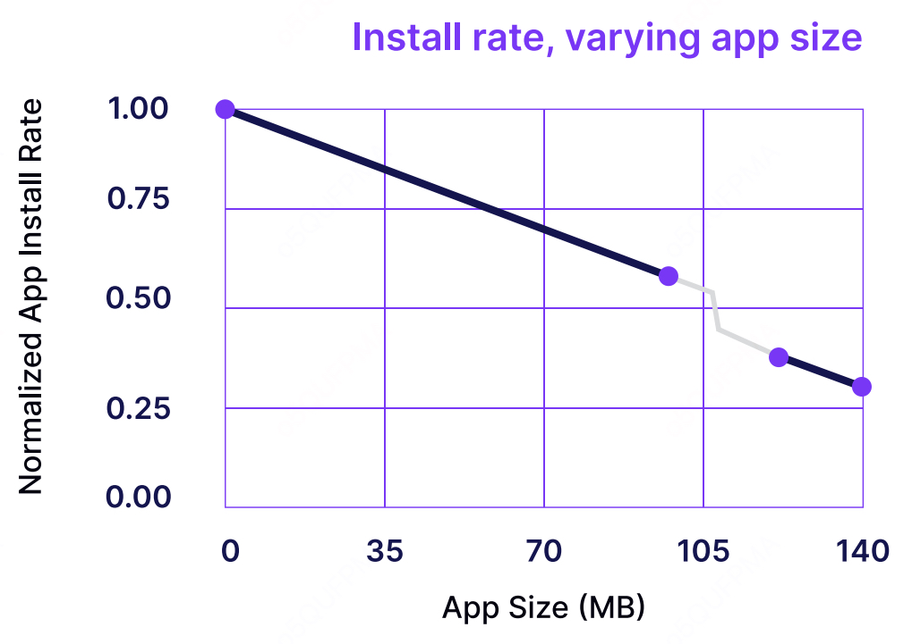

人们普遍认为，每个精心制作和设计的应用程序不仅提供美观的界面，还针对最终设备进行了优化。然而，事实并非总是如此。而且，由于Android市场竞争激烈，很有可能那些美丽但体积庞大的应用程序已经有了一个更小的替代品，并且这个替代品正获得更多用户的青睐。

另一个重要因素是设备的碎片化。Android市场在这方面非常多样化。有超过20个受欢迎的制造商，每年都会发布一系列设备，其中许多是中低端设备，占据了每年超过60%的智能手机销售份额。而这些设备在处理较大的APK时可能会遇到问题。

正如我们已经强调的那样，应用程序的启动时间至关重要。设备在启动应用并准备好第一次交互时，需要执行的代码越多，启动应用所需的时间就越长。

现在，让我们谈一下在这种情况下值得提到的最后一个因素——设备存储。

应用程序通常在安装后占用更多空间。有时它们甚至无法适应设备的内存。在这种情况下，用户可能会选择跳过安装你的产品，如果这意味着需要删除其他资源，比如应用程序或图片。

#### 解决方案：将布尔标志 ENABLEPROGUARDINRELEASEBUILDS 设置为 TRUE，根据需要调整 ProGuard 规则，并测试发布版本是否崩溃。同时，将 ENABLESEPARATEBUILDPERCPUARCHITECTURE 设置为 TRUE。

Android 是一个运行在许多不同架构设备上的操作系统，因此你的构建必须支持大多数设备。React Native 支持四种架构：armeabi-v7a、arm64-v8a、x86 和 x86_64。

在开发你的应用时，Gradle 会生成一个 APK 文件，可以安装到上述提到的任何 CPU 架构的设备上。换句话说，你的 APK（从构建过程输出的文件）实际上是四个独立的应用程序打包成一个 .apk 扩展名的文件。这使得测试变得更加方便，因为应用程序可以一次分发到多种不同的测试设备上。

不幸的是，这种方式也有其缺点。由于包含了所有架构所需的文件，应用程序的整体大小比实际需要的要大得多。因此，用户最终会下载到与他们设备不兼容的多余代码。

幸运的是，你可以通过在发布生产版本时利用 App Bundles 来优化分发过程。

App Bundle 是一种发布格式，允许你包含所有已编译的代码和资源。这是因为 Google Play Store 动态交付会根据最终用户的设备生成定制的 APK。

要构建 App Bundle，你只需调用一个与平常不同的脚本。你应该使用 ./gradlew bundleRelease，而不是 ./gradlew assembleRelease。不过在 React Native Community CLI 中，有一个命令可以在后台处理所有事情，因此你需要运行的命令是：

```
npx react-native build-android
```

Android App Bundle 相比每个 CPU 架构的多个构建，最大的优势在于交付的简便性。毕竟，你只需要交付一个工件，动态交付（Dynamic Delivery）会为你完成所有的魔法。它还为你提供了更多的支持平台的灵活性。

你不需要担心最终用户设备的 CPU 架构是什么。根据 Android 团队的说法，应用的平均大小可以减少大约 35%，在某些情况下，甚至可以减少一半。

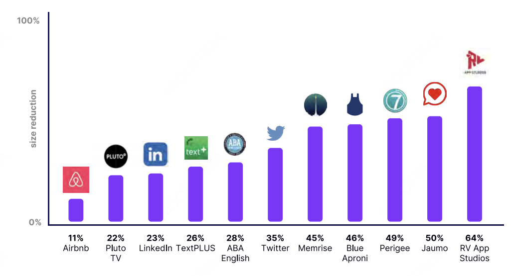

减少构建大小的另一种方法是启用 Proguard。Proguard 的工作方式类似于 JavaScript 中的死代码消除——它会去除第三方 SDK 中未使用的代码，并对代码库进行压缩。

然而，Proguard 可能无法与某些项目开箱即用，通常需要额外的配置才能达到最佳效果。在这个例子中，我们通过 Proguard 将提到的 28 MB 构建文件大小减少了 700 KB。虽然减少不多，但仍然是一个改进。

```javascript
def enableProguardInReleaseBuilds = true
```

另一个好的做法是关注资源优化。每个应用程序都包含一些 SVG 或 PNG 图形，这些图形可以使用免费的网络工具进行优化。

减少 SVG 中冗余的文本并压缩 PNG 图像，可以在你的项目中已有大量这些资源时节省一些字节。

#### 好处：更小的 APK，略微更快的 TTI，以及稍微减少的内存使用。
所有提到的步骤在面对应用程序体积增长时都是值得采取的。通过为不同的架构构建应用，您将实现最显著的体积缩减。但优化的清单并不仅限于此。

通过追求更小的 APK 大小，您将尽力减少下载取消率。同时，您的用户将受益于更短的时间到互动（TTI），并更倾向于更频繁地使用该应用。

最后，您将展示您关心每个用户，而不仅仅是那些拥有顶级设备和高速互联网连接的用户。您的平台越大，支持这些小群体就越重要，因为每一个用户百分比都代表着成千上万的实际用户。如果您想了解更多关于 Android 优化的内容，可以参考《Android Profiling》章节。

### 第六节 实验新的 React Native 架构

> 利用新渲染系统的能力提升你的应用

#### 问题：你的应用正在使用旧架构，无法利用 React 18 的并发特性。

也许更好地说是“当前”架构，因为它仍然主要被生产环境中的应用使用。这个术语指的是 React Native 的两个领域（原生和 JavaScript）如何相互通信。无论是新架构还是旧架构，都基于 JavaScript 和原生端之间的通信。目前，这种通信是通过桥接来处理的。为了更容易理解新架构试图解决的问题，我们先来看看它的局限性。

- 它是异步的：JavaScript 端将数据提交到桥接，并等待数据由原生端处理。
- 它是单线程的（这就是为什么不应该过载 JS 线程，并且要在 UI 线程上执行动画）。
- 它在处理 JSON 对象的数据序列化时会增加额外的开销。

桥接在大多数使用场景下仍然运行良好。然而，当我们开始通过桥接发送大量数据时，它可能会成为应用的瓶颈。这个问题可以在渲染大量组件的长列表时看到。在用户快速滚动的情况下，由于 JS 和原生端之间的通信是异步的，会出现空白区域。实际上发生的情况是，我们在桥接上遇到了“交通堵塞”，对象在等待序列化。原生模块在来回发送大量数据时，也会看到桥接“过载”的同样问题。

这个瓶颈，以及提供一种类型安全的方式来实现原生和 JS 之间的通信，是新架构试图解决的主要问题。然而，并非新架构的一切都像它看起来那么好。我们还将讨论它带来的缺点。

#### 解决方案：将您的应用迁移到新架构。

##### 什么是新架构？
从 React Native v0.68 开始，开发者可以利用框架的新功能。新架构依赖于一系列工具，这些工具是新体验的关键组成部分，其中最重要的两个是：Fabric 和 TurboModules。第一个是新的渲染系统，第二个是编写原生模块的新方式。我们将在本节稍后详细介绍。Codegen 和 JSI 是两个改善开发者体验的新工具，它们对于理解新架构如何工作至关重要。

Codegen 通过生成大量原生样板代码并确保类型安全，极大地提升了开发体验。而 JSI 是一个 C++ API，用于与任何 JS 引擎进行交互。

*** 注意：新架构仍然被视为实验性功能。在使用时，请始终使用最新版本的 React Native。***

###### Codegen
一个代码生成工具，通过自动化 JavaScript 和原生端之间的兼容性，使 JS 成为事实依据。它允许编写静态类型的 JS（称为 JS Spec），然后用它生成 Fabric 原生组件和 TurboModules 所需的接口文件。Spec 由一组用 TypeScript 或 Flow 编写的类型组成，定义了原生模块提供的所有 API。Codegen 确保了类型安全以及编译时类型安全，这意味着更小的代码和更快的执行速度，因为两个领域在每次验证数据时可以相互信任。要了解更多信息，请参考文档。

###### JSI
JSI 是新架构的基础，是一个用于与任何 JS 引擎交互的 C++ API。与桥接是异步的不同，JSI 是同步的，这使得调用原生函数更快。它允许 JavaScript 持有对 C++ 主机对象的引用，并直接调用它们的方法。这通过不再使用桥接序列化对象，消除了 JS 和原生之间异步通信的主要开销。

###### Fabric
Fabric 是 React Native 的新并发渲染系统，是传统渲染系统的概念性演进。其核心原则是将更多的渲染逻辑统一到 C++ 中，以更好地利用跨平台的互操作性。像 View、Text 等主机组件现在采用懒初始化方式，从而实现更快的启动。Fabric 使我们能够利用 React 18 中引入的特性。

###### TurboModules

这是编写原生模块的新方式，它也利用了 JSI 的强大功能，允许同步的数据传输，并使原生与 JS 之间的数据传输速度提高了一个数量级。它是 JavaScript 与平台原生模块（如蓝牙、生物识别等）之间通信层的重写。它还允许使用 C++ 编写两个平台的原生代码，并引入了模块的懒加载，以加快应用启动时间。

###### 无桥模式 Bridgeless mode

新架构的最终目标是完全淘汰桥接。从 React Native 0.73 开始，您可以启用无桥模式，这将完全禁用桥接的创建。这样可以通过去除加载其余 React Native 运行时（错误处理、全局事件发射器、定时器等）的开销，从而略微加快应用启动速度。

##### 如何启用新架构

根据 React Native 核心团队的官方推荐，要在应用中启用新架构，您需要将应用更新到最新版本的 React Native。

将应用迁移到新架构，按照以下步骤操作：
1.	升级应用至至少 React Native 最新版本，您可以使用 React Native Upgrade Helper。
2.	[Android] 在 gradle.properties 文件中设置 newArchEnabled=true。
3.	[iOS] 在 iOS 文件夹中运行 RCT_NEW_ARCH_ENABLED=1 pod install。
4.	在调试和发布模式下运行应用。查看是否有不兼容的组件——这些组件会以红框显示——未实现的组件：<ComponentName>，您很可能会注意到它们。
5.	如果遇到不支持的组件，请通过 react-native.config.js 文件中的 unstable_reactLegacyComponentNames 选项使用互操作层，并重新尝试。请注意，互操作层与旧的渲染和事件系统并不完全兼容,因此在某些情况下可能会出现不一致的情况。

#### 好处：您可以利用所有最新的特性，包括 React 18、Fabric、TurboModules 和 JSI。

现在您已经了解了新架构的基本工作原理，我们来看看它的好处。

###### 性能
由于新架构的同步特性，在与原生端通信时会带来一些性能提升。应用的启动时间将显著缩短，因为每个原生模块都将被懒加载。一旦无桥模式可用，它还将去除启动时加载桥接的开销。然而，并不是每个场景都能证明这一点，在一些基准测试中，架构的性能反而更差。

Meta 的目标并不是让新架构比旧架构快 X 倍。除了消除主要的瓶颈之外，他们还希望创建一个新的稳固基础，能够实现之前架构无法开发的新功能。Facebook 应用的迁移花费了超过一年时间，他们并没有注意到任何显著的性能提升，也没有发现对最终用户可感知的回归。然而，这并不意味着未来不会出现性能提升。现在他们已经重新设计了内部结构，拥有了一个很好的基础来进一步构建。

我们来看看 BAM 的 Alexandre Moureaux 提供的一些性能基准。这里是源链接：React Native New Architecture Discussion。

###### 渲染 10K 视图的基准测试
在这种情况下，新架构证明比旧架构更高效。平均使用更少的 CPU，但占用更多的 RAM。

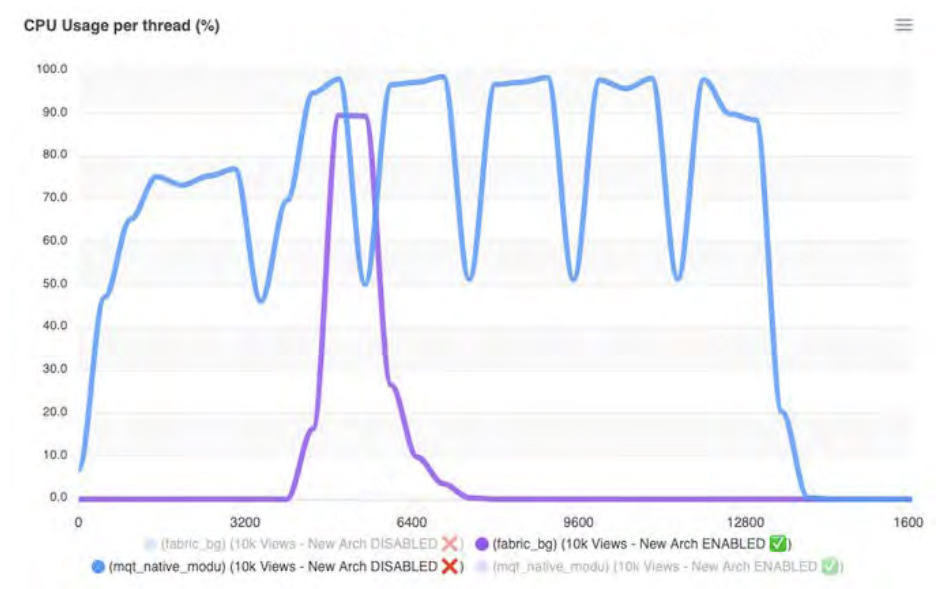

###### 渲染 2K Text 组件的基准测试

在这种情况下，旧架构更快，主要是因为 UI 线程的消耗更大。

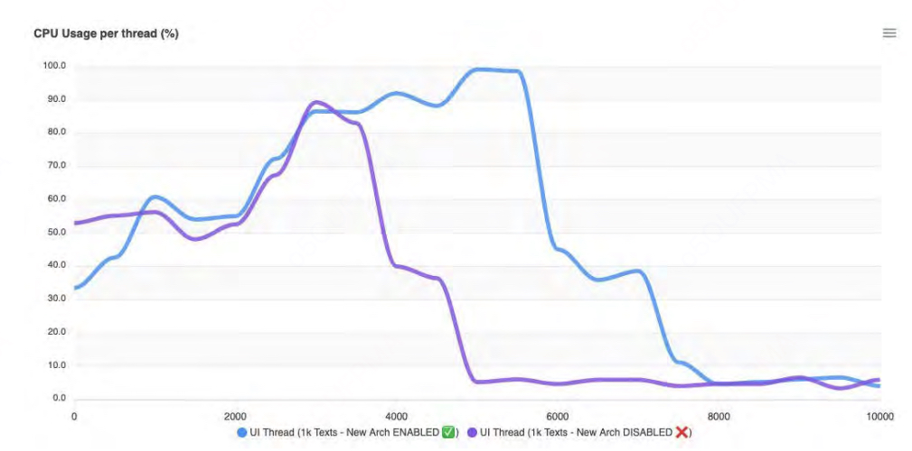

React Native 团队的官方回应是，在将新架构推向用户时，他们在 Facebook 应用的 Android 和 iOS 上进行了内部基准测试，结果显示所有 React Native 表面上的性能变化都呈现中性状态。正如 Samuel Susla 在讨论线程中所说，“在过去的几年里，我们在数百万设备上进行了几十次生产环境测试，以确保性能保持中性。”

因此，在大多数使用场景中，您可以预期性能影响是中性的，不会出现性能回归。请记住，新架构每天都在不断改进，许多开发者都在向该仓库做出贡献，因此，当您阅读这段内容时，结果可能会完全不同。

##### 未来适应性

新架构使您的应用能够利用 React 的并发特性。这提高了 UI 响应性，提供了用于数据获取的 Suspense，以处理复杂的 UI 加载方案，并确保您的应用为将来基于 React 18 引入的新并发引擎构建的任何 React 创新做好准备。

让我们看看如何利用 React 18 的 startTransition API 来优先处理两个状态更新。在我们的示例中，按钮点击可以视为一个紧急更新，而 NonUrgentUI 则可以视为非紧急更新。为了告诉 React 一个非紧急更新，我们可以将 setState 包装在 startTransition API 中。这使得 React 可以准备新的 UI，并在新 UI 准备好之前显示旧的 UI。在我们的示例中，我们将 setNonUrgentValue 包装在 startTransition 中，并告诉 React nonUrgentValue 是一个过渡，并不是那么紧急，可能需要一些时间。我们还添加了一个条件的 backgroundColor。当您运行这个示例时，您会看到，一旦点击按钮，视图将保留其旧的 UI。例如，如果我们从值 1 开始，UI 将是绿色的。

一旦点击按钮，Value 文本 UI 会更新，但容器的 UI 仍会保持绿色，直到过渡完成，颜色才会变为红色，因为新 UI 已经被渲染。这就是 React 并发渲染的魔力。

为了更好地理解这一点，假设将一个更新包装在 startTransition 中就像是在不同的宇宙中渲染它。我们无法直接看到那个宇宙，但可以通过 useTransition 钩子返回的 isPending 变量来获取来自该宇宙的信号。一旦新 UI 准备好，两个宇宙会合并，展示最终的 UI。

```javascript
import React from 'react';
import { Button, StyleSheet, Text, View } from 'react-native';

const dummyData = Array(10000).fill(1);
const NonUrgentUI = ({ value, isPending }) => {
  const backgroundStyle = {
    backgroundColor: value % 2 === 0 ? 'red' : 'green',
  };

  return (
    <View>
      <Text>Non urgent update value: {isPending ? 'PENDING' : value}</Text>
      <View style={[styles.container, backgroundStyle]}>
        {dummyData.map((_, index) => (
          <View key={index} style={styles.item} />
        ))}
      </View>
    </View>
  );
};

const ConcurrentStartTransition = () => {
  const [value, setValue] = React.useState(1);
  const [nonUrgentValue, setNonUrgentValue] = React.useState(1);
  const [isPending, startTransition] = React.useTransition();
  const handleClick = () => {
    const newValue = value + 1;
    setValue(newValue);
    startTransition(() => {
      setNonUrgentValue(newValue);
    });
  };

  return (
    <View>
      <Button onPress={handleClick} title='Increment value'/>
      <Text>Value: {value}</Text>
      <NonUrgentUI value={nonUrgentValue} isPending={isPending} />
    </View>
  );
};

export default ConcurrentStartTransition;

const styles = StyleSheet.create({
  container: {
    flexDirection: 'row',
    flexWrap: 'wrap',
  },
  item: {
    width: 10,
    height: 10,
  },
});
```

为了更好地理解它，让我们通过代码片段的可视化来帮助说明。下图展示了使用 startTransition 和不使用 startTransition 的对比。

从图中我们可以看到，React 会立即刷新紧急更新，这是因为我们在调用 setValue 时没有将其包装在 startTransition 中。

接下来，我们看到 React 显示了依赖于非紧急更新的 UI（以绿色显示），也就是说，依赖于包装在 startTransition 中的更新。我们还看到了显示的 Pending 文本，这是 React 18 告诉我们，依赖于该状态的新 UI 尚未准备好。一旦新 UI 准备好，React 会刷新它，我们就不再看到 Pending 文本，视图的颜色会变成红色。

另一方面，如果我们不使用 startTransition，React 会尝试将两个更新都视为紧急更新，并在它们都准备好时一起刷新。这确实有一些缺点，比如应用会试图一次性渲染一些较重的 UI，可能会导致用户体验不流畅。通过 React 18，我们可以通过延迟那些不紧急的更新来解决这个问题。


在 React 18 中还有一些其他显著的特性，您可能想通过 React 官方网站上的沙箱进行体验。请查看 useDeferredValue 和结合 startTransition 使用的 Suspense。

##### 维护与支持

React Native 核心团队承诺支持最新的 3 个版本（您可以在此查看支持政策：https://github.com/reactwg/react-native-releases#releases-support-policy）。而 React 核心团队也计划在并发渲染引擎基础上构建新特性。保持更新非常重要，因为技术债务的成本随着时间的推移会增加。

值得注意的是，React Native 在这一点上与其他软件项目没有区别。如果不更新依赖项，不仅可能导致您的团队在不可避免时花费更多时间处理这个问题，还可能让您的应用暴露于上游已经修复的安全漏洞中。

React Native 团队有专门的资源来帮助社区解决与新架构采用相关的应用和库问题，并与社区紧密合作。尽管新架构尚未稳定，但今天就尝试在您的应用中使用它仍然是值得的。特别是考虑到从 React Native v0.72 开始，已经存在了互操作层（Interop Layer），它允许在启用新架构的应用中运行大多数旧架构组件。

