> [《React Native 优化终极指南》](https://5711799.fs1.hubspotusercontent-na1.net/hubfs/5711799/The%20Ultimate%20Guide%20to%20React%20Native%20Optimization%202024%20Edition.pdf)

# React Native 优化简介

## 一切都围绕着 TTI 和 FPS？

等等，这些奇怪的缩写到底是什么？！在考虑优化移动端 React Native 应用时，除了价值主张和用户参与度之外，我们需要承认两个最重要的指标——用户判断我们的应用是否快速流畅的依据——分别是交互时间（TTI，Time To Interactive）和每秒帧数（FPS，Frames Per Second）。

> 前者（TTI）衡量的是用户多快可以开始使用（或与）您的应用程序进行交互，主要关注启动时的性能。打开一个新的应用程序应该是快速的，这毫无疑问。而后者（FPS）则衡量的是应用程序界面对用户交互的响应速度，主要关注运行时的性能。使用应用程序的过程应该像骑自行车一样流畅——除非您开启了省电模式。优秀的应用程序将卓越的启动性能和运行性能结合起来，为用户提供最佳的端到端体验。

> 本指南中的几乎每条建议都将直接或间接影响这两个指标。而由于 React Native 为我们提供了构建原生 Android 和 iOS 应用的工具，并在其基础上加入了一些 JavaScript，这使得我们有许多机会可以从不同角度影响这些指标！

> 值得庆幸的是，大部分繁重的工作已经在框架层面为我们完成了，因此任何 React Native 开发者都可以从一个良好的性能基线开始。然而，随着您的应用变得越复杂，要维持健康的 TTI 和 FPS 基线性能可能会变得越具挑战性。

> 坦白说，优化并不只是围绕这两个指标。毕竟，如果您的应用在运行时崩溃，您还能测量交互过程中的 FPS 吗？优化是一个复杂且持续的过程，需要在多个层面不断进行，才能让产品取得成功。随着您深入阅读本指南，您将更清楚地了解哪些因素会影响用户体验、哪些因素对提供和感知更好的性能至关重要、为什么重要，以及如何解决阻碍用户在使用您的 React Native 应用时享受最佳体验的各种挑战。

### React Native 负责渲染，但性能仍是关键。

使用 React Native，您可以创建组件来描述界面的外观。在运行时，React Native 会将这些组件转换为平台特定的原生组件。与其直接与底层 API 对话，您更关注的是应用程序的用户体验。

然而，这并不意味着所有使用 React Native 开发的应用程序都同样快速，或者能够提供相同水平的用户体验。

#### 每种声明式方法（包括 React Native）都建立在命令式 API 之上，这需要特别注意。

当您以命令式方式构建应用程序时，您会仔细分析每个对外部 API 的调用点。例如，在多线程环境中编写代码时，您会在特定线程中安全地编写代码，同时清楚地了解代码运行的上下文以及其需要的资源。

尽管声明式和命令式方法在实现方式上存在诸多差异，但它们之间也有很多相似之处。每个声明式的抽象都可以被分解为若干命令式的调用。例如，React Native 在 iOS 上渲染应用程序时使用的 API，与原生开发者自己使用的 API 是相同的。

#### React Native 统一了性能，但并不保证性能无忧！

虽然您无需担心底层 iOS 和 Android API 调用的性能问题，但您如何组合组件却可能产生巨大的影响。您所有的组件都会提供相同水平的性能和响应能力。

#### 但“相同”是否等于“最佳”？答案是否定的。

这就是我们的清单发挥作用的时候。充分利用 React Native 的潜力。如前所述，React Native 是一个声明式框架，负责为您渲染应用程序。换句话说，您无需指定应用程序的渲染方式。

您的任务是定义 UI 组件，其他的交给框架处理。然而，这并不意味着您可以理所当然地忽略应用程序的性能。为了创建快速且响应迅速的应用程序，您需要以 React Native 的方式思考。您必须了解框架如何与底层平台 API 进行交互。

#### 如果您需要在性能、稳定性、用户体验或其他复杂问题上获得帮助，请联系我们！

作为 React Native 核心贡献者和社区领袖，我们将很乐意为您提供帮助。

## 第三章 如何在稳定的开发环境中更快地交付

React Native 非常适合快速且有信心地交付，但你准备好了吗？

如今，拥有一个稳定且舒适的开发环境是必须的，它能够鼓励快速交付新功能并且不会拖慢进度。你必须快速交付，并保持领先于竞争对手。React Native 在这种环境下表现得非常出色。例如，它的一个最大卖点就是允许你向应用推送更新，而无需通过 App Store 提交。这些更新被称为空中下载（Over-the-Air，OTA）更新。

问题是：你的应用准备好迎接这个挑战了吗？你的开发流程是否能够加速 React Native 的开发和功能交付？

大多数时候，你希望答案是简单的“是”。但实际上，情况往往更为复杂。

在这一部分，我们将介绍一些最佳实践和建议，帮助你更快速且更有信心地交付应用。这不仅仅是开启 OTA 更新，就像大多数文章所建议的那样。更重要的是，建立一个稳定健康的开发环境，在这里 React Native 能够大放异彩，并加速创新。

这正是我们指南这一部分的核心内容。

### 第一节 为应用的关键部分运行测试

将测试重点放在应用的关键部分，以更好地了解新功能和调整的情况。

#### 问题：你根本不写测试，或者编写低质量的测试，覆盖面有限，且仅依赖手动测试。

构建和部署应用并确保其可靠性是一项具有挑战性的任务。然而，要验证一切是否正常工作需要大量的时间和精力——无论是自动化的还是手动的。确保软件按预期工作的人力验证对你的产品至关重要。

不幸的是，随着应用功能的增长，这个过程并不容易扩展。它也无法为编写代码的开发者提供直接反馈。因此，找到并修复 bug 所需的时间会增加。

那么，开发者如何确保他们的软件始终处于生产就绪状态，并不依赖于人工测试呢？他们编写自动化测试。而 React Native 也不例外。你可以为你的 JS 代码（包括业务逻辑和 UI）以及底层使用的原生代码编写各种测试。

你可以通过利用端到端测试框架、启动模拟器、仿真器，甚至真实设备来实现这一点。React Native 的一个大优点是它会打包成原生应用包，因此你可以在原生项目中使用你喜欢并已经习惯的所有端到端测试框架。

但需要注意的是，编写测试本身可能是一个具有挑战性的任务，尤其是在你缺乏经验的情况下。你可能会编写一个没有很好覆盖功能的测试，或者只测试正向行为，而没有处理异常。低质量的测试很常见，它们不会提供太多价值，因此也不会提高你在交付代码时的信心。

无论你编写的是单元测试、集成测试，还是端到端（E2E）测试，有一条黄金法则可以帮助你避免写出不好的测试。这个规则就是“避免测试实现细节”。遵守这个规则，你的测试就能随着时间的推移提供价值。

你不能像竞争对手一样快速前进，回归的可能性较高，而应用在收到差评时可能会被下架。测试代码的主要目标是通过最小化引入代码库的 bug 来确保以信心发布代码。而且，避免将 bug 发布给用户对移动应用尤其重要，因为这些应用通常会发布到应用商店。

因此，它们需要经过漫长的审核过程，这可能需要几小时到几天不等。你最不想的事情就是通过一次更新让你的应用变得有问题，这会导致评分下降，极端情况下甚至将应用从商店下架。

这样的情况看似罕见，但它们确实发生过。然后，你的团队可能会因害怕再次发生回归和崩溃而失去开发速度和信心。

#### 解决方案：不要追求 100% 的覆盖率，而是专注于应用的关键部分。主要进行集成测试。

运行测试的问题不是“是否”而是“如何”。你需要制定一个计划，确保时间投入能够获得最大的价值。要覆盖你所有的代码和依赖，尤其是达到 100% 的覆盖率，通常是非常困难的，而且往往不切实际。

大多数移动应用并不需要对他们编写的代码进行完全的测试覆盖。只有在客户要求由于政府法规必须遵守时，才需要全面的覆盖。但是在这种情况下，你可能已经意识到这个问题了。

专注于测试正确的内容对你来说至关重要。学会识别业务关键功能和能力，通常比编写测试本身更为重要。毕竟，你想增强对代码的信心，而不是为了写测试而写测试。一旦你确定了关键功能，接下来的任务就是决定如何运行这些测试。

在 React Native 中，你的应用由多个层次的代码组成，一些用 JS 编写，一些用 Java/Kotlin 编写，一些用 Objective-C/Swift 编写，还有一些甚至用 C++ 编写，这在 React Native 核心中逐渐被采用。

因此，出于实际考虑，我们可以区分以下几类：
- JavaScript 测试 – 使用 Jest 框架。在 React Native 的上下文中，如果你考虑“单元”或“集成”测试，这些测试最终都属于这个类别。从实际角度来看，区分这两者没有太大必要。
- 端到端应用测试 – 使用 Detox、Appium 或其他你熟悉的移动测试框架。因为大部分业务逻辑都存在于 JS 中，所以集中精力在这一部分是有意义的。

因为大多数业务代码都位于 JS 中，所以集中精力在这一部分是合理的。

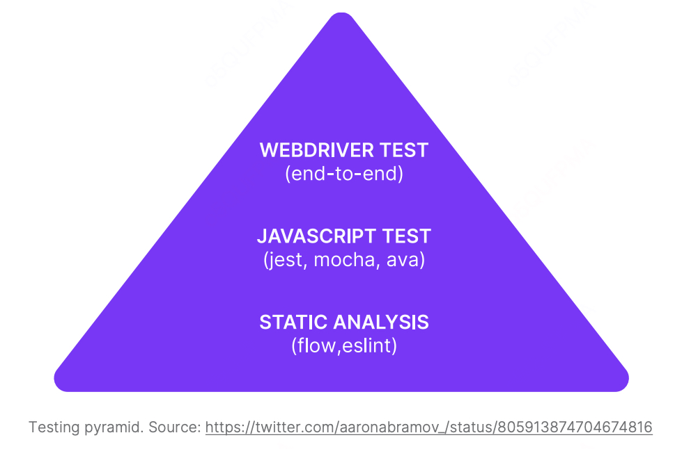

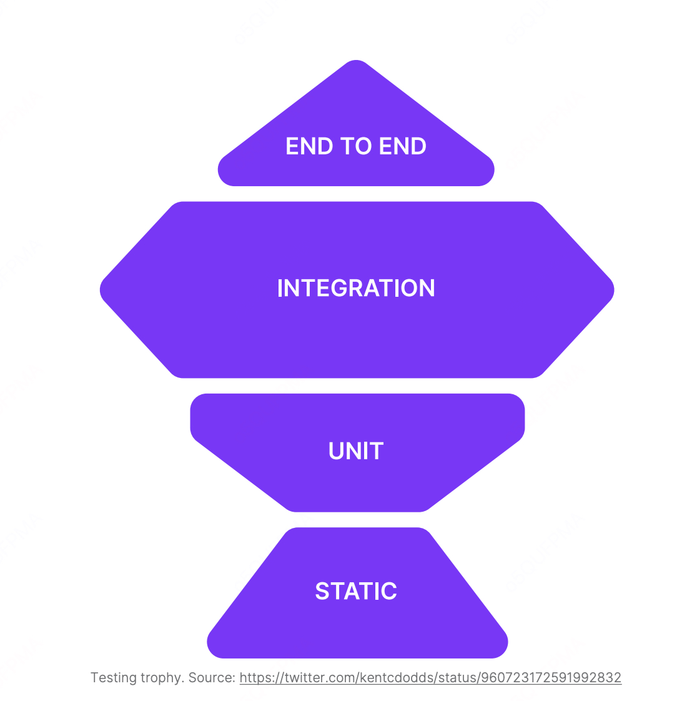

##### JavaScript 测试

为实用函数编写测试应该是相对直接的。你可以使用自己喜欢的测试运行器。在 React Native 社区中，最流行且推荐的测试运行器是 Jest。接下来的章节中我们也会使用 Jest。

对于 React 组件的测试，你需要更高级的工具。让我们以以下组件为例：

```javascript
import React, { useState } from 'react';
import {
 View,
 Text,
 TouchableOpacity,
 TextInput,
 ScrollView,
} from 'react-native';

const QuestionsBoard = ({ questions, onSubmit }) => {
  const [data, setData] = useState({});
  return (
    <ScrollView>
      {questions.map((q, index) => {
        return (
          <View key={q}>
            <Text>{q}</Text>
            <TextInput
              accessibilityLabel="answer input"
              onChangeText={(text) => {
                setData((state) => ({
                ...state,
                [index + 1]: { q, a: text },
              }));
              }}
            />
          </View>
        );
      })}
      <TouchableOpacity onPress={() => onSubmit(data)}>
        <Text>Submit</Text>
      </TouchableOpacity>
    </ScrollView>
  );
};

export default QuestionsBoard;
```

这是一个 React 组件，显示了一组问题并允许用户回答。你需要确保其逻辑正常工作，方法是检查回调函数是否按用户提供的答案集被调用。

为此，你可以使用 React 核心团队提供的官方 react-test-renderer 库。它是一个测试渲染器，换句话说，它允许你渲染组件并与其生命周期进行交互，而不需要实际处理原生 API。有些人可能会觉得它的低级 API 很复杂且难以使用。因此，React Native 社区推出了一些辅助库，如 React Native Testing Library，为我们提供了一组优秀的工具，帮助我们高效地编写高质量的测试。

这个库的一个很棒的特点是，它的 API 强制你避免测试组件的实现细节，使得你的测试在内部重构时更具弹性。

对 QuestionsBoard 组件的测试可能如下所示：

```javascript
import { render, screen, fireEvent } from '@testing-library/react-native';
import { QuestionsBoard } from '../QuestionsBoard';

test('form submits two answers', () => {
  const allQuestions = ['q1', 'q2'];
  const mockFn = jest.fn();
  render(<QuestionsBoard questions={allQuestions} onSubmit={mockFn} />);
  const answerInputs = screen.getAllByLabelText('answer input');
  fireEvent.changeText(answerInputs[0], 'a1');
  fireEvent.changeText(answerInputs[1], 'a2');
  fireEvent.press(screen.getByText('Submit'));
  expect(mockFn).toBeCalledWith({
    1: { q: 'q1', a: 'a1' },
    2: { q: 'q2', a: 'a2' },
  });
});
```

首先，你使用一组问题渲染 QuestionsBoard 组件。接下来，你通过标签文本查询组件的树，访问显示的问答列表。最后，你设置正确的答案并点击提交按钮。

如果一切顺利，你的断言应该通过，确保 verifyQuestions 函数已被正确的参数集调用。

*** 注意：你可能也听说过一种叫做“快照测试”的技术，它在某些测试场景中非常有用，例如，当你处理可能在不同测试间稍有变化的结构化数据时。这个技术在 React 生态系统中被广泛采用，因为 Jest 内置了对它的支持。 ***

如果你有兴趣了解更多关于快照测试的内容，可以查看 Jest 官方网站上的文档。一定要仔细阅读，因为 toMatchSnapshot 和 toMatchInlineSnapshot 是低级 API，使用时有很多细节需要注意。

这些工具可以帮助你和团队快速为项目添加测试覆盖率，但也容易导致低质量且难以维护的测试。因此，使用像 eslint-plugin-jest 的 no-large-snapshots 选项，或者使用 snapshot-diff 的组件快照对比功能进行专注的断言，是使用快照测试技术时的必备工具。

##### E2E（端到端）测试

我们测试金字塔的顶端是端到端测试套件。最好从所谓的“冒烟测试”开始——一个确保你的应用在第一次运行时不会崩溃的测试。拥有这样的测试是至关重要的，因为它能帮助你避免向用户发布故障应用。一旦完成了基础测试，你应该使用你选择的端到端测试框架，覆盖你应用的最重要功能。

这些功能可以是，比如，登录（无论是否成功）、注销、接受支付，以及显示你从自己或第三方服务器获取的数据列表。

*** 注意：要小心，这些测试通常比 JavaScript 测试更难设置。 ***

另外，它们更容易因网络、文件系统操作、存储或内存不足等问题而失败。而且，它们提供的关于失败原因的信息也很少。测试的质量（不仅仅是 E2E 测试）被称为“脆弱性”，应当尽量避免，因为它会降低你对测试套件的信任。因此，将测试断言划分为更小的组非常重要，这样可以更容易地调试问题出在哪里。

在本节中，我们将使用 Detox——React Native 社区中最流行的 E2E 测试运行器。

在继续之前，你需要安装 Detox。这个过程需要你做一些额外的“原生步骤”，然后才能运行第一个测试套件。请遵循官方文档，因为这些步骤未来可能会有所变化。

一旦成功安装并配置好 Detox，你就可以开始编写第一个测试了。

上面展示的简短代码片段将确保第一个问题被正确显示。

在执行这个断言之前，你应该重新加载 React Native 实例，以确保没有先前的状态干扰测试结果。

```javascript
it('should display the questions', async () => {
  await devicePixelRatio.reloadReactNative();
  await element(by.text(allQuestions[0])).toBeVisible();
});
```

*** 注意：当你处理多个元素时（例如，在我们的案例中——一个组件渲染了多个问题），一个好的做法是给每个元素分配一个带有索引的后缀 testID，以便能够查询到特定的元素。这种做法以及其他一些有趣的技术都可以在官方 Detox 推荐中找到。 ***

有各种匹配器和期望值可以帮助你根据自己的需求构建测试套件。

#### 好处：你对新功能和调整有更好的概览，能够自信地发布，并且当测试通过时，你节省了其他人的时间（QA团队）。

一个高质量的测试套件，能够为你的核心功能提供足够的覆盖，是对团队开发速度的投资。毕竟，你的进展速度只能和你对代码的信心相匹配。而测试的目标就是确保你在正确的方向上前进。

React Native 社区正在努力让测试变得尽可能简单和愉快——无论是对你的团队，还是对 QA 团队。得益于这一点，你可以花更多的时间进行创新，给用户带来炫酷的新功能，而不是一次又一次地修复 bug 和回归问题。

### 第二节 建立一个有效的持续集成（CI）环境

> 使用 CI 服务提供商来改善应用的构建、测试和分发

#### 问题：缺乏 CI 或拥有不稳定的 CI 意味着反馈循环更长——你无法及时知道你的代码是否正常工作，也无法与其他开发者高效协作。

正如你从上一节中学到的，覆盖代码进行测试对于提高应用的整体可靠性非常有帮助。然而，尽管测试你的产品至关重要，但这并不是在更快、更有信心地发布应用时的唯一前提条件。

同样重要的是，你能多快地检测到潜在的回归问题，是否能够将这些问题的发现纳入日常开发生命周期。换句话说，一切都归结为反馈循环。

为了更好地理解这一点，让我们看看开发过程的早期阶段。当你刚开始时，你的重点是尽快发布第一次迭代（MVP）。因此，你可能忽视了架构本身的重要性。当你完成更改后，你将它们提交到代码库，告诉团队的其他成员这个功能已经准备好进行审查。

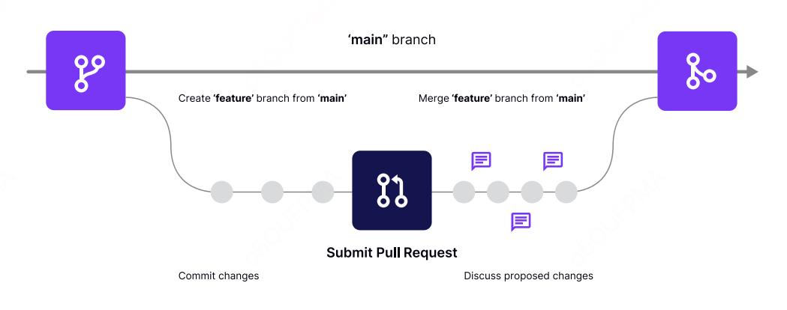

尽管这种技术非常有用，但如果单独使用，它可能是危险的，特别是在团队规模增长时。在你准备接受PR之前，你不仅需要检查代码，还应该将其克隆到你的环境中并进行彻底的测试。在这个过程中，最终可能会发现提议的更改引入了回归，而原作者没有察觉到。

回归问题可能出现，因为我们每个人的配置、环境和工作方式都不同。

##### 很难将新成员引入你的团队。你无法在PR和不同的贡献发生时就进行发布和测试。

如果你手动测试更改，不仅会增加将回归问题发布到生产环境的风险，还会减缓整体开发速度。幸运的是，通过采用正确的方法和一些自动化，你可以彻底克服这一挑战。

这时，持续集成（CI）就派上用场了。CI是一种开发实践，在这种实践中，开发团队每天多次将提议的更改提交到上游代码库。接下来，系统会通过自动化构建来验证这些更改，允许团队及早发现问题。

这些自动化构建由一个专门的基于云的CI提供商执行，该提供商通常会与存储代码的平台进行集成。目前大多数云服务提供商都支持GitHub，这是微软拥有的一个平台，用于协作开发使用Git作为版本控制系统的项目。

CI系统实时拉取更改并执行一组选定的测试，提供早期反馈。这种方法引入了单一的测试真相来源，并允许具有不同环境的开发者获取方便且可靠的信息。

使用CI服务时，你不仅测试代码，还会为项目构建新的文档版本，构建应用并分发给测试人员或发布版本。这种技术被称为持续部署（Continuous Deployment），其重点是自动化发布过程。在本节中，我们将更深入地探讨这一技术。

#### 解决方案：使用CI提供商，如Circle CI或EAS Build，来构建你的应用程序。运行所有必需的测试，并在可能的情况下制作预览版本。

有很多CI提供商可供选择，你可以选择最适合项目需求的工具，甚至可以结合使用多个CI工具。Circle CI和GitHub Actions是通用的CI提供商，功能广泛，涵盖了移动应用开发之外的领域。Bitrise专注于移动应用开发中的服务，而EAS则专门用于构建和部署React Native项目。

我们选择CircleCI作为本节的参考CI提供商，因为它在社区中得到了广泛采用。实际上，React Native已经有一个示例项目，演示了如何使用CI。你可以在这里了解更多内容。我们将在本节稍后使用它来介绍不同的CI概念。

在这段概述之后，我们将展示如何在你的React Native项目中替代性地设置EAS，并使用它来构建开发、预览和生产环境中的本地iOS和Android包。

*** 注意：一个经验法则是，利用React Native或React Native Community项目中已经使用的工具。通过这种方式，你可以确保你选择的提供商与React Native兼容，并且最常见的挑战已经被核心团队解决。 ***

###### CircleCI

与大多数CI提供商一样，在开始之前，研究它们的配置文件是非常重要的。

让我们来看一个CircleCI的示例配置文件，它来自前面提到的React Native示例：

```yml
version: 2.1
jobs:
 android:
 working_directory: ~/CI-CD
 docker:
 - image: reactnativecommunity/react-native-android
 steps:
 - checkout
 - attach_workspace:
 at: ~/CI-CD
 - run: npm i -g envinfo && envinfo
 - run: npm install
 - run: cd android && chmod +x gradlew && ./gradlew
assembleRelease
workflows:
 build_and_test:
 jobs:
 - android
```
这个结构是标准的Yaml语法，用于基于文本的配置文件。在继续之前，你可能需要先了解一下Yaml的基础知识。

*** 注意：许多CI服务，如CircleCI或GitHub Actions，都是基于Docker容器和将不同作业组成工作流的理念。你可能会发现这些服务之间有很多相似之处。 ***

这些是CircleCI配置中最重要的三个构建块：命令（commands）、作业（jobs）和工作流（workflows）。

命令（Command） 只是一个Shell脚本，它在指定的环境中执行。它执行云端的实际任务，可以是任何东西，比如安装依赖项的命令，例如 yarn install（如果你使用Yarn），或者像 ./gradlew assembleDebug 这样构建Android文件的更复杂命令。

作业（Job） 是一系列命令（称为步骤），它专注于实现一个单一的、定义明确的目标。作业可以在不同的环境中运行，通过选择适当的Docker容器。

例如，如果你只需要运行React单元测试，可能想使用Node容器。这样，容器会更小，依赖项更少，安装速度也会更快。如果你想在云端构建React Native应用程序，则可能选择不同的容器，例如带有Android NDK/SDK的容器，或者使用OS X来构建Apple平台的容器。

*** 注意：为了帮助你选择在运行React Native测试时使用的容器，团队已经准备了一个Docker Android容器，其中包含了进行Android构建和测试所需的Node和Android依赖项。 ***

为了执行一个作业（job），它必须被分配到一个工作流（workflow）中。默认情况下，作业会在工作流中并行执行，但通过为作业指定要求，可以更改这一行为。

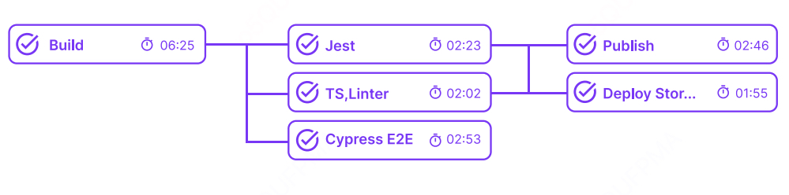

你还可以通过添加过滤器来修改作业的执行计划，例如，只有当代码中的更改涉及到主分支时，部署作业（deploy job）才会运行。

你可以为不同的目的定义多个工作流，例如，一个用于测试，当PR被打开时运行；另一个用于部署应用的新版本。这正是React Native每隔一段时间自动发布新版本的方式。

###### Expo Application Services (EAS)

EAS 是一组为 Expo 和 React Native 应用深度集成的云服务，由 Expo 团队构建和维护。它包含的三个最受欢迎的服务是：

• EAS Build：一个云服务，帮助你构建 React Native 应用的捆绑包（app bundles）。
• EAS Submit：一个云服务，允许你将构建好的应用捆绑包直接上传到 Apple App Store 的 TestFlight，或者上传到 Android Google Play Store 的指定发布通道。
• EAS Update：一个服务，用于向 React Native 应用发送空中（OTA）更新。

在本节中，我们将重点关注 EAS Build。如前所述，EAS 在构建 React Native 应用方面高度专业化，提供了最快且最无缝的体验。为了提供最佳的开发者体验，EAS Build 已经预先配置了 iOS 和 Android 开发环境，并且内置了对所有流行的包管理器（包括 npm、yarn、pnpm 和 bun）的支持。

使用 EAS 构建 React Native 应用的一个好处是，因为它是一个云服务，你可以在 Mac、Windows 甚至 Linux 机器上触发应用构建，并将构建好的应用直接下载到你的开发设备。这意味着，举例来说，你可以在 Windows 机器上开发 iOS 应用，绕过 Apple 要求拥有 Mac 才能构建原生 iOS 应用的限制。

另一个使用 EAS 构建 React Native 应用的好处是，你可以直接获得 JavaScript、Android 和 iOS 依赖项的构建缓存，且无需任何配置。

###### Setting up EAS Build
要在现有的 React Native 应用中设置 EAS Build，首先你需要安装 EAS CLI：

```bash
npm i -g eas-cli
```

如果你还没有 Expo 账户，你还需要创建一个，并在 CLI 中登录：

```bash
eas login
```
要创建在真实设备上运行的应用构建，你需要配置构建签名：这意味着为 Android 生成密钥库，为 iOS 生成 Provisioning Profiles 和证书。

使用 EAS 的一个好处是，它配备了一个 CLI 工具，可以自动为你创建和更新所有构建凭证。在配置第一次构建时，CLI 会提示你执行此操作，或者你也可以通过运行 eas credentials CLI 命令，在不触发构建的情况下管理凭证。

安装 CLI 并登录后，在项目根目录运行以下命令：

```bash
eas build:configure
```

这将把 eas.json 文件添加到你项目的根目录：

```json
{
  "cli": {
    "version": ">= 6.0.0"
  },
  "build": {
    "development": {
    "developmentClient": true,
    "distribution": "internal"
  },
  "preview": {
    "distribution": "internal"
  },
  "production": {}
  },
  "submit": {
   "production": {}
  }
}
```

eas.json 文件将包含在 EAS 上构建应用所需的所有配置。默认情况下，它会包含 3 个构建配置文件：development、preview 和 production：
-	development: 'distribution': 'internal' 在开发配置文件中意味着构建将通过链接下载，而 'developmentClient': true 启用开发菜单，允许 JavaScript 被单独打包。这是你在本地开发时想要使用的构建配置。
-	preview: 预览构建同样可以通过链接下载，但它不包含开发客户端。这意味着它会包含一个 JavaScript 包，因此无法用于本地开发。它最适合用于测试或预览生产版本的应用，在提交到应用商店之前使用。
-	production: 该配置用于创建生产版本的应用，你可以将其上传到 Google Play 和 Apple App Store。

你可以根据需要始终添加额外的配置文件。例如，你可以添加一个单独的构建配置文件，用于创建可以在模拟器上运行的 iOS 应用：

```
"development:simulator": {
  "ios": {
    "simulator": true
  },
  "developmentClient": true,
  "distribution": "internal"
}
```
如上所示，每个配置文件可以有额外的特定平台配置，尽管大多数情况下配置是共享的。请参阅 eas.json 文档，了解所有可用的配置选项。

###### 在 EAS Build 上运行构建

任何在 eas.json 中配置的构建都可以通过单个命令触发。例如，如果你想为本地开发构建应用，可以运行：

```
eas build --profile development
```

CLI会提示您是否想要构建iOS应用、Android应用或两者都构建。开发版的构建配置为"developmentClient": true，意味着它可以用于本地开发。除非添加了新的原生代码或包，否则您无需重新构建该版本。一旦构建完成，您可以使用Expo Orbit来安装和运行来自EAS或本地文件的构建，无论是在模拟器还是实际设备上。

要使用不同的构建配置文件，例如预览构建，您可以运行相同的命令，并添加--profile preview：
```
eas build –profile preview
```

一旦构建完成，CLI 会打印出构建的 URL，团队中的任何成员都可以将应用程序下载到他们的设备上。

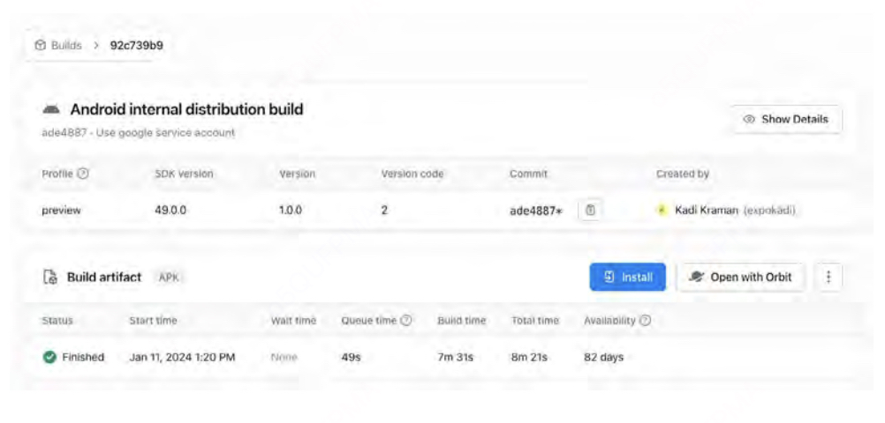

为了自动化这个工作流程，你可以通过 Expo GitHub 应用程序配置 EAS 从 GitHub 进行构建。

虽然 EAS 主要用于构建和提交你的原生应用到应用商店，但它也支持在工作流中运行端到端（E2E）测试。

#### 好处：你可以提前获得关于新功能的反馈，并迅速发现回归问题。此外，你也不会浪费其他开发者的时间去测试那些不起作用的更改。

一个配置正确且正常工作的CI提供者可以在发布新版本应用时为你节省大量时间。

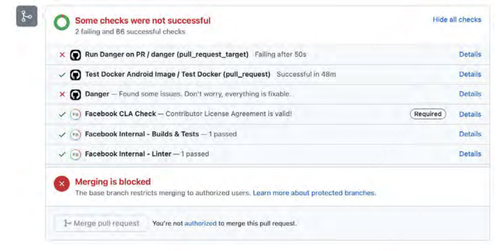

通过提前发现错误，你可以减少审查PR所需的工作量，并保护你的产品免受可能直接影响收入的回归和bug的影响。

### 第三节 不要害怕通过持续部署快速发布。

> 建立持续部署环境，以便更快地发布新功能并验证关键bug。

#### 问题：手动构建和分发应用程序是一个复杂且耗时的过程。

正如你在上一节中所学到的，自动化开发生命周期中的关键环节可以帮助你提高整体开发速度和安全性。反馈周期越短，你的团队就能越快地在产品本身上进行迭代。然而，测试和开发只是你在产品开发过程中必须执行的一部分。另一个重要的步骤是部署——构建并将应用程序分发到生产环境。大多数时候，这个过程是手动的。

部署需要时间进行设置，并且比仅在云端运行测试要复杂得多。例如，在iOS上，Xcode会自动配置许多设置和证书。这确保了从事原生应用开发的开发人员能有更好的开发体验。习惯于这种方法的开发者通常会发现，将部署移到云端并手动设置证书等操作具有挑战性。

手动方法的最大缺点是它需要时间，并且不具备可扩展性。因此，那些没有投资改进这一过程的团队，最终会以较慢的速度发布他们的软件。

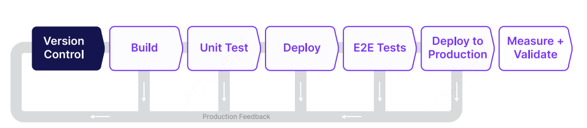

持续部署（Continuous Deployment）是一种通过一套自动化脚本频繁发布软件的策略。它旨在以更快的速度和更高的频率构建、测试和发布软件。这种方法通过允许对生产环境中的应用程序进行更多增量更新，帮助减少交付变更的成本、时间和风险。

##### 你没有像应该的那样快速发布新功能和修复。

手动构建和分发应用程序会减慢开发过程，无论团队多大。即使是在大约 5 人的小型产品团队中，自动化构建流水线也能让每个人的工作变得更轻松，减少不必要的沟通。这对于远程公司尤为重要。

持续部署还允许您引入专注于提升应用程序整体性能的标准和最佳实践，其中一些已经在本指南中讨论过。将所有部署所需的步骤集中在一个地方，可以确保所有发布都按照相同的方式进行，并实施公司范围的标准。

#### 解决方案：建立一个持续部署设置，使得构建过程能够生成变更日志，并能够立即将应用发布给用户。

当谈到自动化移动应用程序的部署时，有几种成熟的方法可以选择。

一种方法是从头开始编写一组脚本，直接与Xcode和Gradle交互。不幸的是，Android和iOS的工具链存在显著差异，并且并不是很多开发人员具备足够的经验来处理这种自动化。此外，iOS比Android要复杂得多，因为它涉及高级代码签名和分发策略。正如我们之前所说，如果你手动操作，即便是Xcode也无法帮助你。

另一种方法是使用现成的工具，这些工具已经处理了大多数用例。我们最喜欢的工具是Fastlane——一个用Ruby编写的模块化工具集，允许你通过编写配置文件中的一组指令来构建iOS和Android应用程序。

成功构建好二进制文件后，就可以将它们部署到目标平台了。同样，你可以手动将文件上传到所需的服务（例如App Store），或者使用一个工具来帮你完成上传。由于之前提到的原因，我们更喜欢使用现有的解决方案——在这种情况下，我们选择了微软的AppCenter。

AppCenter是一个云服务，提供应用程序自动化和部署工具。它的最大优点是许多设置可以通过图形界面进行配置。这种方式比从命令行上传文件要容易得多，尤其是设置App Store和Play Store部署时。

同样的操作可以通过EAS来实现，结合EAS Build来构建应用程序包，使用EAS Submit来自动上传到你选择的Google Play Store和TestFlight上的App Store Connect。

在本节中，我们将使用Fastlane和AppCenter在CircleCI管道中完全自动化应用程序交付流程。然后，我们将深入探讨EAS Submit的使用。

*** 注意：详细描述设置过程会让本节内容过长。因此，我们选择仅引用具体的文档。我们的目标是为你提供概览，而不是逐步指南，因为最终的配置将因项目而异。 ***

接下来，你需要在React Native项目中运行init命令。我们将从每个原生文件夹中运行fastlane命令两次。这是因为React Native从底层来看实际上是两个独立的应用。

因此，执行该命令后，它将在ios和android文件夹中分别生成设置文件。每个文件夹中的主要文件将被称为Fastfile，这个文件就是配置所有lane的地方。
```bash
cd ./ios && fastlane init
cd ./android && fastlane init
```

在Fastlane的术语中，lane 就像是一个工作流，它是将低级操作组合在一起，用于部署你的应用。每个lane定义了一个独立的工作流，用于完成从构建到发布的任务。

低级操作是通过action来执行的。action是Fastlane中的预定义操作，它们简化了整个工作流的执行。例如，上传构建到TestFlight、构建Android APK、签名iOS应用等。

##### 设置 Fastlane 在 Android 上

现在你已经成功在项目中设置了 fastlane，你可以开始自动化部署我们的 Android 应用程序。为此，你可以选择一个特定于 Android 的动作——在本例中是 gradle。顾名思义，Gradle 是一个动作，它允许你实现与单独使用 Android Gradle 类似的结果。

我们的 lane 使用 gradle 动作首先清理构建文件夹，然后根据传入的参数组装带签名的 APK。

```fastlane
default_platform(:android)
project_dir = File.expand_path("..", Dir.pwd)
platform :android do
 lane :build do |options|
 if (ENV["ANDROID_KEYSTORE_PASSWORD"] && ENV["ANDROID_
KEY_PASSWORD"])
 properties = {
 "RELEASE_STORE_PASSWORD" => ENV["ANDROID_KEYSTORE_
PASSWORD"]
 "RELEASE_KEY_PASSWORD" => ENV["ANDROID_KEY_
PASSWORD"]
 }
 end
 gradle(
 task: "clean",
 project_dir: project_dir,
 properties: properties,
 print_command: false
 )
 gradle(
 task: "assemble",
 build_type: "Release",
 project_dir: project_dir,
 properties: properties,
 print_command: false
 )
 end
```

你应该能够通过实现以下内容来运行一个 lane 构建：

```bash
cd ./android && fastlane build
```

这应该生成一个签名的 Android APK。

注意：不要忘记设置环境变量以访问 keystore。这些变量是 RELEASE_STORE_PASSWORD 和 RELEASE_KEY_PASSWORD，并且已经在上面提供的示例中设置。

##### SETTING UP FASTLANE ON IOS

在 Android 构建自动化完成后，您现在可以继续处理 iOS 构建。如前所述，由于证书和配置文件的原因，iOS 构建稍微复杂一些。这些证书和配置文件是 Apple 设计的，目的是提高安全性。幸运的是，fastlane 提供了一些专门的操作，帮助我们克服这些复杂性。

您可以从 match 操作开始。它有助于管理和分发 iOS 证书和配置文件，确保团队成员能够访问所需的资源。您可以阅读有关 match 的概念，了解它如何帮助简化代码签名。

简而言之，match 会确保设置您的设备，使其能够成功构建一个能够通过 Apple 服务器验证并被接受的应用。

*** 注意：在继续之前，请确保为您的项目初始化 match。它将生成所需的证书，并将其存储在一个中央仓库中，您的团队和其他自动化工具可以从中获取证书。 ***

除了 match，另一个可以使用的操作是 gym。gym 类似于 Gradle 操作，它实际执行应用的构建。为了实现这一点，它会使用从 match 获取的证书和签名设置。

```
default_platform(:ios)
ios_directory = File.expand_path("..", Dir.pwd)
base_path = File.expand_path("..", ios_directory)
ios_workspace_path = "#{ios_directory}/YOUR_WORKSPACE.
xcworkspace"
ios_output_dir = File.expand_path("./output", base_path)
ios_app_id = "com.example"
ios_app_scheme = "MyScheme"
before_all do
 if is_ci? && FastlaneCore::Helper.mac?
 setup_circle_ci
 end
end

platform :ios do
 lane :build do |options|
 match(
 type: options[:type],
 readonly: true,
 app_identifier: ios_app_id,
 )
 cocoapods(podfile: ios_directory)
 gym(
 configuration: "Release",
 scheme: ios_app_scheme,
 export_method: "ad-hoc",
 workspace: ios_workspace_path,
 output_directory: ios_output_dir,
 clean: true,
 xcargs: "-UseModernBuildSystem=NO"
 )
 end
end
```

您应该能够通过运行与 Android 相同的命令来执行 lane build：

```bash
cd ./ios && fastlane build
```

这也应该生成一个 iOS 应用程序。

##### 部署二进制文件

现在您已经自动化了构建过程，接下来可以自动化流程的最后一部分——部署。为此，您可以使用之前在本指南中讨论过的 App Center。

*** 注意：您需要在 App Center 创建账户，在仪表盘中为 Android 和 iOS 创建应用，并为每个应用生成访问令牌。您还需要一个特殊的 Fastlane 插件，以便将适当的操作带到您的工具箱中。为此，运行 fastlane add_plugin appcenter。 ***

完成项目配置后，您可以继续编写 lane，将生成的二进制文件打包并上传到 App Center。

```
lane :deploy do
 build
 appcenter_upload(
 api_token: ENV["APPCENTER_TOKEN"],
 owner_name: "ORGANIZATION_OR_USER_NAME",
 owner_type: "organization", # "user" |
"organization"
 app_name: "YOUR_APP_NAME",
 file: "#{ios_output_dir}/YOUR_WORKSPACE.ipa",
 notify_testers: true
 )
end
```

就这样！现在是时候通过从本地机器执行 deploy lane 来部署应用程序了。

##### 集成到 CircleCI
使用所有这些命令，你可以在本地构建和分发应用程序。现在，你可以配置 CI 服务器，让它在每次提交到 main 分支时自动执行相同的操作。为此，你将使用 CircleCI——我们在本指南中使用的 CI 提供商。

*** 注意：在 CI 服务器上运行 Fastlane 通常需要一些额外的配置。请参考官方文档，深入了解本地环境和 CI 环境中的设置差异。 ***

要从 CircleCI 部署应用程序，你可以配置一个专门的工作流，专注于构建和部署应用程序。该工作流将包含一个名为 deploy_ios 的单独作业，它将执行我们的 fastlane 命令。

```
version: 2.1
jobs:
 deploy_ios:
 macos:
 xcode: 14.2.0
 working_directory: ~/CI-CD
 steps:
 - checkout
 - attach_workspace:
 at: ~/CI-CD
 - run: npm install
 - run: bundle install
 - run: cd ios && bundle exec fastlane deploy
workflows:
 deploy:
 jobs:
 - deploy_ios
```

Android 的管道将与 iOS 类似。主要区别在于执行器的选择。你应该使用一个 Docker 容器，而不是 macOS 容器，使用 react-native-android Docker 镜像即可。

*** 注意：这是 CircleCI 中的示例用法。在你的情况中，可能更合理的是定义过滤器和其他作业的依赖关系，以确保 deploy_ios 在合适的时间点执行。 ***

你可以修改或参数化这些展示的 lanes，用于其他类型的部署，例如平台特定的 App Store。要了解这些高级用例的详细信息，请参考官方的 Fastlane 文档。

##### EAS Submit

EAS Submit 是一个托管服务，用于将你的应用程序二进制文件上传并提交到应用商店。与 CircleCI 或 AppCenter 不同，使用 EAS Submit 时，你无需手动创建应用签名凭证或手动签署构建文件。EAS CLI 工具简化了这个过程，当你运行 eas build 时，EAS Submit 会自动处理这些步骤。

如果需要，你也可以使用 eas credentials 来管理你的签名凭证，而无需创建构建。

为了使用 EAS Submit，你首先需要运行 eas build 来生成生产环境的 .ipa 文件（用于 Apple）和 .aab 文件（用于 Android）。在上一章的 EAS Build 部分，你可以找到如何设置这一过程的详细说明。

##### 上传 iOS 应用到 App Store Connect 使用 EAS Submit：

一旦你拥有了构建好的 .ipa 文件，无论是保存在本地机器还是 EAS 上，打开终端并运行 eas submit 命令。命令行界面会提示你选择一个构建版本，既可以选择来自 EAS 的构建，也可以选择本地的构建文件。接着，你将被提示登录到你的 Apple Developer 账户，随后该构建将会被上传到 App Store Connect。

通常，这个过程需要几分钟时间来完成处理，直到你的应用在 App Store Connect 上变得可用。

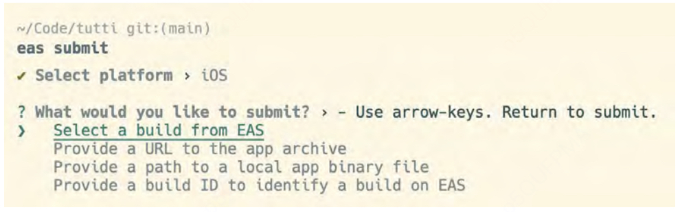

或者，你可以通过以下命令在一条命令中同时构建并提交你的应用：

```javascript
eas build –auto-submit
```

使用 eas submit 上传应用并不会立即让你的应用在 Apple App Store 上可用。因为不能直接将应用上传到 App Store。相反，eas submit 会将你的应用上传到 TestFlight，在 TestFlight 上你可以选择将其发布到测试组，或者创建一个发布版本并提交给 App Store 审核。只有当应用通过审核后，才会在 App Store 上发布给用户。

##### 使用 EAS Submit 上传 Android 应用到 Google Play

在使用 eas submit 自动上传构建到 Google Play 之前，需要进行一些额外的配置。首先，你需要在 Google Play 控制台上创建你的 Android 应用，并手动上传第一个构建。为此，你可以使用 eas build 创建构建，从 EAS 下载它，并将 .aab 文件拖放到 Google Play 控制台的应用上传部分。

在此过程中，你需要填写所有关于应用的元数据，包括添加应用截图、市场描述、条款和条件，以及安全和隐私声明。

如果你打开 Google Play 控制台中的仪表板，请确保“完成设置你的应用”下的所有项目都已勾选。然后打开“发布概述”，确保所有更改已提交审批并已批准。

完成上述步骤后，你需要按照此指南设置 Google 服务帐户。完成指南后，你应该已经下载了 Google 服务帐户的 JSON 私钥（这是一个私钥，因此应该安全存储，并且不应提交到 .git 中）。在你的 eas.json 文件中，添加指向 JSON 文件的路径，配置项为 serviceAccountPath：

```json
{
  "submit": {
    "production": {
      "android": {
        "serviceAccountPath": "../path/to/api-xyz.json",
        "track":"internal"
      }
    }
  }
}
```

现在你已经完成了所有的设置，可以进行自动提交了！对于下一个你想要上传的构建，你可以运行 eas submit 来自动提交，或者运行 eas build --auto-submit 来一次性构建并提交。

Google Play 构建会上传到特定的测试轨道，“internal” 是最低的测试轨道。你可以上传到其他测试轨道，或者在 Google Play 中手动将发布版本从一个测试阶段推进到下一个阶段。

#### 好处：短反馈循环加上每日或每周构建，让你能够更快地验证功能，并且更频繁地发布修复关键bug。

通过自动化部署，你不再浪费时间在手动构建和将工件发送到测试设备或应用商店上。你的利益相关者能够更快地验证功能，进一步缩短反馈循环。通过定期构建，你可以轻松捕捉或发布任何关键bug的修复。

### 第四节 在紧急情况下通过 OTA（空中下载）发布更新。

> 通过 OTA 立即提交关键更新和修复。

#### 问题：传统的应用更新方式太慢，你会浪费宝贵的时间。

传统的移动更新模式与我们在其他平台编写 JavaScript 应用时的模式截然不同。与 web 不同，移动部署更加复杂，并且默认具有更好的安全性。在之前关于 CI/CD 的章节中，我们已经详细讨论过这一点。

###### 这对你的业务意味着什么？ 

每次更新，无论开发人员多么迅速地发布，通常都需要等待一段时间，直到App Store和Play Store团队根据他们的政策和最佳实践审核你的产品。

这个过程在所有Apple平台上尤其具有挑战性，因为应用程序往往因未遵守某些政策或未达到用户界面的标准而被下架或拒绝。幸运的是，使用React Native时，应用被拒绝的风险降到了最低，因为你只是在处理应用的JavaScript部分。React Native核心团队确保对框架所做的所有更改不会影响你的应用提交的成功率。

因此，提交过程需要一些时间。如果你即将发布一个关键更新，那么每一分钟都很重要。

幸运的是，通过React Native，你可以直接将JavaScript更改动态推送给用户，跳过App Store审核流程。这种技术通常被称为“OTA（Over-The-Air）更新”。它让你能够立即更改应用的外观，并通过你选择的技术让所有用户看到这些更改。

##### 当关键的BUG发生时，几分钟和几小时可能至关重要。不要等待，立即修复终端用户的体验。 

如果你的应用没有准备好进行OTA更新，你就有可能面临在许多设备上留下关键BUG的风险，直到苹果/谷歌审核完你的产品并允许其分发。尽管审核时间近年来已有所改善，但能够立即从测试管道中漏掉的错误中恢复过来，仍然是一个很好的应急解决方案。

#### 解决方案：使用 App Center/CodePush 或 EAS Update 实现 OTA 更新

如前所述，React Native 已经准备好支持 OTA 更新。这意味着其架构和设计选择使得此类更新成为可能。然而，它并不自带执行这些操作的基础设施。为了实现这一点，您需要集成一个第三方服务，该服务拥有自己的基础设施来执行这些操作。

以下是实现 OTA 更新到您应用程序的流行方式：
- CodePush：是微软 App Center 套件的一部分的服务。
- EAS Update：是 Expo 创建的服务，是 EAS 套件的一部分。

##### App Center/CodePush

###### 配置原生端

为了将 CodePush 集成到您的应用中，请分别按照 iOS 和 Android 的要求步骤进行操作。我们决定链接到官方指南，而不是在这里包括详细步骤，因为官方指南包含的原生代码可能会发生变化，且可能会在未来几个月有所更新。

###### 配置js端

一旦在原生端设置好服务，您可以使用 JavaScript API 来启用更新并定义何时进行更新。启用在应用启动时获取更新的方式之一是使用 codePush 包装器，并将其应用于您的主组件。

```javascript
import React from 'react';
import { View } from 'react-native';
import codePush from 'react-native-code-push';

const MyApp = () => <View />;

export default codePush(MyApp);
```
就这样！如果您已在原生端完成所有更改，那么您的应用现在已经具备了 OTA 更新功能。

对于更高级的用例，您还可以更改默认的设置，指定何时检查更新以及何时下载并应用它们。例如，您可以强制 CodePush 每次将应用切换回前台时都检查更新，并在下次恢复时安装更新。

以下代码示例展示了这种解决方案：
```javascript
import React from 'react';
import { View } from 'react-native';
import codePush from 'react-native-code-push';

const MyApp = () => <View />;

export default codePush({
  updateDialog: true,
  checkFrequency: codePush.CheckFrequency.ON_APP_RESUME,
  installMode: codePush.InstallMode.ON_NEXT_RESUME,
})(MyApp);
```

##### 发布应用更新

在将 CodePush 配置完成并在 JavaScript 和原生端都设置好后，接下来就是发布更新，让您的新用户享受更新内容。您可以通过命令行工具来完成这一步，使用 App Center CLI 执行更新：

```bash
npm install -g appcenter-cli

appcenter login
```

接下来，您可以使用 release 命令来打包 React Native 资源和文件，并将它们发送到云端：

```bash
appcenter codepush release-react -a <ownerName>/<appName>
```

一旦完成这些步骤，所有运行您应用的用户将会根据您在前一节中配置的体验接收更新。

*** 注意：在发布新的 CodePush 发布之前，您需要在 App Center 仪表盘中创建一个应用。 ***

##### EAS update

EAS Update 是一个用于提供 OTA 更新的 EAS 服务。它为 React Native 应用程序提供了原生的即时更新支持，尤其适合已经在使用 Expo 的用户。

它通过全球 CDN 从边缘节点提供更新，并使用现代的网络协议，如 HTTP/3（对于支持的客户端）。此外，它还实现了 Expo 更新协议，这是一个用于即时更新的开放标准规范。

与其他 Expo 产品一样，EAS Update 提供了卓越的开发者体验，使其成为许多开发者的首选。它还通过以下功能增强了开发者的工作流：
- 自动发布：与 GitHub Actions 集成，实现自动化更新发布。
- 增量发布：逐步向选定百分比的用户发布更新。
- 回滚功能：能够回滚任何先前发布的更新。
- 资产选择：选择要包含在更新中的资产。
- 自定义更新策略：使用 useUpdates() 钩子创建量身定制的更新策略。

###### Using EAS Update

要在你的项目中使用 EAS Update，你需要安装 eas-cli 包，并使用 eas login 登录到你的 Expo 账户。

*** 注意：要在使用裸 React Native 工作流的项目中启用 EAS Update，你还需要在项目中设置 Expo。请参考官方指南来确保正确配置。 ***

##### 设置 EAS Update：

开始在你的项目中安装 expo-updates 库：
```javascript
npx expo install expo-updates
```
接下来，使用 EAS Update 初始化你的项目
```javascript
eas update:configure
```
然后，为构建设置配置文件：
```javascript
eas build:configure
```
运行这些命令后，eas.json 文件会在你的项目根目录下创建。在文件中，你会注意到有两个不同的构建配置文件（preview 和 production），每个配置文件都有一个 channel 属性。channel 允许我们将更新指向特定构建的配置文件。

###### 创建构建

使用 EAS Build 或其他你选择的工具创建你的应用构建。新的构建将包括 expo-updates 原生模块，该模块将负责下载并启动你的更新。

你可以使用预览构建配置文件设置一个内部分发构建，构建完成后，将其安装到你的设备、模拟器或仿真器上。有关更多信息，请参阅内部分发。

###### 创建更新
在将新构建安装到设备上之后，您准备好向其发送更新了！对应用的 JS 代码进行一些小的、可见的更改。您也可以通过在本地运行 npx expo start 来确认这个更改。

确认更改后，运行以下命令来创建并发布更新：

```bash
eas update --branch preview --message “Fixed a bug.”
```
此命令会创建一个更新。您可以在 EAS 项目的仪表盘中查看该更新：

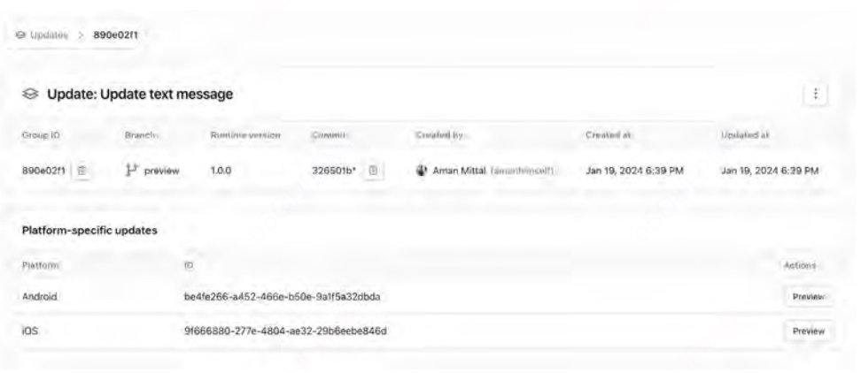

每个更新都包含有关与构建配置文件关联的分支、提交以及平台特定（Android 和 iOS）详细信息的详细信息。有关更多信息，请参阅 EAS Update 的概念概述。

###### 运行更新

完成此步骤后，所有运行我们应用的用户将收到包含更改的更新。默认情况下，expo-updates 在应用启动时会在后台检查更新。在进行内部分发测试时，要在应用中查看更新，您需要强制关闭并重新打开应用，最多两次才能看到更改。

您可以扩展默认功能，使用 expo-updates 的 useUpdates() 钩子实现自己的更新策略，该钩子允许您：
- 获取可用更新的信息
- 获取当前运行中的更新信息
- 使用 Updates.checkForUpdateAsync() 手动检查更新
- 使用 Updates.fetchUpdateAsync() 下载并运行更新

EAS Update 对于将更改部署到生产环境非常有用，在开发阶段也同样受益。它为团队成员共享您的工作提供了一种便捷且快速的方法。

### 好处： 即时将关键修复和部分内容推送给用户。

通过将OTA更新集成到应用程序中，您可以在几分钟内将JavaScript更新推送给所有用户。这种可能性对于修复重大bug或发送即时补丁至关重要。

例如，可能会发生您的后端停止工作，导致应用在启动时崩溃。这可能是一个处理不当的错误——在开发过程中，您从未遇到过后端故障，导致忘记处理这些边缘情况。

您可以通过显示一个备用信息并告知用户问题来修复这个问题。尽管开发过程可能需要一个小时，但实际的更新和审核过程可能需要数小时，甚至数天。通过设置OTA更新，您可以在几分钟内做出反应，而不必冒着影响大多数用户的糟糕用户体验的风险。

### 第五节 让您的应用始终保持快速

> 用DMAIC过程帮助您防止应用性能退化

#### 问题：每当解决一个性能问题后，应用偶尔会再次变慢。

客户对慢速应用的耐心非常有限。市场上有很多竞争者，客户可以迅速切换到其他应用程序。根据Unbounce的报告，近70%的消费者承认页面速度会影响他们的购买意愿。这里的好例子是沃尔玛和亚马逊——这两家公司都注意到，每提高100毫秒的加载时间，它们的收入就会增加最多1%。因此，网站和移动应用的性能显著影响着企业的表现。

越来越重要的不仅是修复性能问题，还要确保它们不再发生。你希望你的React Native应用始终保持良好和快速的性能。

####  解决方案：使用DMAIC方法论帮助您持续解决性能问题。

从技术角度来看，我们应该从避免任何猜测开始，所有决策都应基于数据。错误的假设会导致错误的结果。我们还应该记住，性能改进是一个过程，因此不可能一次性解决所有问题。小的步骤可以带来大的成果。

这一切使我们意识到，开发应用程序是一个过程。有一些互动会导致结果。最重要的是，这些过程可以被优化。

其中最有效的方法之一就是使用DMAIC方法论。它非常依赖数据且结构良好，可以用于改进React Native应用程序。DMAIC是Define（定义）、Measure（测量）、Analyze（分析）、Improve（改进）和Control（控制）的首字母缩写。让我们看看如何将每个阶段应用到我们的应用中。

###### 定义
在这个阶段，我们应该专注于定义问题、我们想要实现的目标、改进的机会等。倾听客户的声音在这个阶段非常重要——他们的期望和反馈。这有助于更好地理解他们的需求和偏好，以及他们面临的问题。接下来，非常重要的是以某种方式进行衡量。假设客户希望快速结账。通过分析组件，我们知道要实现这一目标，我们需要一个快速的结账过程、短的等待时间以及流畅的动画和过渡。这些点可以分解为可衡量且可追踪的CTQ（关键质量指标）。例如，短的等待时间可以分解为快速的服务器响应和较少的服务器错误。

另一个有用的工具是分析常见的用户路径。通过良好的跟踪，我们可以分析和了解用户主要使用应用程序的哪些部分。

在这个阶段，选择优先级非常重要。最终应该确定我们将按照什么顺序来优化事项。任何优先级排序的工具和技术都会在这里发挥作用。

最终，我们需要定义我们的目标——我们应该明确我们要去哪里以及我们到底想要实现什么。请记住，这一切都应该是可衡量的！将这些目标写入项目范围是一个很好的做法。

###### 测量

既然我们已经知道了目标，接下来是评估起点。关键是收集尽可能多的数据，以便准确了解问题的实际情况。我们需要确保测量过程的精确性。制定数据收集计划并让开发团队参与构建指标是非常有帮助的。之后，便是进行性能分析的时机。

在React Native中进行性能分析时，主要问题是选择在JavaScript端还是原生端进行分析。这通常取决于应用的架构，但大多数时候是两者的结合。

其中一个最流行的工具是React Profiler，它允许我们包裹一个组件来测量渲染时间和渲染次数。这个工具非常有帮助，因为许多性能问题都来源于不必要的重新渲染。了解如何使用它，请点击这里：

```javascript
import React, { Profiler } from 'react';
import { View } from 'react-native';

const Component = () => (
  <Profiler id=''Component'' onRender={(...args) => console.log(args)}>
    <View />
  </Profiler>
);

export default Component;
```
它将输出以下数据：
```json
{
 id: ''Component'',
 phase: ''mount'',
 actualDuration: 1.3352311453,
 baseDuration: 0.95232323318,
 ...
}
```
第二个工具是由Shopify创建的库——react-native-performance。它允许你在代码中放置一些标记来测量执行时间。还有一个非常不错的Flipper插件，它有助于可视化输出：

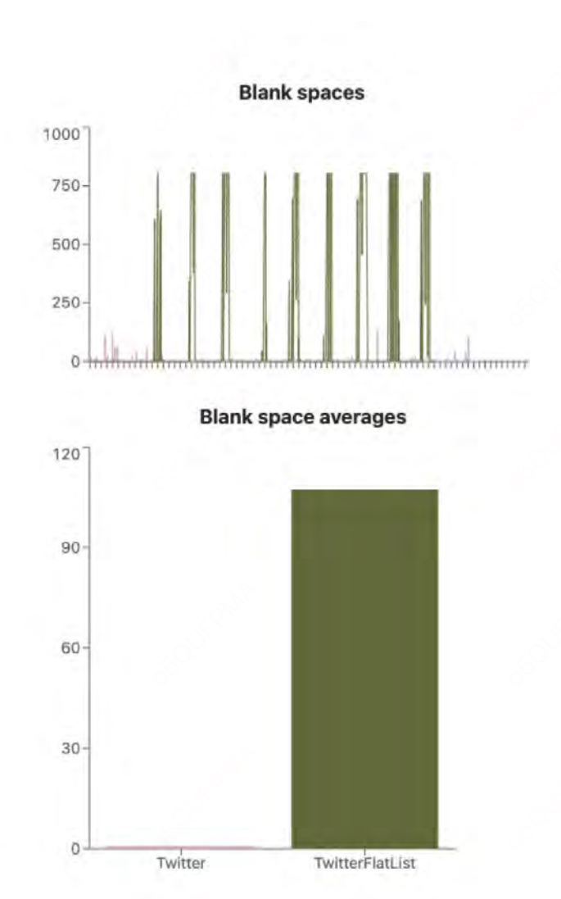

说到Flipper，它还有一些插件可以帮助我们测量应用性能并加速开发过程。我们可以使用例如React Native Performance Monitor插件来获得类似Lighthouse的体验，或者使用React Native Performance Lists Profiler插件。

在原生端，最常见的方法是使用原生IDE——Xcode和Android Studio。它们提供了许多有用的洞察，可以进行分析并得出一些结论和结果。

这个阶段最重要的方面是测量的变化。由于不同的环境，我们在进行性能分析时必须非常小心。即使应用在相同的设备上运行，也可能有一些外部因素影响性能测量。因此，我们应该将所有的测量基于发布版本进行。
###### 分析
这个阶段的目标是找出问题的根本原因。最好从可能导致问题的一些事项列表开始。和团队进行一些头脑风暴在这里非常有帮助。

定义问题的一个最常用工具是因果图。它看起来像一条鱼，我们应该从右向左绘制。我们从鱼头开始，它应该包含问题陈述——在这个阶段，我们应该已经根据定义阶段得到它。然后，我们识别出所有可能的主要原因，并将它们分配到鱼骨上。接着，我们将所有潜在的原因分配给每个主要原因。

有许多因素可能会影响性能，这个列表可能会非常长，因此缩小范围非常重要。列出最重要的因素并集中精力解决它们。

最后，是时候验证假设了。例如，如果主要问题是低FPS，而潜在的主要原因与列表渲染相关，我们可以考虑在列表项中的图片方面做一些改进。我们需要设计一个测试来帮助我们接受或拒绝这个假设——它可能是某种概念验证。接下来，我们解读结果，决定是否得到了改进。然后，我们做出最终决定。

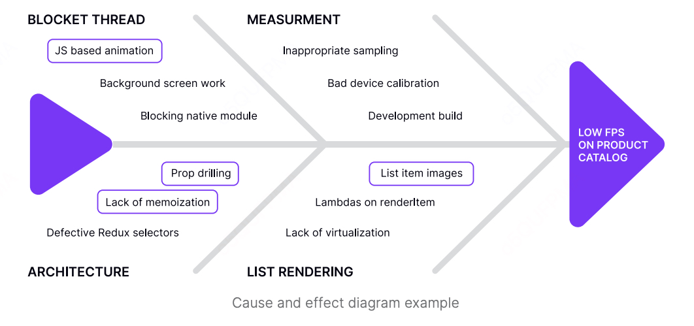

###### 改进

现在我们知道了目标是什么，以及如何实现它，是时候进行一些改进了。这个阶段是优化技术开始发挥作用的时候。

在开始之前，最好进行一次头脑风暴会议，识别出潜在的解决方案。根据根本原因，可能会有很多解决方案。以之前关于列表项中的图片为例，我们可以考虑实现适当的图片缓存，并减少不必要的重新渲染。

在列出解决方案后，是时候选择最好的方案了。有时，效果最好的解决方案可能会非常昂贵，例如，当需要进行一些架构上的改变时。

然后，进入实现解决方案的阶段。之后，需要对其进行适当的测试，完成后就可以结束了！

###### 控制 

最后一步是控制阶段。我们需要确保一切现在都运作良好。如果没有得到控制，性能可能会下降。当性能不佳时，人们往往会归咎于设备、所用技术，甚至是用户。那么，我们需要做些什么来保持我们的性能处于高水平？

我们需要确保有一个控制计划。我们可以利用前几个阶段的工作来制定这个计划。我们应该指出重点，定义一些测量特性、指标的可接受范围和测试频率。此外，编写一些程序和应对措施，以防发现问题，也是一个很好的做法。

控制阶段最重要的方面是监控回归。直到最近，在React Native中做这件事一直比较困难，但现在我们有很多选项可以改善我们的监控。

###### 实时用户监控

保持我们在应用中引入的性能改进的一种方法是通过实时监控工具。例如，Firebase性能监控，它是一个可以让我们深入了解生产环境中性能问题的服务。或者Sentry性能监控，它跟踪应用性能，收集吞吐量、延迟等指标，并展示错误在多个服务中的影响。

对于希望了解应用在所有安装设备上的性能分布的开发者来说，这些工具是一个很好的补充，基于真实用户数据。

##### 作为开发过程的一部分进行回归测试

控制性能回归的另一种方法是通过自动化测试。性能分析、测量和在各种设备上运行是相当手动且耗时的，这也是开发人员避免这样做的原因。然而，性能回归很容易在不经意间引入，这些回归通常只会在QA过程中被发现，或者更糟，甚至是由用户发现。幸运的是，我们有办法在React和React Native中编写自动化的性能回归测试。

Reassure 允许你在CI或本地机器上自动化React Native应用的性能回归测试。就像你编写集成测试和单元测试来自动验证你的应用是否仍然正常工作一样，你可以编写性能测试来验证你的应用是否仍然保持良好的性能。你可以把它看作是一个React性能测试库。实际上，Reassure被设计成尽可能重用你在React Native Testing Library中的测试和设置，正如它的维护者和创建者所设计的那样。

它通过测量你提供的测试场景的某些特征——渲染时长和渲染次数——并将其与事先测量的稳定版本进行比较来工作。它会多次重复该场景，以减少由于运行时环境导致的渲染时间随机变化的影响。然后，它应用统计分析来判断代码更改是否具有统计学意义。最终，它生成一个易于阅读的报告，总结结果并显示在CI上，或者作为你的拉取请求的评论。

你可以编写的最简单的测试大概是这样的：
```javascript
import React from 'react';
import { View } from 'react-native';
import { measurePerformance } from 'reassure';

const Component = () => {
  return <View />;
};

test('mounts Component', async () => {
  await measurePerformance(<Component />);
});

```

这个测试将测量组件在挂载期间的渲染时间以及随之产生的同步效果。不过，先来看一个更复杂的例子。这里我们有一个包含计数器和一个慢列表组件的组件：

```javascript
import React from 'react';
import { Pressable, Text, View } from 'react-native';
import { SlowList } from './SlowList';

const AsyncComponent = () => {
  const [count, setCount] = React.useState(0);
  const handlePress = () => {
    setTimeout(() => setCount((c) => c + 1), 10);
  };
  return (
    <View>
      <Pressable accessibilityRole=''button''
        onPress={handlePress}>
        <Text>Action</Text>
      </Pressable>
      <Text>Count: {count}</Text>
      <SlowList count={200} />
    </View>
  );
};
```
性能测试如下所示：

```javascript
import React from 'react';
import { screen, fireEvent } from '@testing-library/reactnative';
import { measurePerformance } from 'reassure';
import { AsyncComponent } from '../AsyncComponent';

test('AsyncComponent', async () => {
  const scenario = async () => {
    const button = screen.getByText('Action');

    fireEvent.press(button);
    await screen.findByText('Count: 1');
    
    fireEvent.press(button);
    await screen.findByText('Count: 2');
    
    fireEvent.press(button);
    fireEvent.press(button);
    fireEvent.press(button);
    await screen.findByText('Count: 5');
  };

  await measurePerformance(<AsyncComponent />, { scenario });
});
```

通过其CLI运行时，Reassure将生成一个性能对比报告。需要注意的是，为了获取测量差异，我们需要运行两次。第一次使用--baseline标志，这样可以在.reassure/目录下收集测量数据。

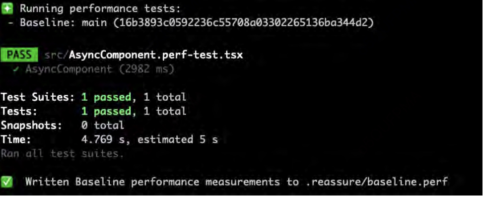

运行此命令后，我们可以开始优化代码，并查看它如何影响组件的性能。通常，我们会保留基准测量数据，并等待Reassure捕捉到性能回归并报告。但在这个例子中，我们跳过了这一步，直接进入优化阶段，因为我们刚刚发现了一个不错的优化机会。由于我们有基准测量数据作为参考，我们实际上可以验证我们的假设，看看性能提升是否真实存在，还是仅仅是主观感觉。

我们注意到的优化机会是，<SlowList/>组件可以进行记忆化，因为它不依赖任何外部变量。我们可以在这种情况下使用useMemo：

```javascript
const slowList = useMemo(() => <SlowList count={200} />, []);
```
完成优化后，我们可以第二次运行Reassure。这次不带 --baseline 标志。

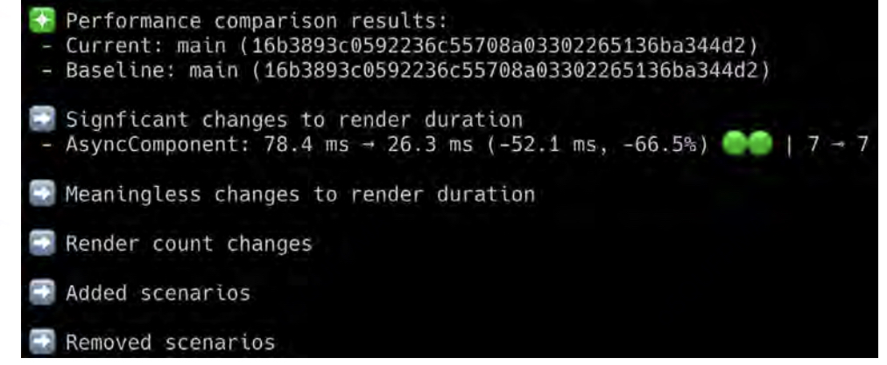

现在，Reassure有了两次测试运行可以进行比较——当前测试和基准测试，它可以准备一个性能对比报告。如你所见，通过对AsyncComponent渲染的SlowList组件应用记忆化，渲染时长从78.4毫秒减少到26.3毫秒，性能提升约为66%。

测试结果会被分配到以下几个类别：
	•	显著的渲染时长变化：显示一个测试场景，其中变化在统计学上是显著的，应该被关注，因为它可能标志着性能的损失/提升。
	•	无意义的渲染时长变化：显示测试场景，其中变化在统计学上不显著。
	•	渲染次数变化：显示渲染次数发生变化的测试场景。
	•	新增场景：显示在基准测量中不存在的测试场景。
	•	移除场景：显示在当前测量中不存在的测试场景。

当与Danger JS连接时，Reassure可以将这个报告以GitHub评论的形式输出，这有助于在代码审查过程中捕捉回归问题。 

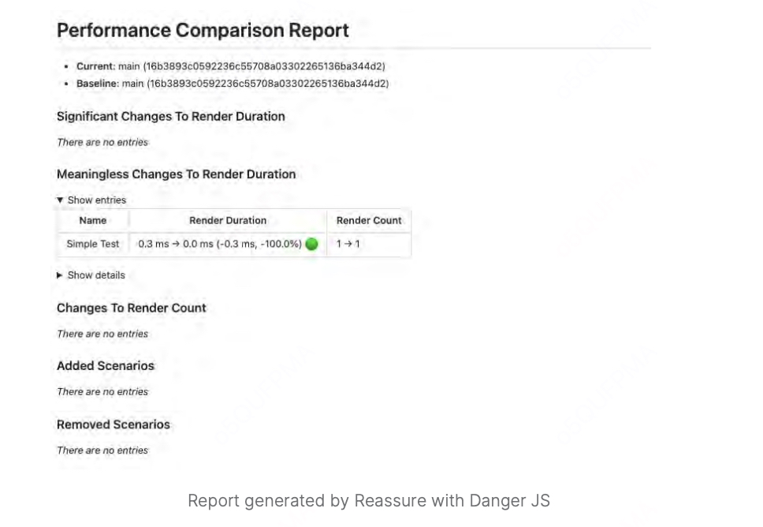

你可以在文档中发现更多的用例和示例。

#### 好处：一个结构良好且有组织的优化过程。

在开发一个应用时，无论其大小，拥有一个清晰的路径以实现我们的目标是非常重要的。使用DMAIC方法优化React Native应用的主要好处是它提供了一个结构化且直接的方法。如果没有它，可能很难验证哪些方法有效（以及为什么有效）。有时候，我们的经验和直觉足够了，但并非总是如此。

拥有这样的过程可以让我们专注于问题解决，并不断提高生产力。得益于DMAIC方法，性能优化成为了正常开发流程的一部分，使得你的应用默认更接近于高性能。能够在问题影响到用户之前，发现并解决性能问题。

没有任何软件是完美的。即使你是团队中最有经验的开发者，仍然会遇到错误和性能问题。但我们可以通过使用像Sentry、Firebase或Reassure这样的自动化工具来采取措施，减轻这些风险。将它们应用到你的项目中，并享受它们为你的项目带来的额外信心，以及它们为用户带来的改善的用户体验。

### 第六节 如何进行iOS性能分析

> 通过实时指标改善你的应用

#### 问题：执行一个操作后，结果显示所需时间过长。

性能分析对于理解应用的运行时性能至关重要，通过分析来衡量内存或时间复杂度、函数调用的频率和持续时间等。获取这些信息有助于你追踪问题，并提供合适的解决方案，以保持应用的健康并提高用户的参与度。

Xcode提供了一些基本工具来生成初步报告。你可以监控CPU、内存和网络的使用情况。

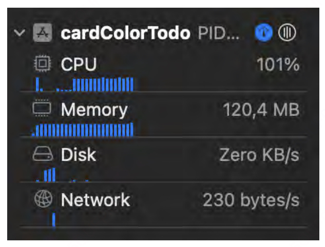

CPU监控器衡量的是执行的工作量。内存监控器用于观察应用的内存使用情况。所有iOS设备都使用SSD作为永久存储，相比RAM，访问这些数据会更慢。磁盘监控器用于了解应用的磁盘写入性能。网络监控器分析iOS应用的TCP/IP和UDP/IP连接。

你可以点击每个监控器，查看更多信息。

它还提供了一个默认未显示但可以帮助你检查UI的额外监控器——视图层次结构（View Hierarchy）。

当应用运行并且你在想要检查的屏幕上时，点击 Debug View Hierarchy。


这将以2D/3D模型和视图树的形式显示你当前的UI。

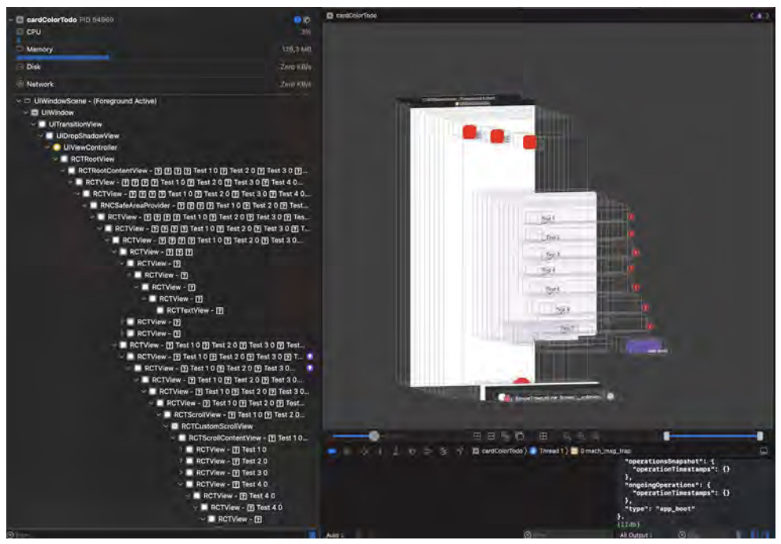

这将帮助你检测视图重叠（例如，你看不见某个组件）或者如果你想要扁平化组件树。尽管React Native会进行视图扁平化，但有时它无法处理所有的组件，因此在这里我们可以针对特定项进行优化。


假设我们有一个待办事项列表应用，当点击“添加”按钮时，它会将新项目添加到列表中。然而，由于在添加项目之前有一些逻辑处理，项目需要几秒钟才能显示在列表上。现在，让我们进入开发工具箱，拿起第一个工具，确认并测量这个延迟。

##### iOS工具

Instruments 是一个调试和性能分析工具，随 Xcode 一起提供，实际上它是一个工具箱，每个工具都用于不同的目的。你可以从模板列表中选择，并根据目标选择相应的工具：提高性能、延长电池寿命或修复内存问题。

我们将使用 Time Profiler。首先，打开 Xcode，然后进入 Open Developer Tool -> Instruments。接下来，向下滚动找到 Time Profiler 工具。

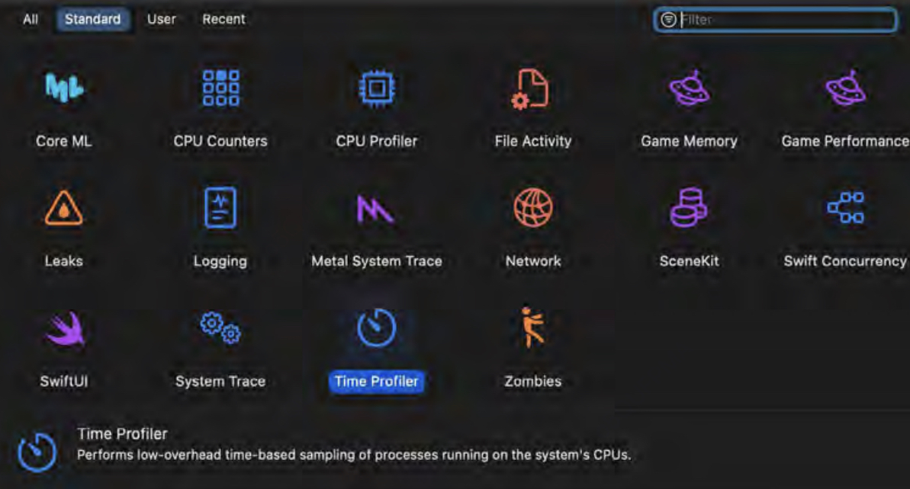

它会打开一个新窗口。要开始分析你的应用，点击下拉菜单，选择你的设备和应用。


当应用打开后，开始正常使用它，或者在这个例子中，添加一个新的待办事项。

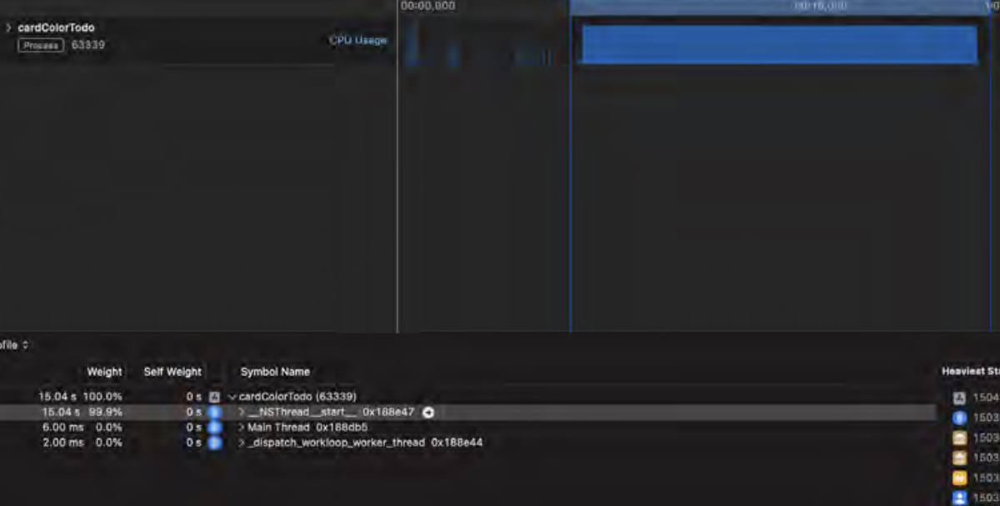

在添加新的待办事项并进行操作后，我们可以看到一个大的蓝色矩形，这意味着有些操作花费了很长时间才能完成。让我们来看一下线程情况。

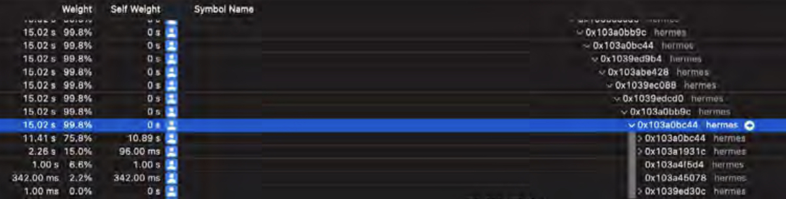

你可以通过按住 Option + 点击 键点击箭头（chevron）来展开，显示更多有用的信息。至少目前它显示的是内存地址，但我们需要找到另一种方法来定位问题所在。

#### 解决方案：结合一个专门用于JS上下文跟踪的工具。

让我们使用 Flipper，就像我们在《关注UI重新渲染》中使用的那样，不过这次我们使用另一个监控工具——Hermes Debugger (RN)。在应用打开并运行时，进入 Flipper，选择正在运行的应用（如果尚未选择），然后进入 Hermes Debugger (RN) -> Profiler。

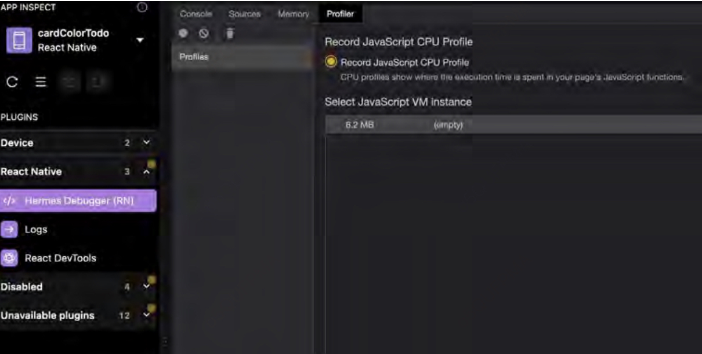

点击 Start，以开始性能分析。然后按照之前使用 Time Profiler 时的相同步骤和操作进行操作。当点击 Stop 时，我们将看到所有收集到的数据。


默认情况下，数据将按从下到上的顺序排序，耗时较长的任务会排在最上面。我们可以看到一个名为 doFib 的函数花费了大约 14 秒才能完成，这是一个很好的开始，让我们进入这个函数看看能做些什么。修复的方式将根据你的代码而有所不同。

在应用了可能的修复后，我们首先再次检查 Time Profiler。点击 记录按钮，然后开始使用应用，在我们的例子中，添加一个新的待办事项。

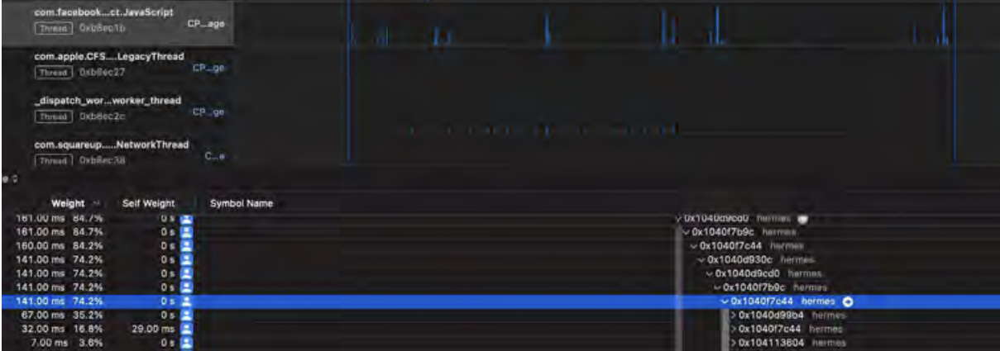
如我们所见，应用的修复确实有效，我们不再看到像之前那样的大蓝色矩形了。这是一个好兆头。接下来，让我们继续我们的性能分析流程，检查在 Flipper 中的表现。

再次使用 Hermes Debugger (RN) -> Profiler 开始分析应用。

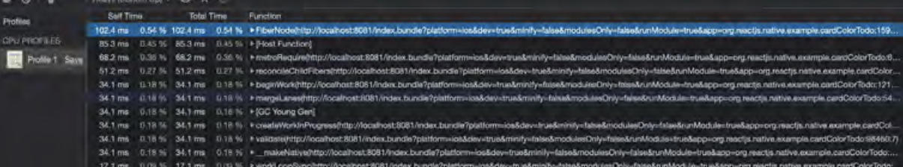

我们不再看到 doFib 函数，只有其他预期的 RN 任务。

###### iOS 15中的预热介绍
预热（Prewarming），在 iOS 15 中引入，影响了用户体验，通过减少应用程序变得可操作之前的延迟来提升体验。这个过程提前启动非活动的应用程序进程，使系统能够构建并缓存关键的低级结构，从而加快完整启动的速度。它改变了传统的启动时间度量方式，因为它可能会在用户实际打开应用之前就激活某些进程。例如，如果用户每天习惯在早上 8 点启动某个应用，iOS 可能会在 7:50 左右预先启动某些进程，以便与用户的预期行为同步。

###### 应用启动的初期阶段

在应用的主函数和 +applicationDidFinishLaunching 执行之前，iOS 会进行大量的准备工作。这包括初始化动态库（dylibs）、执行 +load 方法等，这一过程可能会持续超过一秒。理解这个过程对于那些专注于优化应用启动效率的开发者至关重要。

###### 预热机制

在预热过程中，应用的启动序列会被暂停，直到启动完整的应用程序，或者当系统需要释放资源时，将预热的应用从内存中移除。这样的预热可以在设备重启后触发，或者根据系统状态间歇性地进行。

###### iOS 15 预热的特殊处理

随着 iOS 15 的出现，初始化程序和其他准备步骤可以在实际应用启动前数小时就开始执行。因此，开发者必须考虑到 pre-main 初始化程序开始和随后 post-main 阶段之间的时间间隔。否则，他们可能会在监控工具中看到许多非常高的数字。

######  区分 Objective-C 和 Swift 中的预热
开发者可以使用 ProcessInfo 环境变量来确定是否发生了预热。这有助于根据预热状态调整应用程序的行为。以下代码片段可以帮助开发者检测应用是否通过预热启动，并相应地调整启动度量标准。
```oc
if ([[[NSProcessInfo processInfo] environment]
[@''ActivePrewarm''] isEqual:@''1'']) {
  // Handle prewarmed app launch scenario
} else {
  // Handle regular app launch scenario
}
```

```
if ProcessInfo.processInfo.environment[''ActivePrewarm''] ==
''1'' {
// Handle prewarmed app launch scenario
} else {
// Handle regular app launch scenario
}
```
#### 好处：拥有更快且更响应的应用

如果对某个操作的响应时间过长，70%的用户会离开应用。对应用进行性能分析已经成为我们开发生命周期中的关键步骤之一。使用像 Time Profiler 这样的工具可以帮助我们了解应用是否响应迅速，或者在哪些地方可以进行改进。记住，用户对速度和延迟变得越来越敏感，哪怕是 0.1 秒的提升，也能使转化率提高 10.1%。

### 第七节 了解如何对 Android 进行性能分析

> 获取实时指标，提升对应用的理解

#### 问题：你遇到了一个直接来自 Android 运行时的性能问题。

当遇到性能问题时，我们通常使用 React Profiler 来排查和解决问题。由于大多数性能问题源自于 JavaScript 领域，因此通常不需要做超出该范围的处理。但有时，我们会遇到直接来自 Android 运行时的 bug 或性能问题。在这种情况下，我们需要一个强大的工具来帮助我们收集以下设备指标：
- CPU
- 内存
- 网络
- 电池使用情况

根据这些数据，我们可以检查我们的应用是否消耗了比平时更多的电量，或者在某些情况下，是否使用了更多的 CPU 资源。特别是在低端 (LE) Android 设备上检查执行的代码是很有帮助的。某些算法可能在某些设备上运行更快，最终用户可能察觉不到任何卡顿，但我们必须记住，部分用户可能使用低端设备，某些算法或功能可能对他们的手机过于繁重。高端设备能够处理这些，因为它们的硬件更强大。

#### 解决方案：使用 Android Studio 中的 Android Profiler 对应用进行性能分析

###### Android Profiler in Android Studio

Android Studio 是由 JetBrains 开发的集成开发环境（IDE）。它由 Google 官方支持，是开发任何 Android 应用的官方 IDE。它功能强大，集成了许多实用功能，其中之一就是 Android Profiler。

如果你还没有安装 Android Studio，可以通过这个链接进行安装。

要打开 Profiler，请从 Android Studio 菜单栏选择 View > Tool Windows > Profiler。

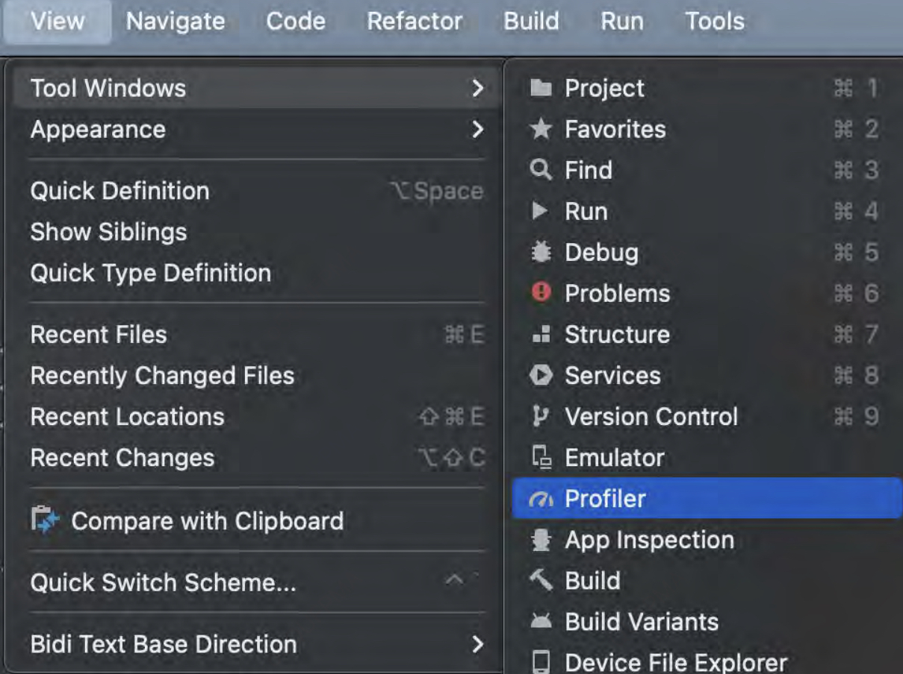

或者点击工具栏中的 Profile。

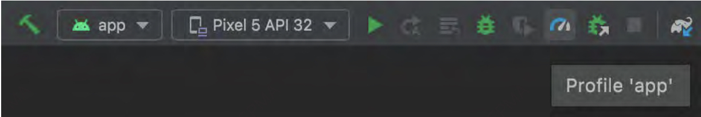

在开始分析应用性能之前，请记住以下事项：
- 在实际的安卓设备上运行应用，最好是低端手机或者如果没有的话使用模拟器。如果你的应用已经设置了运行时监控，请使用最常被用户使用的设备型号，或者是受特定问题影响的设备。
- 关闭开发者模式。确保应用使用的是 JS 包而不是 Metro 服务器提供的包。要关闭开发模式，请进入设备设置，点击设置并找到 JS 开发模式：

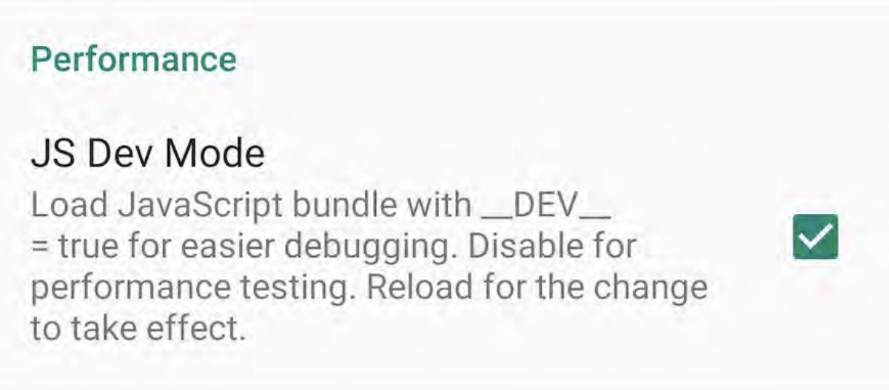

之后，进入 Profiler 标签页并添加一个新的分析会话：

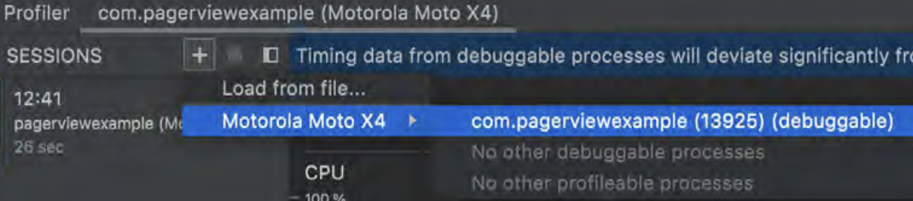

等待会话连接到你的应用程序，并开始执行可能导致性能问题的操作，如滑动、滚动、导航等。一旦完成，你应该能看到以下的度量数据：

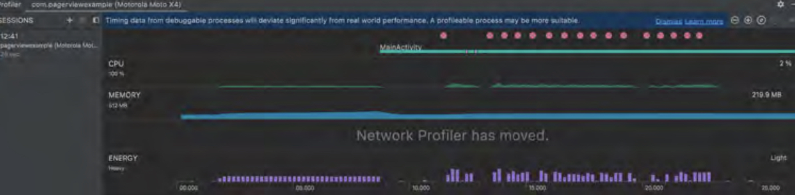

每个绿色场 React Native 应用程序只有一个 Android Activity。如果你的应用程序有多个 Activity，那么它很可能是一个棕地（brownfield）应用。可以在这里了解更多关于棕地方法的信息。在上面的示例中，我们没有看到任何问题，一切正常工作，没有任何卡顿。让我们检查每个度量指标：
- CPU 指标与能耗密切相关，因为 CPU 需要更多的能量来执行计算任务。
- 内存指标在使用应用时没有变化，这是正常的。内存使用量可能会增长，例如在打开新页面时，然后在垃圾回收器（GC）释放内存时下降，例如在导航离开某个页面时。当内存量意外增加并持续增长时，可能意味着内存泄漏，这是我们要避免的，因为它可能导致应用因内存溢出（OOM）错误崩溃。
- 网络部分已经移到了一个单独的工具中，叫做“网络标签页”（Network Tab）。在大多数情况下，这个度量指标不需要使用，因为它主要与后端基础设施有关。如果你想要分析网络连接，可以在这里找到更多的信息。
- 能量部分提供了关于我们应用能量使用的提示，显示何时我们的应用能量使用处于低、中或高状态，这会影响用户日常使用应用的体验。

##### 使用 Android Profiler 实际操作

在前面的例子中，我们可以看到各个指标之间的关系：


要查看更详细的视图，我们需要双击该标签页。现在我们可以看到更多的细节。当用户开始进行某些触摸操作（例如上面的滑动）时，我们可以看到更多的 CPU 工作。每个应用程序都会有其独特的 CPU 峰值和低谷特征。通过与应用程序交互并将某些活动（如触摸事件）与 CPU 使用量的增加配对，可以帮助我们建立对这些变化的直觉。换句话说，某些 CPU 峰值是预期中的，因为工作需要执行。然而，问题出现在 CPU 使用率在长时间内过高，或者在一些不常见的地方出现时。

假设你希望为你的 React Native 应用挑选最适合低端设备的列表或滚动视图组件。你注意到当前的解决方案可能需要改进，因此你开始着手进行优化。在你的实验中，你希望检查你的新方案在低端设备上的表现，使用上述描述的解决方案。双击 CPU 后，你可能会看到以下数据：

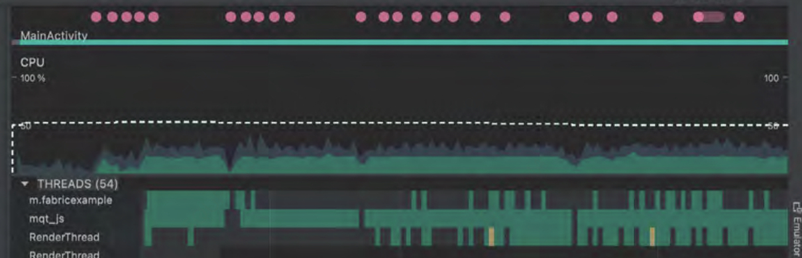

在这里，你可以看到 mqt_js 线程几乎一直在运行，并且执行一些繁重的计算，因为你的计算是在 JS 端完成的。你可以开始思考如何改善这一点。可以检查多个选项：
- 用 JSI 替换桥接 —— 测试 JSI 是否比桥接更快。
- 将部分代码移到原生端 —— 在原生端，你可以更好地控制线程执行，并可以安排一些工作来避免阻塞 JS 或 UI 线程。
- 使用不同的原生组件 —— 用你自定义的解决方案替换原生的滚动视图组件。
-	使用 shadow 节点 —— 在 C++ 中做一些开销较大的计算，并将结果传递给原生端。

你可以尝试这些解决方案，并对它们之间的效果进行比较。Profiler 会为你提供相关的度量指标，基于这些数据，你可以做出最适合你特定问题的决策。

有关 Android Profiler 的更多信息，可以参考这里。

##### 系统追踪 (System Tracing)

要在 Android Studio 中使用 CPU Profiler 进行系统追踪，我们可以检查何时调用了相应的函数。我们可以对所有线程进行排查，看看哪个函数是最耗时的，从而影响用户体验。要启用系统追踪，请点击 CPU 部分并选择 System Trace Recording。

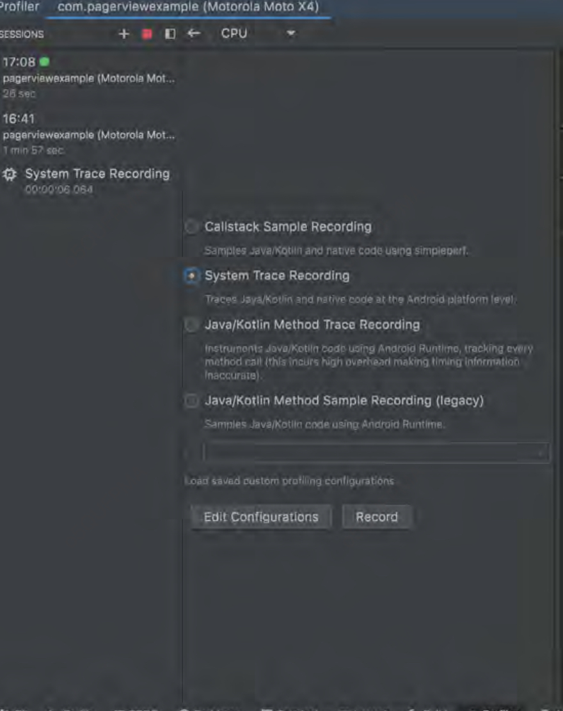

经过一些交互后，您应该能够看到所有线程及其详细信息：

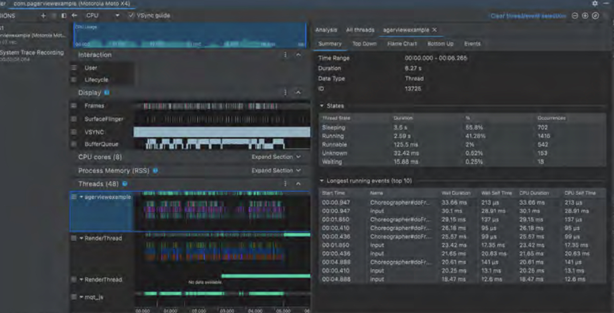

您也可以通过点击保存按钮来保存您的数据：


并将数据导入到其他工具中，例如 Perfetto：

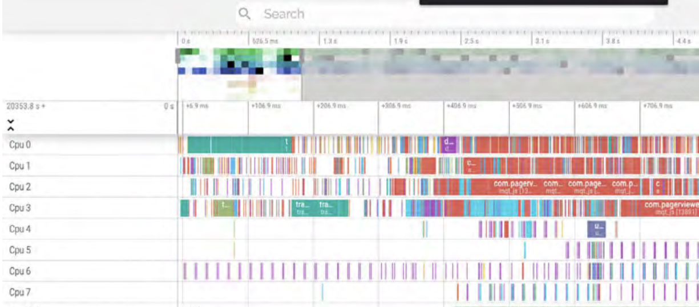

你还应该查看 React Native 核心团队提供的官方 Android 性能分析指南。他们使用不同的工具，但结果是一样的。该指南提供了案例研究，讲解如何在不同的线程上发现问题：
- UI 线程
- JS 线程
- 原生模块线程
- 渲染线程（仅限 Android）

你可以在《新架构》章节中找到更多关于线程模型的内容。

##### FLIPPER 性能插件用于 Android
我们已经知道 Flipper 在排查性能问题时非常有用。对于 Android，最有趣的插件之一是 android-performance-profiler。它可以作为独立工具使用，也可以集成到 CI 中。它能够生成漂亮的报告，因此这个工具可以用于进行一些复杂的实验。

这是一个示例实验的图片：

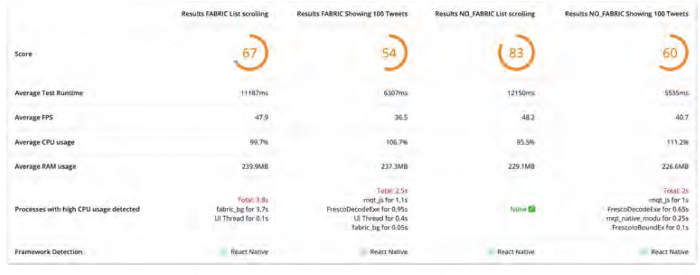

你还可以通过端到端（e2e）测试自动化你的实验，并在本地或CI上生成报告。这些报告可以用来比较不同的解决方案。

#### 好处：实时指标将提升你对应用的理解

如上所述，如果响应时间过长，用户会放弃你的应用。使用特定的工具将帮助你了解应用性能问题的根本原因。


